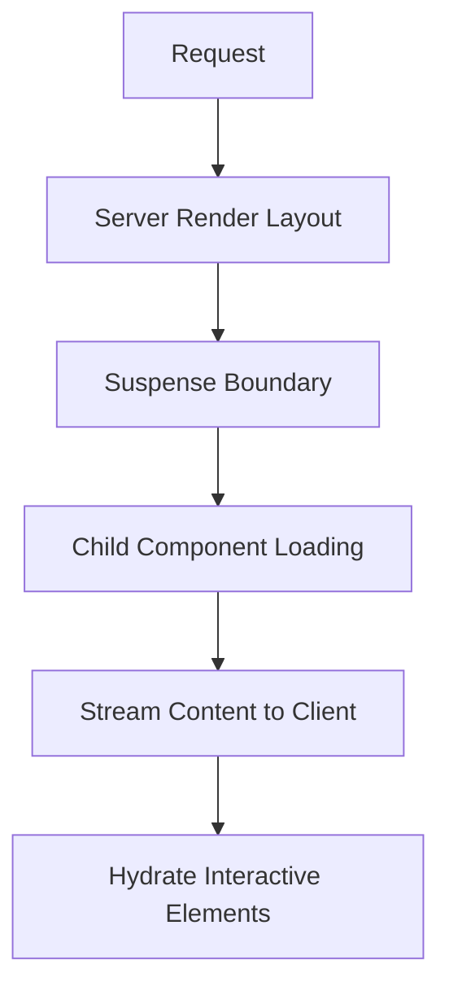

# Feedback Signals Layout - Next.js 15+ App Router Pattern

## Overview

This document describes the architecture pattern for the feedback signals layout component in our Next.js 15+ App Router application. This layout demonstrates advanced routing patterns, server-first rendering, and optimized loading states.

## Route Structure

```
src/app/(misc)/feedback/signals/layout.tsx
└── Route Pattern: /feedback/signals/*
    ├── Route Group: (misc) - Groups non-core application routes
    ├── Route Segment: feedback - Main feedback module
    └── Route Segment: signals - Specific feedback signals feature
```

### URL Mapping
- **Physical Path**: `src/app/(misc)/feedback/signals/`
- **URL Pattern**: `/feedback/signals` (route group doesn't affect URL)
- **Child Routes**: All routes under `/feedback/signals/*` inherit this layout

## Purpose

This architectural pattern accomplishes several key objectives:

1. **Centralized Loading State**: Provides consistent loading UI for all feedback signal pages
2. **Visual Consistency**: Ensures uniform styling and theming across the feedback signals module
3. **Performance Optimization**: Implements Suspense boundaries for optimal streaming
4. **User Experience**: Delivers immediate visual feedback during navigation and data loading

## Route Groups

### `(misc)` Route Group
- **Purpose**: Organizes non-core application features without affecting URL structure
- **Benefits**: 
  - Logical separation of auxiliary features
  - Cleaner file organization
  - Potential for shared layouts across misc features
- **URL Impact**: None - route groups are ignored in URL generation

```typescript
// Route group structure
(misc)/
├── feedback/
│   └── signals/
│       ├── layout.tsx     // This component
│       ├── page.tsx       // /feedback/signals
│       └── [id]/
│           └── page.tsx   // /feedback/signals/[id]
└── other-misc-features/
```

## Layout Hierarchy

The layout cascade follows Next.js 15+ App Router conventions:

```
RootLayout (src/app/layout.tsx)
└── FeedbackLayout (src/app/(misc)/feedback/signals/layout.tsx)
    └── Page Components (page.tsx files)
        └── Child Components
```

### Layout Responsibilities

| Layout Level | Responsibilities |
|--------------|------------------|
| **Root Layout** | Global styles, providers, metadata |
| **Feedback Layout** | Feature-specific theming, loading states, layout structure |
| **Page Components** | Route-specific content and data fetching |

## Data Flow

### Props Interface
```typescript
interface FeedbackLayoutProps {
  children: ReactNode; // Child page components
}
```

### Data Flow Pattern
1. **Server-First**: Layout renders on server by default
2. **Children Injection**: Child pages are injected via `children` prop
3. **Suspense Boundaries**: Child components can trigger loading states
4. **Streaming**: Content streams as it becomes available



## Server vs Client Components

### Current Implementation: Server Component

```tsx
// Server Component (default in App Router)
export default function FeedbackLayout({ children }: { children: ReactNode }) {
  // Renders on server
  // No client-side interactivity
  // Optimal for static layout structure
}
```

### When to Use Each Pattern

| Pattern | Use Case | Example |
|---------|----------|---------|
| **Server Component** | Static layouts, SEO-critical content | Current implementation |
| **Client Component** | Interactive layouts, client state | Would need `'use client'` directive |

### Conversion to Client Component (if needed)
```tsx
'use client';

import { ReactNode, useState } from 'react';

export default function FeedbackLayout({ children }: { children: ReactNode }) {
  const [isExpanded, setIsExpanded] = useState(false);
  // Client-side interactivity now available
}
```

## Loading States

### Suspense Implementation

The layout implements a sophisticated loading pattern using React Suspense:

```tsx
<Suspense
  fallback={
    <div className='flex size-full flex-col items-center justify-center gap-1'>
      <PiLoader5Line className='size-8 animate-spin' />
      <Typography variant='labelSmall' color='950'>
        Loading...
      </Typography>
    </div>
  }
>
  {children}
</Suspense>
```

### Loading Strategy Benefits

1. **Immediate Feedback**: Users see loading state instantly
2. **Streaming Support**: Content streams as it becomes available
3. **Granular Control**: Each route can have its own loading behavior
4. **Accessibility**: Screen readers announce loading states

### Loading State Hierarchy

```
Page Request
├── Layout Shell (immediate)
├── Suspense Fallback (if children not ready)
└── Children Content (streams when ready)
```

## Error Handling

### Current Error Handling

The layout provides foundational error boundaries through Suspense:

```tsx
// Suspense catches loading errors and shows fallback
<Suspense fallback={<LoadingUI />}>
  {children} // Errors here are caught by parent boundaries
</Suspense>
```

### Recommended Error Boundary Pattern

```tsx
// Enhanced error handling (future implementation)
import { ErrorBoundary } from '@/components/error-boundary';

<ErrorBoundary fallback={<FeedbackErrorUI />}>
  <Suspense fallback={<LoadingUI />}>
    {children}
  </Suspense>
</ErrorBoundary>
```

### Error Boundary Hierarchy

```
RootLayout Error Boundary
└── Feature Error Boundary (recommended)
    └── Page Error Boundary
        └── Component Error Boundary
```

## Metadata

### Layout Metadata Pattern

Layouts in Next.js 15+ can export metadata that merges with page metadata:

```tsx
// Future metadata implementation
import { Metadata } from 'next';

export const metadata: Metadata = {
  title: {
    template: '%s | Feedback Signals',
    default: 'Feedback Signals'
  },
  description: 'Manage and analyze user feedback signals',
  openGraph: {
    title: 'Feedback Signals',
    description: 'User feedback management system'
  }
};
```

### Metadata Cascade

```
Root Metadata (global defaults)
└── Layout Metadata (feature-specific)
    └── Page Metadata (route-specific)
        └── Final Rendered Metadata
```

## Security

### Current Security Posture

The layout operates as a public component with no built-in security:

```tsx
// No authentication/authorization implemented
export default function FeedbackLayout({ children }: { children: ReactNode }) {
  // Public access - security handled at page level
}
```

### Recommended Security Patterns

#### 1. Layout-Level Protection
```tsx
import { auth } from '@/lib/auth';
import { redirect } from 'next/navigation';

export default async function FeedbackLayout({ children }: { children: ReactNode }) {
  const session = await auth();
  
  if (!session?.user) {
    redirect('/login');
  }
  
  return (
    <div className='dark flex size-full flex-col items-center justify-center bg-pgBackgroundNeutral'>
      {children}
    </div>
  );
}
```

#### 2. Role-Based Access
```tsx
import { hasPermission } from '@/lib/permissions';

export default async function FeedbackLayout({ children }: { children: ReactNode }) {
  const session = await auth();
  
  if (!hasPermission(session?.user, 'feedback:read')) {
    redirect('/unauthorized');
  }
  
  // Layout content
}
```

## Performance

### Optimization Strategies

#### 1. Server-First Rendering
```tsx
// Renders on server by default
// Reduces client-side JavaScript bundle
// Improves Core Web Vitals
```

#### 2. Suspense Streaming
```tsx
<Suspense fallback={<LoadingUI />}>
  {children} // Streams content as it becomes available
</Suspense>
```

#### 3. Static Asset Optimization
```tsx
// Icons imported from optimized icon system
import { PiLoader5Line } from '@/components/icons';
```

### Performance Metrics Impact

| Metric | Impact | Reason |
|--------|---------|--------|
| **LCP** | ✅ Improved | Server-side rendering |
| **FID** | ✅ Improved | Minimal client-side JS |
| **CLS** | ✅ Improved | Consistent layout structure |
| **TTFB** | ✅ Improved | Streaming content delivery |

### Caching Strategy

```tsx
// Layout components are automatically cached by Next.js
// No additional caching configuration needed
// Benefits from React Server Component caching
```

## Environment Variables

### Current Usage

The layout doesn't directly consume environment variables but follows our centralized pattern:

```tsx
// Environment variables would be imported from centralized validation
import { env } from '@/env';

// Usage example (if needed)
const apiUrl = env.FEEDBACK_API_URL;
```

### Environment Variable Patterns

#### 1. Centralized Validation (`src/env.ts`)
```typescript
import { z } from 'zod';

const envSchema = z.object({
  FEEDBACK_API_URL: z.string().url(),
  FEEDBACK_FEATURE_ENABLED: z.boolean().default(true),
});

export const env = envSchema.parse(process.env);
```

#### 2. Layout-Level Configuration
```tsx
import { env } from '@/env';

export default function FeedbackLayout({ children }: { children: ReactNode }) {
  // Only render if feature is enabled
  if (!env.FEEDBACK_FEATURE_ENABLED) {
    return <FeatureDisabledUI />;
  }
  
  return (
    <div className='dark flex size-full flex-col items-center justify-center bg-pgBackgroundNeutral'>
      {children}
    </div>
  );
}
```

## Best Practices

### 1. Component Composition
```tsx
// Good: Composable layout structure
<div className='layout-container'>
  <Suspense fallback={<LoadingUI />}>
    {children}
  </Suspense>
</div>

// Avoid: Tightly coupled layout logic
```

### 2. Error Boundaries
```tsx
// Recommended: Wrap Suspense with error boundaries
<ErrorBoundary>
  <Suspense fallback={<LoadingUI />}>
    {children}
  </Suspense>
</ErrorBoundary>
```

### 3. Performance Monitoring
```tsx
// Monitor layout performance
import { analytics } from '@/lib/analytics';

useEffect(() => {
  analytics.track('feedback_layout_rendered');
}, []);
```

## Migration Considerations

### From Pages Router
```tsx
// Pages Router pattern
export default function FeedbackLayout({ children }) {
  return <div>{children}</div>;
}

// App Router pattern (current)
export default function FeedbackLayout({ children }: { children: ReactNode }) {
  return (
    <Suspense fallback={<LoadingUI />}>
      {children}
    </Suspense>
  );
}
```

### Future Enhancements
1. **Metadata Integration**: Add layout-specific metadata
2. **Error Boundaries**: Implement comprehensive error handling
3. **Authentication**: Add layout-level security
4. **Analytics**: Integrate usage tracking
5. **A/B Testing**: Support for layout variations