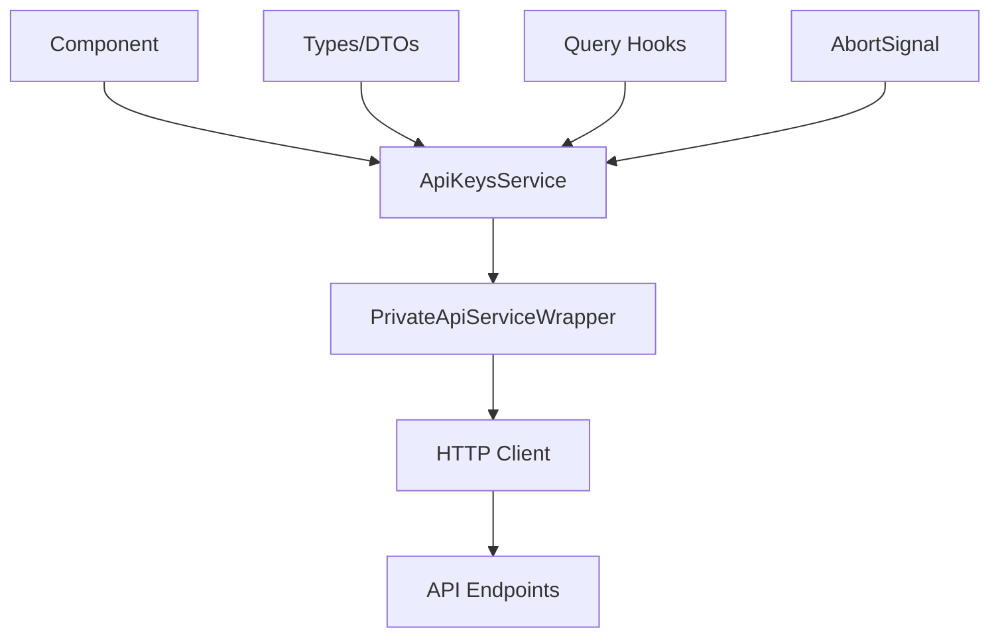

# API Keys Service Pattern Documentation

## Pattern Overview

The API Keys Service pattern implements a **service-oriented data access layer** that provides a clean, type-safe interface for managing API keys through HTTP operations. This pattern abstracts away low-level HTTP concerns and provides a consistent API for CRUD operations while maintaining strong typing and error handling.

**Use this pattern when:**
- Building data access services for RESTful APIs
- Need consistent HTTP operation patterns across multiple services
- Require type-safe API interactions with proper error handling
- Want to centralize API endpoint management and request/response handling

## Architecture



### Core Components

1. **Service Factory**: `PrivateApiServiceWrapper` provides the HTTP client instance
2. **Service Interface**: Object containing all API operations
3. **Type Definitions**: Strong typing for requests, responses, and parameters
4. **Operation Methods**: Individual methods for each API endpoint

## Implementation Details

### Service Wrapper Pattern

```typescript
export const ApiKeysService = PrivateApiServiceWrapper((api) => ({
  // Service methods using the injected api client
}));
```

The wrapper pattern provides:
- **Dependency Injection**: HTTP client injected into service factory
- **Consistent Configuration**: Shared authentication, base URL, interceptors
- **Error Handling**: Centralized error handling and response processing

### Method Signature Pattern

Each service method follows a consistent signature:

```typescript
async methodName(
  data: RequestType,
  signal?: AbortSignal
): Promise<ResponseType>
```

**Key patterns:**
- **Async/Await**: All operations are asynchronous
- **Abort Support**: Optional `AbortSignal` for request cancellation
- **Type Safety**: Strongly typed inputs and outputs
- **Consistent Response**: All methods return parsed JSON responses

## Usage Examples

### Basic CRUD Operations

```typescript
import { ApiKeysService } from '@/lib/services/api-keys-service';

// Get all API keys
const apiKeys = await ApiKeysService.getList({ enabled: true });

// Get paginated results
const paginatedKeys = await ApiKeysService.getListPaginated({
  enabled: true,
  page: 1,
  limit: 10,
  sortBy: 'createdAt',
  sortOrder: 'desc'
});

// Create new API key
const newKey = await ApiKeysService.createKey({
  name: 'Development Key',
  permissions: ['read', 'write'],
  expiresAt: new Date('2024-12-31')
});

// Update existing key
const updatedKey = await ApiKeysService.update({
  id: 'key-123',
  dto: {
    name: 'Updated Key Name',
    enabled: false
  }
});

// Delete API key
const deletedKey = await ApiKeysService.delete('key-123');
```

### With Request Cancellation

```typescript
const controller = new AbortController();

try {
  const apiKeys = await ApiKeysService.getList(
    { enabled: true },
    controller.signal
  );
} catch (error) {
  if (error.name === 'AbortError') {
    console.log('Request was cancelled');
  }
}

// Cancel the request
controller.abort();
```

### React Integration

```typescript
import { useQuery, useMutation } from '@tanstack/react-query';
import { ApiKeysService } from '@/lib/services/api-keys-service';

function ApiKeysComponent() {
  // Query for API keys list
  const { data: apiKeys, isLoading } = useQuery({
    queryKey: ['apiKeys', { enabled: true }],
    queryFn: ({ signal }) => ApiKeysService.getList({ enabled: true }, signal),
  });

  // Mutation for creating new keys
  const createKeyMutation = useMutation({
    mutationFn: (dto: CreateApiKeyDto) => ApiKeysService.createKey(dto),
    onSuccess: (newKey) => {
      console.log('Key created:', newKey);
    },
  });

  const handleCreateKey = () => {
    createKeyMutation.mutate({
      name: 'New API Key',
      permissions: ['read']
    });
  };

  return (
    <div>
      {isLoading ? 'Loading...' : apiKeys?.map(key => (
        <div key={key.id}>{key.name}</div>
      ))}
      <button onClick={handleCreateKey}>Create Key</button>
    </div>
  );
}
```

## Best Practices

### 1. Consistent Error Handling

```typescript
// Good: Handle specific error cases
try {
  const apiKey = await ApiKeysService.create({
    params: { ifNotExists: true },
    dto: newKeyData
  });
} catch (error) {
  if (error.status === 409) {
    // Handle conflict (key already exists)
  } else if (error.status === 400) {
    // Handle validation errors
  }
  throw error; // Re-throw if not handled
}
```

### 2. Parameter Validation

```typescript
// Good: Validate parameters before API calls
function validateCreateKeyDto(dto: CreateApiKeyDto): void {
  if (!dto.name?.trim()) {
    throw new Error('API key name is required');
  }
  if (dto.permissions?.length === 0) {
    throw new Error('At least one permission is required');
  }
}

const newKey = await ApiKeysService.createKey(validatedDto);
```

### 3. Request Cancellation

```typescript
// Good: Always support cancellation in long-running operations
useEffect(() => {
  const controller = new AbortController();
  
  const fetchApiKeys = async () => {
    try {
      const keys = await ApiKeysService.getListPaginated(
        { page: currentPage },
        controller.signal
      );
      setApiKeys(keys);
    } catch (error) {
      if (error.name !== 'AbortError') {
        setError(error);
      }
    }
  };

  fetchApiKeys();
  
  return () => controller.abort();
}, [currentPage]);
```

## Integration

### With React Query

```typescript
// Query key factory
export const apiKeysQueryKeys = {
  all: ['apiKeys'] as const,
  lists: () => [...apiKeysQueryKeys.all, 'list'] as const,
  list: (params: GetApiKeysListParams) => 
    [...apiKeysQueryKeys.lists(), params] as const,
  details: () => [...apiKeysQueryKeys.all, 'detail'] as const,
  detail: (id: string) => [...apiKeysQueryKeys.details(), id] as const,
};

// Custom hooks
export function useApiKeysList(params: GetApiKeysListParams) {
  return useQuery({
    queryKey: apiKeysQueryKeys.list(params),
    queryFn: ({ signal }) => ApiKeysService.getList(params, signal),
  });
}

export function useCreateApiKey() {
  const queryClient = useQueryClient();
  
  return useMutation({
    mutationFn: ApiKeysService.createKey,
    onSuccess: () => {
      queryClient.invalidateQueries({ 
        queryKey: apiKeysQueryKeys.lists() 
      });
    },
  });
}
```

### With State Management

```typescript
// Redux Toolkit Query integration
export const apiKeysApi = createApi({
  reducerPath: 'apiKeysApi',
  baseQuery: async (args, api, extraOptions) => {
    try {
      const result = await ApiKeysService[args.method](
        args.data, 
        api.signal
      );
      return { data: result };
    } catch (error) {
      return { error };
    }
  },
  tagTypes: ['ApiKey'],
  endpoints: (builder) => ({
    getApiKeys: builder.query<ApiKey[], GetApiKeysListParams>({
      query: (params) => ({ method: 'getList', data: params }),
      providesTags: ['ApiKey'],
    }),
  }),
});
```

## Type Safety

### Interface Definitions

```typescript
// Strong typing for all service parameters
export interface GetApiKeysListParams {
  enabled?: boolean;
  search?: string;
  permissions?: string[];
}

// Generic pagination with proper constraints
interface PaginationSort<T> {
  page?: number;
  limit?: number;
  sortBy?: keyof T;
  sortOrder?: 'asc' | 'desc';
}

// Union types for response variations
type ApiKeyResponse = ApiKey | ApiKeyWithToken;
```

### Generic Service Pattern

```typescript
// Reusable service interface pattern
interface ServiceMethod<TParams, TResponse> {
  (params: TParams, signal?: AbortSignal): Promise<TResponse>;
}

interface CrudService<TEntity, TCreateDto, TUpdateDto> {
  getList: ServiceMethod<ListParams, TEntity[]>;
  create: ServiceMethod<TCreateDto, TEntity>;
  update: ServiceMethod<{ id: string; dto: TUpdateDto }, TEntity>;
  delete: ServiceMethod<string, TEntity>;
}
```

### Type Guards

```typescript
// Type guards for response validation
function isApiKeyWithToken(obj: any): obj is ApiKeyWithToken {
  return obj && typeof obj.token === 'string' && 'id' in obj;
}

// Usage in service methods
const response = await ApiKeysService.createKey(dto);
if (isApiKeyWithToken(response)) {
  // TypeScript knows response.token exists
  console.log('Token:', response.token);
}
```

## Performance

### Optimization Strategies

```typescript
// 1. Request deduplication
const requestCache = new Map<string, Promise<any>>();

function getCachedRequest<T>(key: string, factory: () => Promise<T>): Promise<T> {
  if (!requestCache.has(key)) {
    const promise = factory().finally(() => {
      requestCache.delete(key);
    });
    requestCache.set(key, promise);
  }
  return requestCache.get(key)!;
}

// 2. Pagination optimization
export const ApiKeysService = PrivateApiServiceWrapper((api) => ({
  async getListPaginated(
    params: GetApiKeysListParams & PaginationSort<ApiKey> = {},
    signal?: AbortSignal
  ): Promise<CustomSearchResult<ApiKey>> {
    // Use reasonable defaults
    const { page = 1, limit = 20, ...otherParams } = params;
    
    const response = await api.get('/apiKeys', { 
      params: { page, limit, ...otherParams }, 
      signal 
    });
    return await response.json();
  },
}));
```

### Caching Strategy

```typescript
// Service-level caching
class CachedApiKeysService {
  private cache = new Map<string, { data: any; timestamp: number }>();
  private readonly TTL = 5 * 60 * 1000; // 5 minutes

  private getCacheKey(method: string, params: any): string {
    return `${method}:${JSON.stringify(params)}`;
  }

  private isExpired(timestamp: number): boolean {
    return Date.now() - timestamp > this.TTL;
  }

  async getList(params: GetApiKeysListParams, signal?: AbortSignal) {
    const key = this.getCacheKey('getList', params);
    const cached = this.cache.get(key);

    if (cached && !this.isExpired(cached.timestamp)) {
      return cached.data;
    }

    const data = await ApiKeysService.getList(params, signal);
    this.cache.set(key, { data, timestamp: Date.now() });
    return data;
  }
}
```

## Testing

### Unit Testing

```typescript
// Mock the service wrapper
jest.mock('@/lib/service-wrappers', () => ({
  PrivateApiServiceWrapper: (factory: Function) => factory({
    get: jest.fn(),
    post: jest.fn(),
    put: jest.fn(),
    delete: jest.fn(),
  }),
}));

describe('ApiKeysService', () => {
  let mockApi: jest.Mocked<any>;

  beforeEach(() => {
    mockApi = {
      get: jest.fn(),
      post: jest.fn(),
      put: jest.fn(),
      delete: jest.fn(),
    };
    
    // Reset the service with mocked API
    jest.doMock('@/lib/service-wrappers', () => ({
      PrivateApiServiceWrapper: (factory: Function) => factory(mockApi),
    }));
  });

  it('should fetch API keys list', async () => {
    const mockApiKeys = [{ id: '1', name: 'Test Key' }];
    mockApi.get.mockResolvedValue({
      json: () => Promise.resolve(mockApiKeys),
    });

    const result = await ApiKeysService.getList({ enabled: true });

    expect(mockApi.get).toHaveBeenCalledWith('/apiKeys/all', {
      params: { enabled: true },
      signal: undefined,
    });
    expect(result).toEqual(mockApiKeys);
  });

  it('should handle request cancellation', async () => {
    const controller = new AbortController();
    mockApi.get.mockRejectedValue(new DOMException('Aborted', 'AbortError'));

    await expect(
      ApiKeysService.getList({ enabled: true }, controller.signal)
    ).rejects.toThrow('Aborted');

    expect(mockApi.get).toHaveBeenCalledWith('/apiKeys/all', {
      params: { enabled: true },
      signal: controller.signal,
    });
  });
});
```

### Integration Testing

```typescript
// Test with real HTTP client
import { setupServer } from 'msw/node';
import { rest } from 'msw';

const server = setupServer(
  rest.get('/api/apiKeys/all', (req, res, ctx) => {
    const enabled = req.url.searchParams.get('enabled');
    const mockKeys = [
      { id: '1', name: 'Key 1', enabled: true },
      { id: '2', name: 'Key 2', enabled: false },
    ];

    const filtered = enabled === 'true' 
      ? mockKeys.filter(key => key.enabled)
      : mockKeys;

    return res(ctx.json(filtered));
  })
);

describe('ApiKeysService Integration', () => {
  beforeAll(() => server.listen());
  afterEach(() => server.resetHandlers());
  afterAll(() => server.close());

  it('should filter API keys by enabled status', async () => {
    const enabledKeys = await ApiKeysService.getList({ enabled: true });
    expect(enabledKeys).toHaveLength(1);
    expect(enabledKeys[0].enabled).toBe(true);
  });
});
```

### React Testing

```typescript
import { renderHook, waitFor } from '@testing-library/react';
import { QueryClient, QueryClientProvider } from '@tanstack/react-query';
import { useApiKeysList } from './api-keys-hooks';

function createWrapper() {
  const queryClient = new QueryClient({
    defaultOptions: { queries: { retry: false } },
  });
  
  return ({ children }: { children: React.ReactNode }) => (
    <QueryClientProvider client={queryClient}>
      {children}
    </QueryClientProvider>
  );
}

it('should load API keys in React component', async () => {
  const { result } = renderHook(
    () => useApiKeysList({ enabled: true }),
    { wrapper: createWrapper() }
  );

  await waitFor(() => {
    expect(result.current.isSuccess).toBe(true);
  });

  expect(result.current.data).toBeDefined();
});
```

## Common Pitfalls

### 1. Missing Error Handling

```typescript
// ❌ Bad: No error handling
const apiKeys = await ApiKeysService.getList({ enabled: true });

// ✅ Good: Proper error handling
try {
  const apiKeys = await ApiKeysService.getList({ enabled: true });
} catch (error) {
  if (error.status === 403) {
    // Handle unauthorized access
    redirectToLogin();
  } else {
    // Handle other errors
    showErrorMessage(error.message);
  }
}
```

### 2. Memory Leaks with AbortSignal

```typescript
// ❌ Bad: No cleanup
useEffect(() => {
  ApiKeysService.getList({ enabled: true });
}, []);

// ✅ Good: Proper cleanup
useEffect(() => {
  const controller = new AbortController();
  
  ApiKeysService.getList({ enabled: true }, controller.signal)
    .catch(error => {
      if (error.name !== 'AbortError') {
        console.error(error);
      }
    });
    
  return () => controller.abort();
}, []);
```

### 3. Inconsistent Parameter Handling

```typescript
// ❌ Bad: Inconsistent parameter structure
const key1 = await ApiKeysService.create({
  params: { ifNotExists: true },
  dto: createDto
});

const key2 = await ApiKeysService.createKey(createDto);

// ✅ Good: Consistent parameter structure
const ApiKeysService = PrivateApiServiceWrapper((api) => ({
  async create(
    dto: CreateApiKeyDto,
    options: { ifNotExists?: boolean } = {},
    signal?: AbortSignal
  ): Promise<ApiKey> {
    const response = await api.post('/apiKeys', dto, {
      params: options,
      signal,
    });
    return await response.json();
  },
}));
```

### 4. Type Safety Violations

```typescript
// ❌ Bad: Losing type safety
const updateData: any = {
  id: keyId,
  dto: updateDto
};
await ApiKeysService.update(updateData);

// ✅ Good: Maintaining type safety
const updateData: UpdateApiKey = {
  id: keyId,
  dto: updateDto
};
await ApiKeysService.update(updateData);
```

### 5. Poor Response Handling

```typescript
// ❌ Bad: Assuming response structure
const response = await api.put(`/apiKeys/${data.id}`, data.dto);
const apiKey = await response.json(); // Might not have expected structure

// ✅ Good: Consistent response handling
const response = await api.put(`/apiKeys/${data.id}`, data.dto);
const result = await response.json();
return result.data || result; // Handle both wrapped and direct responses
```

This pattern provides a robust foundation for API service layers, offering type safety, consistent error handling, and excellent developer experience while maintaining good performance and testability characteristics.