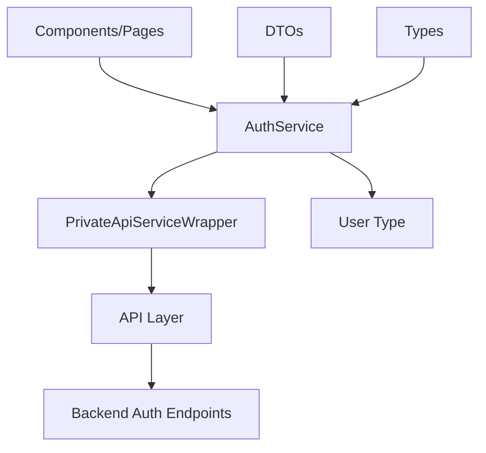

# AuthService Pattern Documentation

## Pattern Overview

The **AuthService Pattern** is a service layer implementation that provides a centralized, type-safe interface for all authentication-related operations in a web application. This pattern encapsulates authentication business logic, manages API communication, and provides a consistent interface for components to interact with authentication endpoints.

**When to use this pattern:**
- Building applications with user authentication requirements
- Need to centralize authentication logic across multiple components
- Requiring consistent error handling and request management for auth operations
- Implementing type-safe API communication with proper cancellation support

## Architecture



### Core Components

1. **AuthService**: Main service export providing authentication methods
2. **PrivateApiServiceWrapper**: Wrapper handling authenticated API requests
3. **DTOs**: Data Transfer Objects for request validation and type safety
4. **Types**: Response type definitions (User)

## Implementation Details

### Service Wrapper Pattern
```typescript
export const AuthService = PrivateApiServiceWrapper((api) => ({
  // Methods that return an object with auth operations
}));
```

The service uses a **factory function pattern** where:
- `PrivateApiServiceWrapper` provides the configured API client
- Returns an object containing all authentication methods
- Each method receives the same `api` instance with consistent configuration

### Method Signature Pattern
```typescript
async methodName(
  dto: RequestDto, 
  signal?: AbortSignal
): Promise<ReturnType>
```

**Key characteristics:**
- Async/await for promise handling
- Strongly typed DTOs for request data
- Optional `AbortSignal` for request cancellation
- Explicit return type promises

## Usage Examples

### Basic Authentication Flow
```typescript
import { AuthService } from '@/lib/services/auth-service';

// Component usage
const LoginComponent = () => {
  const [loading, setLoading] = useState(false);
  
  const handleLogin = async (credentials: UserLoginDto) => {
    const controller = new AbortController();
    setLoading(true);
    
    try {
      const user = await AuthService.login(credentials, controller.signal);
      // Handle successful login
      console.log('Logged in user:', user);
    } catch (error) {
      // Handle login error
      console.error('Login failed:', error);
    } finally {
      setLoading(false);
    }
  };
  
  // Cleanup on unmount
  useEffect(() => {
    return () => controller.abort();
  }, []);
};
```

### Password Recovery Flow
```typescript
// Forgot password
const handleForgotPassword = async (email: string) => {
  try {
    await AuthService.forgotPassword({ email });
    showNotification('Reset email sent');
  } catch (error) {
    showError('Failed to send reset email');
  }
};

// Reset password
const handleResetPassword = async (token: string, newPassword: string) => {
  try {
    await AuthService.resetPassword({ token, password: newPassword });
    showNotification('Password reset successful');
    router.push('/login');
  } catch (error) {
    showError('Password reset failed');
  }
};
```

### Email Verification
```typescript
// Email verification on page load
useEffect(() => {
  const verifyEmailToken = async () => {
    const token = searchParams.get('token');
    if (token) {
      try {
        await AuthService.verifyEmail(token);
        showNotification('Email verified successfully');
      } catch (error) {
        showError('Email verification failed');
      }
    }
  };
  
  verifyEmailToken();
}, [searchParams]);
```

## Best Practices

### 1. Request Cancellation
Always provide AbortSignal for long-running operations:
```typescript
const controller = new AbortController();

// Pass signal to service methods
await AuthService.login(dto, controller.signal);

// Cancel if component unmounts
useEffect(() => () => controller.abort(), []);
```

### 2. Error Handling Strategy
Implement consistent error handling patterns:
```typescript
const handleAuthOperation = async (operation: () => Promise<any>) => {
  try {
    await operation();
  } catch (error) {
    if (error.name === 'AbortError') {
      // Request was cancelled, don't show error
      return;
    }
    
    // Handle specific auth errors
    if (error.status === 401) {
      redirectToLogin();
    } else if (error.status === 422) {
      showValidationErrors(error.data);
    } else {
      showGenericError();
    }
  }
};
```

### 3. State Management Integration
```typescript
// With Redux/Zustand
const useAuthStore = () => {
  const login = async (dto: UserLoginDto) => {
    const user = await AuthService.login(dto);
    setUser(user);
    setIsAuthenticated(true);
  };
  
  const logout = async () => {
    await AuthService.logout();
    setUser(null);
    setIsAuthenticated(false);
  };
};
```

## Integration

### DTO Integration
```typescript
// Define strong typing for requests
interface UserLoginDto {
  email: string;
  password: string;
  rememberMe?: boolean;
}

// Service automatically validates and uses DTO
await AuthService.login({
  email: "user@example.com",
  password: "securePassword",
  rememberMe: true
});
```

### Router Integration
```typescript
// Next.js App Router integration
'use client';

export default function AuthPage() {
  const router = useRouter();
  
  const handleAuthSuccess = (user: User) => {
    // Redirect based on user role or intended destination
    const redirectUrl = user.role === 'admin' ? '/dashboard' : '/profile';
    router.push(redirectUrl);
  };
}
```

### Middleware Integration
```typescript
// API middleware for token management
const apiMiddleware = (api) => {
  api.interceptors.response.use(
    (response) => response,
    async (error) => {
      if (error.status === 401) {
        // Token expired, attempt refresh or logout
        await AuthService.logout();
        window.location.href = '/login';
      }
      return Promise.reject(error);
    }
  );
};
```

## Type Safety

### Generic Service Pattern
```typescript
// Type-safe service wrapper
type AuthServiceMethods = {
  signup(dto: UserSignUpDto, signal?: AbortSignal): Promise<User>;
  login(dto: UserLoginDto, signal?: AbortSignal): Promise<User>;
  logout(signal?: AbortSignal): Promise<void>;
  // ... other methods
};

// Ensures all methods are properly typed
const AuthService: AuthServiceMethods = PrivateApiServiceWrapper(/*...*/);
```

### DTO Validation Types
```typescript
// Runtime validation with type safety
import { z } from 'zod';

const UserLoginSchema = z.object({
  email: z.string().email(),
  password: z.string().min(8),
});

type UserLoginDto = z.infer<typeof UserLoginSchema>;

// Validate before service call
const validateAndLogin = async (data: unknown) => {
  const dto = UserLoginSchema.parse(data); // Throws if invalid
  return await AuthService.login(dto);
};
```

## Performance

### Request Optimization
```typescript
// Implement request deduplication
const pendingRequests = new Map<string, Promise<any>>();

const optimizedAuthService = {
  async login(dto: UserLoginDto, signal?: AbortSignal) {
    const key = `login-${JSON.stringify(dto)}`;
    
    if (pendingRequests.has(key)) {
      return pendingRequests.get(key);
    }
    
    const promise = AuthService.login(dto, signal);
    pendingRequests.set(key, promise);
    
    try {
      const result = await promise;
      return result;
    } finally {
      pendingRequests.delete(key);
    }
  }
};
```

### Caching Strategy
```typescript
// Cache user data after successful authentication
const authCache = new Map<string, { user: User; timestamp: number }>();

const getCachedUser = (token: string): User | null => {
  const cached = authCache.get(token);
  if (cached && Date.now() - cached.timestamp < 300000) { // 5 minutes
    return cached.user;
  }
  return null;
};
```

## Testing

### Unit Testing
```typescript
// Mock the service wrapper
jest.mock('@/lib/service-wrappers', () => ({
  PrivateApiServiceWrapper: (factory) => factory({
    post: jest.fn(),
    get: jest.fn(),
  }),
}));

describe('AuthService', () => {
  const mockApi = {
    post: jest.fn(),
    get: jest.fn(),
  };

  beforeEach(() => {
    jest.clearAllMocks();
  });

  it('should login successfully', async () => {
    const mockUser = { id: '1', email: 'test@example.com' };
    mockApi.post.mockResolvedValue({
      json: () => Promise.resolve(mockUser),
    });

    const result = await AuthService.login({
      email: 'test@example.com',
      password: 'password',
    });

    expect(mockApi.post).toHaveBeenCalledWith('/auth/login', {
      email: 'test@example.com',
      password: 'password',
    }, { signal: undefined });
    expect(result).toEqual(mockUser);
  });
});
```

### Integration Testing
```typescript
// Test complete authentication flow
import { render, screen, fireEvent, waitFor } from '@testing-library/react';

test('complete login flow', async () => {
  render(<LoginForm />);
  
  fireEvent.change(screen.getByLabelText(/email/i), {
    target: { value: 'test@example.com' }
  });
  fireEvent.change(screen.getByLabelText(/password/i), {
    target: { value: 'password123' }
  });
  
  fireEvent.click(screen.getByRole('button', { name: /login/i }));
  
  await waitFor(() => {
    expect(screen.getByText(/welcome/i)).toBeInTheDocument();
  });
});
```

## Common Pitfalls

### 1. Missing Request Cancellation
```typescript
// ❌ Bad - No cleanup
const handleLogin = async () => {
  await AuthService.login(dto); // Request continues even if component unmounts
};

// ✅ Good - Proper cleanup
const handleLogin = async () => {
  const controller = new AbortController();
  await AuthService.login(dto, controller.signal);
  
  // Cleanup function
  return () => controller.abort();
};
```

### 2. Inconsistent Error Handling
```typescript
// ❌ Bad - Different error handling per method
try {
  await AuthService.login(dto);
} catch (error) {
  alert(error.message); // Inconsistent UX
}

// ✅ Good - Centralized error handling
const handleAuthError = (error: ApiError) => {
  if (error.status === 401) return showLoginRequired();
  if (error.status === 422) return showValidationErrors(error.data);
  showGenericError();
};
```

### 3. Memory Leaks with Pending Requests
```typescript
// ❌ Bad - No request cleanup
useEffect(() => {
  AuthService.verifyEmail(token);
}, []); // Component unmount doesn't cancel request

// ✅ Good - Proper cleanup
useEffect(() => {
  const controller = new AbortController();
  AuthService.verifyEmail(token, controller.signal)
    .catch(error => {
      if (error.name !== 'AbortError') {
        handleError(error);
      }
    });
  
  return () => controller.abort();
}, [token]);
```

### 4. Missing Type Validation
```typescript
// ❌ Bad - Runtime errors possible
const handleSignup = async (formData: any) => {
  await AuthService.signup(formData); // Could fail if formData is invalid
};

// ✅ Good - Validate before service call
const handleSignup = async (formData: unknown) => {
  const dto = UserSignUpSchema.parse(formData);
  await AuthService.signup(dto);
};
```

This pattern provides a robust, type-safe foundation for authentication services that scales well with application complexity while maintaining clean separation of concerns and excellent developer experience.