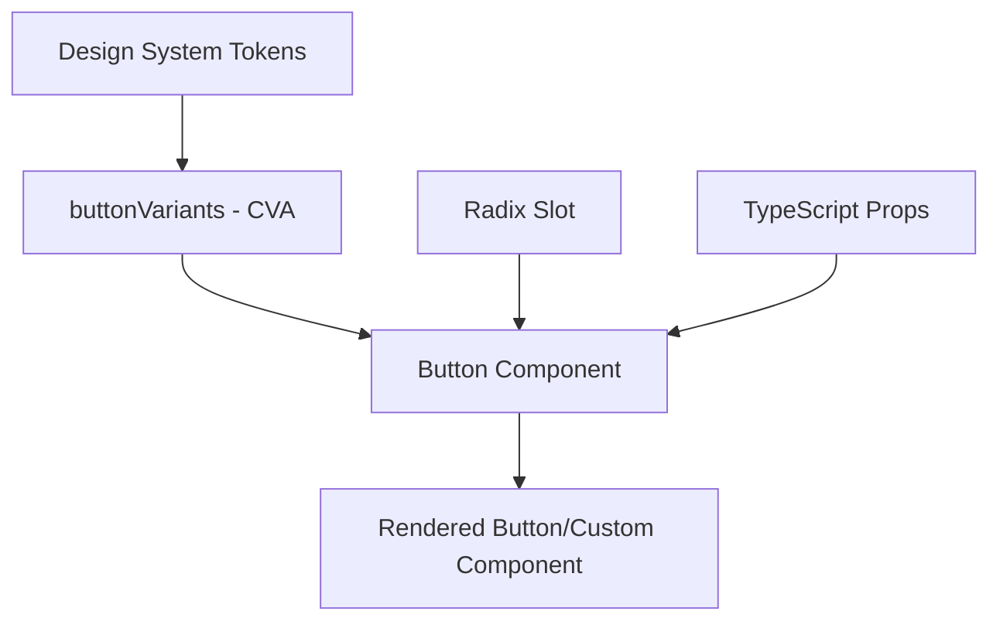

# UI Button Component Pattern

## Pattern Overview

This pattern implements a highly flexible, accessible button component using modern React and TypeScript practices. It combines **Class Variance Authority (CVA)** for type-safe style variants, **Radix UI Slot** for polymorphic rendering, and a comprehensive design system integration.

**When to use this pattern:**
- Building design system components that need multiple visual variants
- Creating reusable UI components with consistent styling and behavior
- Implementing accessible, keyboard-navigable interactive elements
- Supporting both button elements and custom component rendering (polymorphism)

## Architecture



### Core Components

1. **`buttonVariants`** - CVA configuration defining all visual states and combinations
2. **`ButtonProps`** - TypeScript interface extending HTML button attributes
3. **`Button`** - React component implementing the rendering logic

### Design System Integration

The component integrates deeply with a custom design system using semantic color tokens:
- `pg*` prefixed tokens (e.g., `pgBackground-950`, `pgText-0`)
- Alpha channel variants (e.g., `alphaSapphire/10`)
- State-specific tokens (e.g., `pgStateError-dark`)

## Implementation Details

### Class Variance Authority (CVA) Pattern

```tsx
export const buttonVariants = cva(
  // Base classes applied to all variants
  'inline-flex items-center justify-center whitespace-nowrap ring-offset-2...',
  {
    variants: {
      variant: { /* style variants */ },
      size: { /* size variants */ },
      onlyIcon: { /* icon-only modifications */ },
      // ... other variant dimensions
    },
    compoundVariants: [
      // Complex combinations of multiple variants
      {
        variant: 'neutralStroke',
        onlyIcon: true,
        class: 'text-pgIcon-600 hover:text-pgIcon-950...',
      }
    ],
    defaultVariants: {
      variant: 'primaryFilled',
      size: 'md',
      onlyIcon: false,
    },
  }
);
```

### Polymorphic Component Pattern

```tsx
const Comp = asChild ? Slot : 'button';
return <Comp {...other} className={...} ref={ref} />;
```

This enables the component to render as different elements while maintaining the same API.

## Usage Examples

### Basic Button Usage

```tsx
import { Button } from '@/components/ui/button';

// Default primary filled button
<Button>Click me</Button>

// Different variants
<Button variant="neutralStroke" size="xl">
  Large Neutral Button
</Button>

// Error state button
<Button variant="errorFilled" size="sm">
  Delete Item
</Button>
```

### Icon-Only Buttons

```tsx
import { TrashIcon } from 'lucide-react';

<Button variant="neutralGhost" size="xs" onlyIcon>
  <TrashIcon className="h-4 w-4" />
</Button>
```

### Polymorphic Usage (asChild)

```tsx
import Link from 'next/link';

// Renders as a Link component with button styling
<Button asChild variant="primaryLink">
  <Link href="/dashboard">Go to Dashboard</Link>
</Button>
```

### Active State Toggle

```tsx
const [isActive, setIsActive] = useState(false);

<Button 
  variant="primaryStroke" 
  isActive={isActive}
  onClick={() => setIsActive(!isActive)}
>
  Toggle Button
</Button>
```

## Best Practices

### 1. Variant Organization
```tsx
// Group related variants together
variants: {
  // Primary variants (main CTA actions)
  primaryFilled: '...',
  primaryStroke: '...',
  primaryGhost: '...',
  
  // Neutral variants (secondary actions)
  neutralFilled: '...',
  neutralStroke: '...',
  
  // State variants (error, success, etc.)
  errorFilled: '...',
  errorStroke: '...',
}
```

### 2. Compound Variants for Complex Logic
```tsx
compoundVariants: [
  // Handle specific size + variant combinations
  {
    variant: 'neutralLighter',
    size: ['xl', 'md', 'sm'], // Multiple sizes
    onlyIcon: false,
    class: 'specific-styling-for-this-combination',
  }
]
```

### 3. Accessibility Considerations
```tsx
// Always include focus-visible styles
'focus-visible:outline-none focus-visible:ring-2'

// Proper disabled state handling
'disabled:pointer-events-none disabled:bg-pgBackground-50'

// Icon accessibility
<Button onlyIcon aria-label="Delete item">
  <TrashIcon />
</Button>
```

## Integration

### With State Management

```tsx
// Redux/Zustand integration
const { isLoading, submitForm } = useFormStore();

<Button 
  variant="primaryFilled"
  disabled={isLoading}
  onClick={submitForm}
>
  {isLoading ? 'Submitting...' : 'Submit'}
</Button>
```

### With Form Libraries

```tsx
// React Hook Form integration
const { register, formState: { isSubmitting } } = useForm();

<Button 
  type="submit"
  disabled={isSubmitting}
  variant="primaryFilled"
>
  Submit Form
</Button>
```

### With Routing Libraries

```tsx
// Next.js Link integration
<Button asChild variant="primaryLink">
  <Link href="/profile">View Profile</Link>
</Button>

// React Router integration  
<Button asChild variant="neutralStroke">
  <NavLink to="/settings">Settings</NavLink>
</Button>
```

## Type Safety

### Core Type Definitions

```tsx
// Extends HTML button attributes for full DOM compatibility
interface ButtonProps
  extends ButtonHTMLAttributes<HTMLButtonElement>,
    VariantProps<typeof buttonVariants> {
  asChild?: boolean;
  isActive?: boolean;
  ref?: RefObject<HTMLButtonElement>;
}
```

### CVA Type Integration

```tsx
// VariantProps automatically generates types from CVA config
type ButtonVariants = VariantProps<typeof buttonVariants>;
// Results in: { variant?: 'primaryFilled' | 'primaryStroke' | ..., size?: 'xl' | 'md' | ... }
```

### Advanced Type Patterns

```tsx
// Conditional props based on variant
type ConditionalButtonProps<T extends ButtonProps['variant']> = 
  T extends 'primaryLink' | 'neutralLink' 
    ? ButtonProps & { href?: string }
    : ButtonProps;

// Usage with generic constraint
function TypedButton<V extends ButtonProps['variant']>(
  props: ConditionalButtonProps<V>
) {
  return <Button {...props} />;
}
```

## Performance

### CSS-in-JS Optimization

```tsx
// CVA generates atomic CSS classes, avoiding runtime style computation
const buttonVariants = cva(/* ... */); // Computed once at build time

// Runtime performance is O(1) for class name generation
className={cn(buttonVariants({ variant, size }))}
```

### Bundle Size Considerations

```tsx
// Tree-shakeable exports
export { buttonVariants, Button };

// Conditional imports for large icon sets
const IconComponent = lazy(() => import('./icons/SpecificIcon'));
```

### Memoization Strategies

```tsx
// Memoize expensive button configurations
const MemoizedButton = memo(Button);

// Or memoize specific variant combinations
const PrimaryButton = memo((props: Omit<ButtonProps, 'variant'>) => (
  <Button variant="primaryFilled" {...props} />
));
```

## Testing

### Unit Testing with Jest/Testing Library

```tsx
import { render, screen } from '@testing-library/react';
import userEvent from '@testing-library/user-event';
import { Button } from './button';

describe('Button Component', () => {
  it('renders with correct variant classes', () => {
    render(<Button variant="primaryFilled">Test</Button>);
    const button = screen.getByRole('button');
    expect(button).toHaveClass('bg-pgBackground-950');
  });

  it('handles click events', async () => {
    const handleClick = jest.fn();
    render(<Button onClick={handleClick}>Click me</Button>);
    
    await userEvent.click(screen.getByRole('button'));
    expect(handleClick).toHaveBeenCalledTimes(1);
  });

  it('renders as child component when asChild is true', () => {
    render(
      <Button asChild>
        <a href="/test">Link Button</a>
      </Button>
    );
    
    expect(screen.getByRole('link')).toBeInTheDocument();
    expect(screen.queryByRole('button')).not.toBeInTheDocument();
  });
});
```

### Visual Regression Testing

```tsx
// Storybook story for visual testing
export const AllVariants: Story = {
  render: () => (
    <div className="space-y-4">
      {Object.keys(buttonVariants.variants.variant).map(variant => (
        <Button key={variant} variant={variant}>
          {variant} Button
        </Button>
      ))}
    </div>
  ),
};
```

### Accessibility Testing

```tsx
import { axe, toHaveNoViolations } from 'jest-axe';

expect.extend(toHaveNoViolations);

it('should not have accessibility violations', async () => {
  const { container } = render(<Button>Accessible Button</Button>);
  const results = await axe(container);
  expect(results).toHaveNoViolations();
});
```

## Common Pitfalls

### 1. **Compound Variant Conflicts**

```tsx
// ❌ Conflicting compound variants
compoundVariants: [
  { variant: 'primary', size: 'sm', class: 'p-2' },
  { variant: 'primary', size: 'sm', class: 'p-4' }, // Conflicts!
]

// ✅ Use more specific conditions
compoundVariants: [
  { variant: 'primary', size: 'sm', onlyIcon: false, class: 'p-2' },
  { variant: 'primary', size: 'sm', onlyIcon: true, class: 'p-4' },
]
```

### 2. **Missing Forwarded Props**

```tsx
// ❌ Not forwarding HTML attributes
export function Button({ variant, size, children }: ButtonProps) {
  return <button className={...}>{children}</button>;
}

// ✅ Forward all HTML attributes
export function Button({ variant, size, className, ...other }: ButtonProps) {
  return <button {...other} className={cn(buttonVariants({...}))} />;
}
```

### 3. **Incorrect asChild Usage**

```tsx
// ❌ Passing button-specific props to non-button elements
<Button asChild type="submit"> {/* type="submit" invalid for links */}
  <Link href="/page">Navigate</Link>
</Button>

// ✅ Conditional props based on asChild
const buttonOnlyProps = asChild ? {} : { type: 'submit' };
<Button {...buttonOnlyProps}>Content</Button>
```

### 4. **Design Token Inconsistencies**

```tsx
// ❌ Hardcoded colors breaking design system
variant: {
  custom: 'bg-red-500 text-white', // Bypasses design system
}

// ✅ Use design system tokens
variant: {
  custom: 'bg-pgRed-500 text-pgText-0', // Consistent with system
}
```

### 5. **Accessibility Oversights**

```tsx
// ❌ Icon-only button without label
<Button onlyIcon>
  <TrashIcon />
</Button>

// ✅ Always provide accessible labels
<Button onlyIcon aria-label="Delete item">
  <TrashIcon />
</Button>
```

This pattern provides a robust foundation for building consistent, accessible, and maintainable UI components while leveraging modern React and TypeScript best practices.