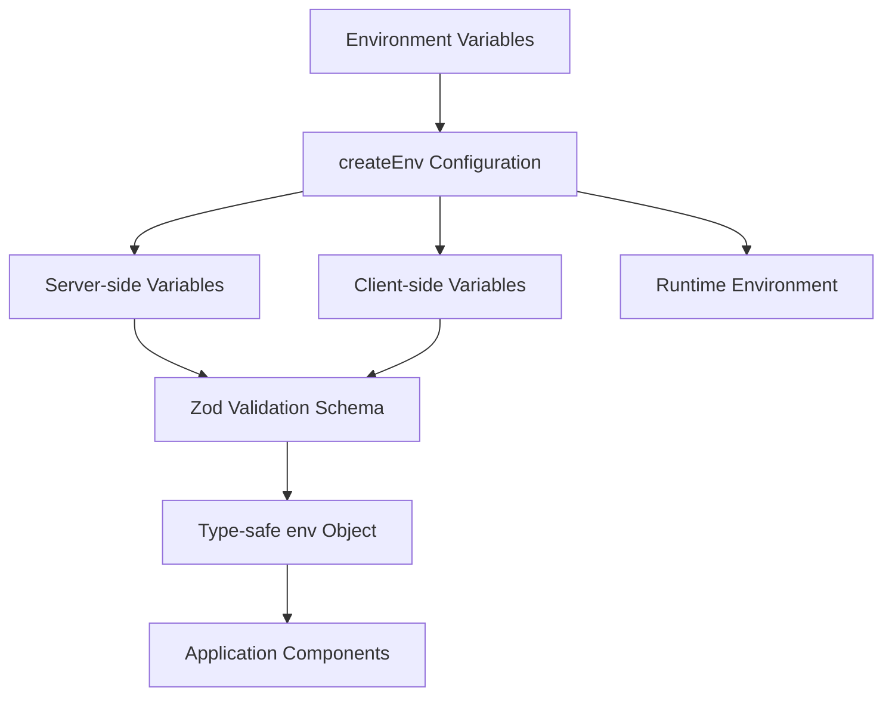

# Environment Configuration Pattern Documentation

## Pattern Overview

The Environment Configuration Pattern provides a type-safe, validated approach to managing environment variables in Next.js applications. This pattern uses `@t3-oss/env-nextjs` and Zod validation to ensure environment variables are properly typed, validated, and accessible throughout the application with compile-time safety.

**When to use this pattern:**
- Next.js applications requiring environment variable management
- Projects needing compile-time validation of configuration
- Applications with both server-side and client-side environment variables
- Teams requiring strict type safety for configuration values

## Architecture



The pattern is structured around three main sections:
- **Server Configuration**: Variables accessible only on the server
- **Client Configuration**: Variables prefixed with `NEXT_PUBLIC_` for client access
- **Runtime Environment**: Explicit mapping for client variables in Next.js 13.4.4+

## Implementation Details

### Core Dependencies
```typescript
import { createEnv } from '@t3-oss/env-nextjs';
import { z } from 'zod';
```

### Key Implementation Techniques

1. **Separation of Concerns**: Server and client variables are explicitly separated
2. **Schema Validation**: Each variable has a Zod schema defining its expected type and constraints
3. **Runtime Mapping**: Client variables are explicitly mapped for Next.js compatibility
4. **Type Inference**: TypeScript types are automatically inferred from Zod schemas

### Variable Categories

**Server Variables** (5 variables):
- API keys and secrets
- Service configuration
- Build-time URLs

**Client Variables** (23 variables):
- Public API endpoints
- Feature flags
- Third-party service keys
- UI configuration

## Usage Examples

### Basic Usage
```typescript
import { env } from '@/env';

// Server-side usage (API routes, getServerSideProps, etc.)
export async function GET() {
  const apiKey = env.API_KEY; // Type: string
  const sentryToken = env.SENTRY_AUTH_TOKEN; // Type: string
  
  // Use in API calls
  const response = await fetch(`https://api.service.com/data`, {
    headers: { Authorization: `Bearer ${apiKey}` }
  });
}
```

### Client-side Usage
```typescript
import { env } from '@/env';

// Client component
export function ApiClient() {
  const baseUrl = env.NEXT_PUBLIC_API_BASE_URL; // Type: string
  const companyName = env.NEXT_PUBLIC_COMPANY_NAME; // Type: string
  
  useEffect(() => {
    fetch(`${baseUrl}/api/data`)
      .then(response => response.json());
  }, [baseUrl]);
  
  return <div>{companyName}</div>;
}
```

### Conditional Usage with Optional Variables
```typescript
import { env } from '@/env';

// Analytics setup with optional variables
function setupAnalytics() {
  if (env.NEXT_PUBLIC_POSTHOG_KEY && env.NEXT_PUBLIC_POSTHOG_HOST) {
    // Initialize PostHog
    posthog.init(env.NEXT_PUBLIC_POSTHOG_KEY, {
      api_host: env.NEXT_PUBLIC_POSTHOG_HOST
    });
  }
  
  if (env.NEXT_PUBLIC_SEGMENT_WRITE_KEY) {
    // Initialize Segment
    analytics.load(env.NEXT_PUBLIC_SEGMENT_WRITE_KEY);
  }
}
```

## Best Practices

### 1. Schema Design
```typescript
// Use specific validation rules
server: {
  API_KEY: z.string().min(32), // Enforce minimum length
  SITEMAP_URL: z.string().url(), // Validate URL format
  PORT: z.string().regex(/^\d+$/).transform(Number), // Transform to number
}
```

### 2. Environment-Specific Defaults
```typescript
client: {
  NEXT_PUBLIC_API_BASE_URL: z.string().url().default(
    process.env.NODE_ENV === 'development' 
      ? 'http://localhost:3000/api'
      : 'https://api.production.com'
  ),
}
```

### 3. Grouping Related Variables
```typescript
// Group by service or feature
server: {
  // Sentry configuration
  SENTRY_AUTH_TOKEN: z.string(),
  SENTRY_PROJECT: z.string(),
  
  // External APIs
  API_KEY: z.string(),
  UPTIME_API_KEY: z.string(),
}
```

### 4. Documentation Comments
```typescript
server: {
  /**
   * Main API authentication key
   * Required for all external API calls
   */
  API_KEY: z.string(),
  
  /**
   * Sentry authentication token for error reporting
   * Format: sntrys_xxxxx
   */
  SENTRY_AUTH_TOKEN: z.string(),
}
```

## Integration

### With Next.js API Routes
```typescript
// pages/api/data.ts or app/api/data/route.ts
import { env } from '@/env';

export async function GET() {
  const response = await fetch(`${env.SITEMAP_URL}/api/external`, {
    headers: { 'X-API-Key': env.API_KEY }
  });
  
  return Response.json(await response.json());
}
```

### With React Components
```typescript
// components/analytics.tsx
import { env } from '@/env';

export function AnalyticsProvider({ children }: { children: React.ReactNode }) {
  useEffect(() => {
    if (env.NEXT_PUBLIC_SEGMENT_WRITE_KEY) {
      analytics.load(env.NEXT_PUBLIC_SEGMENT_WRITE_KEY);
    }
  }, []);
  
  return <>{children}</>;
}
```

### With Configuration Objects
```typescript
// config/services.ts
import { env } from '@/env';

export const serviceConfig = {
  sentry: {
    dsn: env.NEXT_PUBLIC_SENTRY_DSN,
    org: env.NEXT_PUBLIC_SENTRY_ORG,
    authToken: env.SENTRY_AUTH_TOKEN, // Server-side only
  },
  stripe: {
    publishableKey: env.NEXT_PUBLIC_STRIPE_PUBLISHABLE_KEY,
  },
} as const;
```

## Type Safety

### Automatic Type Inference
```typescript
// Types are automatically inferred from Zod schemas
const apiKey: string = env.API_KEY;
const isOptional: string | undefined = env.NEXT_PUBLIC_POSTHOG_KEY;
const urlValidated: string = env.NEXT_PUBLIC_API_BASE_URL; // Guaranteed valid URL
```

### Custom Type Extensions
```typescript
// types/env.d.ts
declare global {
  namespace NodeJS {
    interface ProcessEnv {
      // Extend with additional type information if needed
      CUSTOM_ENV_VAR: string;
    }
  }
}
```

### Type Guards for Optional Variables
```typescript
function hasPostHogConfig(): boolean {
  return !!(env.NEXT_PUBLIC_POSTHOG_KEY && env.NEXT_PUBLIC_POSTHOG_HOST);
}

if (hasPostHogConfig()) {
  // TypeScript knows these are defined
  initPostHog(env.NEXT_PUBLIC_POSTHOG_KEY, env.NEXT_PUBLIC_POSTHOG_HOST);
}
```

## Performance

### Build-Time Validation
- Environment variables are validated at build time, preventing runtime errors
- Invalid configurations fail fast during development

### Runtime Optimization
```typescript
// Variables are cached after first validation
const config = {
  apiUrl: env.NEXT_PUBLIC_API_BASE_URL, // Computed once
  features: {
    analytics: !!env.NEXT_PUBLIC_SEGMENT_WRITE_KEY,
    monitoring: !!env.NEXT_PUBLIC_POSTHOG_KEY,
  }
};
```

### Bundle Size Considerations
```typescript
// Client variables are included in bundle
// Keep client variables minimal and use server variables when possible
client: {
  // Only include what's absolutely needed on client
  NEXT_PUBLIC_API_BASE_URL: z.string().url(),
}
```

## Testing

### Unit Tests
```typescript
// __tests__/env.test.ts
import { env } from '@/env';

describe('Environment Configuration', () => {
  it('should have required server variables', () => {
    expect(env.API_KEY).toBeDefined();
    expect(env.SENTRY_AUTH_TOKEN).toBeDefined();
  });
  
  it('should validate URL formats', () => {
    expect(() => new URL(env.NEXT_PUBLIC_API_BASE_URL)).not.toThrow();
    expect(() => new URL(env.SITEMAP_URL)).not.toThrow();
  });
});
```

### Integration Tests
```typescript
// __tests__/api.test.ts
import { env } from '@/env';

describe('API Integration', () => {
  it('should connect to external services', async () => {
    const response = await fetch(`${env.NEXT_PUBLIC_API_BASE_URL}/health`);
    expect(response.ok).toBe(true);
  });
});
```

### Environment-Specific Testing
```typescript
// jest.config.js
module.exports = {
  setupFilesAfterEnv: ['<rootDir>/jest.setup.js'],
};

// jest.setup.js
process.env.NEXT_PUBLIC_API_BASE_URL = 'http://localhost:3000';
process.env.API_KEY = 'test-api-key';
```

## Common Pitfalls

### 1. Missing Runtime Environment Mapping
```typescript
// ❌ Wrong: Client variables not mapped in runtime environment
client: {
  NEXT_PUBLIC_NEW_VAR: z.string(),
}
// Missing from experimental__runtimeEnv

// ✅ Correct: Always map client variables
experimental__runtimeEnv: {
  NEXT_PUBLIC_NEW_VAR: process.env.NEXT_PUBLIC_NEW_VAR,
}
```

### 2. Server Variables in Client Code
```typescript
// ❌ Wrong: Using server variables in client components
export function ClientComponent() {
  const apiKey = env.API_KEY; // Error: Not available on client
}

// ✅ Correct: Use client variables or pass from server
export function ClientComponent({ apiEndpoint }: { apiEndpoint: string }) {
  // Use passed prop or NEXT_PUBLIC_ variable
}
```

### 3. Incorrect Zod Schema Types
```typescript
// ❌ Wrong: Using string for numeric values
client: {
  NEXT_PUBLIC_PORT: z.string(), // Should be transformed to number
}

// ✅ Correct: Transform to appropriate type
client: {
  NEXT_PUBLIC_PORT: z.string().transform(Number),
  // or
  NEXT_PUBLIC_PORT: z.coerce.number(),
}
```

### 4. Not Handling Optional Variables
```typescript
// ❌ Wrong: Assuming optional variables are always present
const host = env.NEXT_PUBLIC_POSTHOG_HOST.toLowerCase(); // Error if undefined

// ✅ Correct: Check for existence first
const host = env.NEXT_PUBLIC_POSTHOG_HOST?.toLowerCase();
```

### 5. Hardcoding Environment Values
```typescript
// ❌ Wrong: Hardcoding values that should be configurable
const API_URL = 'https://api.production.com';

// ✅ Correct: Use environment variables
const API_URL = env.NEXT_PUBLIC_API_BASE_URL;
```

This pattern provides a robust foundation for environment variable management in Next.js applications, ensuring type safety, validation, and proper separation between server and client configuration.