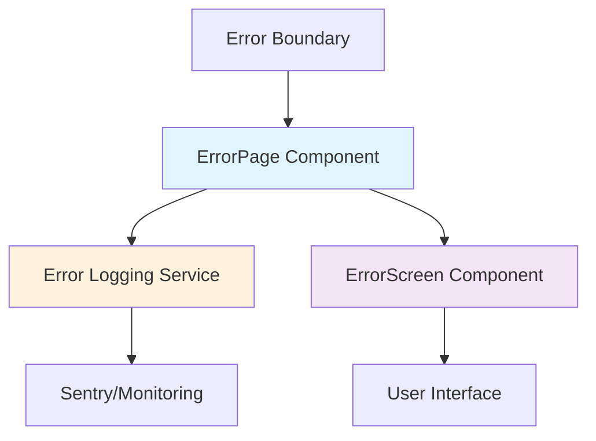

# Error Page Component Pattern

## Pattern Overview

The Error Page pattern is a React component design that provides centralized error handling, logging, and user-friendly error display for application-level errors. This pattern combines error boundary functionality with automated error reporting and recovery mechanisms.

**When to use this pattern:**
- Handling unrecoverable application errors
- Providing fallback UI when components fail to render
- Implementing centralized error logging and monitoring
- Creating consistent error experiences across the application

## Architecture



### Component Structure

```
error/
├── error-page.tsx          # Main error handling component
├── error-screen.tsx        # UI presentation component
└── index.ts               # Barrel exports
```

## Implementation Details

### Core Implementation

```tsx
'use client';

import React, { FC, useEffect } from 'react';
import { ErrorPageProps } from '@/lib/types';
import { captureException, SentryScope } from '@/lib/utils/sentry';
import { ErrorScreen } from './error-screen';

export const ErrorPage: FC<ErrorPageProps> = (props) => {
  const { error, reset } = props;

  useEffect(() => {
    captureException(error, { 
      scope: SentryScope.ERROR_PAGE, 
      extra: null 
    });
  }, [error]);

  return <ErrorScreen code={error.digest} onRefresh={reset} />;
};
```

### Key Implementation Techniques

1. **Separation of Concerns**: Error handling logic separated from UI presentation
2. **Side Effect Management**: Using `useEffect` for error logging
3. **Dependency Injection**: Error reporting service injected via utilities
4. **Client-Side Rendering**: `'use client'` directive for Next.js compatibility

## Usage Examples

### Basic Error Boundary Integration

```tsx
// app/error.tsx (Next.js App Router)
'use client';

import { ErrorPage } from '@/components/error/error-page';

interface ErrorProps {
  error: Error & { digest?: string };
  reset: () => void;
}

export default function Error({ error, reset }: ErrorProps) {
  return <ErrorPage error={error} reset={reset} />;
}
```

### Custom Error Boundary Wrapper

```tsx
// components/error-boundary.tsx
import React, { Component, ReactNode } from 'react';
import { ErrorPage } from '@/components/error/error-page';

interface Props {
  children: ReactNode;
  fallback?: ReactNode;
}

interface State {
  hasError: boolean;
  error?: Error;
}

export class ErrorBoundary extends Component<Props, State> {
  constructor(props: Props) {
    super(props);
    this.state = { hasError: false };
  }

  static getDerivedStateFromError(error: Error): State {
    return { hasError: true, error };
  }

  componentDidCatch(error: Error, errorInfo: React.ErrorInfo) {
    console.error('Error boundary caught an error:', error, errorInfo);
  }

  render() {
    if (this.state.hasError && this.state.error) {
      return (
        <ErrorPage 
          error={this.state.error} 
          reset={() => this.setState({ hasError: false, error: undefined })}
        />
      );
    }

    return this.props.children;
  }
}
```

### Advanced Error Context Provider

```tsx
// contexts/error-context.tsx
import React, { createContext, useContext, ReactNode, useState } from 'react';

interface ErrorContextValue {
  reportError: (error: Error, context?: Record<string, any>) => void;
  clearError: () => void;
  hasError: boolean;
}

const ErrorContext = createContext<ErrorContextValue | undefined>(undefined);

export const ErrorProvider: React.FC<{ children: ReactNode }> = ({ children }) => {
  const [hasError, setHasError] = useState(false);

  const reportError = (error: Error, context?: Record<string, any>) => {
    captureException(error, { 
      scope: SentryScope.MANUAL_REPORT,
      extra: context 
    });
    setHasError(true);
  };

  const clearError = () => setHasError(false);

  return (
    <ErrorContext.Provider value={{ reportError, clearError, hasError }}>
      {children}
    </ErrorContext.Provider>
  );
};

export const useError = () => {
  const context = useContext(ErrorContext);
  if (!context) {
    throw new Error('useError must be used within ErrorProvider');
  }
  return context;
};
```

## Best Practices

### 1. Error Categorization

```tsx
// lib/types/error.ts
export enum ErrorCategory {
  NETWORK = 'network',
  VALIDATION = 'validation',
  AUTHENTICATION = 'authentication',
  PERMISSION = 'permission',
  SYSTEM = 'system'
}

export interface CategorizedError extends Error {
  category: ErrorCategory;
  userMessage?: string;
  retryable?: boolean;
}

// Enhanced ErrorPage
export const ErrorPage: FC<ErrorPageProps> = ({ error, reset }) => {
  const categorizedError = error as CategorizedError;
  
  useEffect(() => {
    captureException(error, { 
      scope: SentryScope.ERROR_PAGE,
      extra: {
        category: categorizedError.category,
        retryable: categorizedError.retryable
      }
    });
  }, [error, categorizedError.category, categorizedError.retryable]);

  return (
    <ErrorScreen 
      code={error.digest}
      category={categorizedError.category}
      userMessage={categorizedError.userMessage}
      onRefresh={categorizedError.retryable ? reset : undefined}
    />
  );
};
```

### 2. Error Recovery Strategies

```tsx
// components/error/error-page-with-recovery.tsx
export const ErrorPageWithRecovery: FC<ErrorPageProps> = ({ error, reset }) => {
  const [retryCount, setRetryCount] = useState(0);
  const [isRetrying, setIsRetrying] = useState(false);

  const handleRetry = async () => {
    if (retryCount >= 3) return;
    
    setIsRetrying(true);
    setRetryCount(prev => prev + 1);
    
    // Add delay for network-related errors
    if (error.message.includes('network')) {
      await new Promise(resolve => setTimeout(resolve, 1000 * retryCount));
    }
    
    setIsRetrying(false);
    reset();
  };

  return (
    <ErrorScreen 
      code={error.digest}
      onRefresh={handleRetry}
      isRetrying={isRetrying}
      retryCount={retryCount}
      maxRetries={3}
    />
  );
};
```

### 3. Development vs Production Behavior

```tsx
// lib/utils/error-handler.ts
export const handleError = (error: Error, isDevelopment: boolean) => {
  if (isDevelopment) {
    console.error('Development Error:', error);
    console.trace();
  }
  
  // Always report to monitoring in production
  if (!isDevelopment) {
    captureException(error, { 
      scope: SentryScope.ERROR_PAGE,
      extra: { environment: 'production' }
    });
  }
};

// Updated ErrorPage
export const ErrorPage: FC<ErrorPageProps> = ({ error, reset }) => {
  useEffect(() => {
    handleError(error, process.env.NODE_ENV === 'development');
  }, [error]);

  return <ErrorScreen code={error.digest} onRefresh={reset} />;
};
```

## Integration

### Next.js App Router Integration

```tsx
// app/global-error.tsx
'use client';

export default function GlobalError({
  error,
  reset,
}: {
  error: Error & { digest?: string };
  reset: () => void;
}) {
  return (
    <html>
      <body>
        <ErrorPage error={error} reset={reset} />
      </body>
    </html>
  );
}
```

### API Route Error Handling

```tsx
// lib/api/error-handler.ts
export const apiErrorHandler = (error: unknown) => {
  if (error instanceof Error) {
    captureException(error, { 
      scope: SentryScope.API_ERROR,
      extra: { timestamp: new Date().toISOString() }
    });
  }
  
  return new Response(
    JSON.stringify({ error: 'Internal Server Error' }),
    { status: 500, headers: { 'Content-Type': 'application/json' } }
  );
};
```

## Type Safety

### Core Type Definitions

```tsx
// lib/types/error.ts
export interface ErrorPageProps {
  error: Error & { digest?: string };
  reset: () => void;
  metadata?: ErrorMetadata;
}

export interface ErrorMetadata {
  timestamp: string;
  userId?: string;
  sessionId?: string;
  route?: string;
  userAgent?: string;
}

export interface ErrorScreenProps {
  code?: string;
  category?: ErrorCategory;
  userMessage?: string;
  onRefresh?: () => void;
  isRetrying?: boolean;
  retryCount?: number;
  maxRetries?: number;
}
```

### Utility Types

```tsx
// lib/types/sentry.ts
export interface SentryErrorContext {
  scope: SentryScope;
  extra: Record<string, any> | null;
  tags?: Record<string, string>;
  user?: {
    id?: string;
    email?: string;
  };
}

export type ErrorReporter = (
  error: Error, 
  context: SentryErrorContext
) => void;
```

## Performance

### Optimization Strategies

1. **Lazy Loading Error Components**
```tsx
// components/error/lazy-error-page.tsx
import { lazy, Suspense } from 'react';

const ErrorPageLazy = lazy(() => import('./error-page').then(module => ({ 
  default: module.ErrorPage 
})));

export const LazyErrorPage: FC<ErrorPageProps> = (props) => (
  <Suspense fallback={<div>Loading error handler...</div>}>
    <ErrorPageLazy {...props} />
  </Suspense>
);
```

2. **Debounced Error Reporting**
```tsx
// hooks/use-debounced-error.ts
import { useCallback, useRef } from 'react';

export const useDebouncedErrorReporting = (delay = 1000) => {
  const timeoutRef = useRef<NodeJS.Timeout>();

  return useCallback((error: Error) => {
    if (timeoutRef.current) {
      clearTimeout(timeoutRef.current);
    }

    timeoutRef.current = setTimeout(() => {
      captureException(error, { scope: SentryScope.ERROR_PAGE });
    }, delay);
  }, [delay]);
};
```

3. **Memoized Error Screen**
```tsx
// components/error/optimized-error-screen.tsx
import { memo } from 'react';

export const OptimizedErrorScreen = memo<ErrorScreenProps>(
  ({ code, onRefresh, ...props }) => {
    return <ErrorScreen code={code} onRefresh={onRefresh} {...props} />;
  },
  (prevProps, nextProps) => {
    return prevProps.code === nextProps.code && 
           prevProps.isRetrying === nextProps.isRetrying;
  }
);
```

## Testing

### Unit Testing

```tsx
// __tests__/error-page.test.tsx
import { render, screen } from '@testing-library/react';
import userEvent from '@testing-library/user-event';
import { ErrorPage } from '../error-page';
import { captureException } from '@/lib/utils/sentry';

jest.mock('@/lib/utils/sentry');

describe('ErrorPage', () => {
  const mockReset = jest.fn();
  const mockError = new Error('Test error');
  mockError.digest = 'test-digest';

  beforeEach(() => {
    jest.clearAllMocks();
  });

  it('should capture exception on mount', () => {
    render(<ErrorPage error={mockError} reset={mockReset} />);
    
    expect(captureException).toHaveBeenCalledWith(
      mockError,
      { scope: 'ERROR_PAGE', extra: null }
    );
  });

  it('should display error code', () => {
    render(<ErrorPage error={mockError} reset={mockReset} />);
    
    expect(screen.getByText(/test-digest/i)).toBeInTheDocument();
  });

  it('should call reset when refresh is clicked', async () => {
    const user = userEvent.setup();
    render(<ErrorPage error={mockError} reset={mockReset} />);
    
    const refreshButton = screen.getByRole('button', { name: /refresh/i });
    await user.click(refreshButton);
    
    expect(mockReset).toHaveBeenCalled();
  });
});
```

### Integration Testing

```tsx
// __tests__/error-boundary.integration.test.tsx
import { render, screen } from '@testing-library/react';
import { ErrorBoundary } from '../error-boundary';

const ThrowError = ({ shouldThrow }: { shouldThrow: boolean }) => {
  if (shouldThrow) {
    throw new Error('Component error');
  }
  return <div>Normal component</div>;
};

describe('ErrorBoundary Integration', () => {
  it('should catch errors and display error page', () => {
    render(
      <ErrorBoundary>
        <ThrowError shouldThrow={true} />
      </ErrorBoundary>
    );
    
    expect(screen.queryByText('Normal component')).not.toBeInTheDocument();
    expect(screen.getByText(/error occurred/i)).toBeInTheDocument();
  });
});
```

### End-to-End Testing

```tsx
// e2e/error-handling.spec.ts
import { test, expect } from '@playwright/test';

test('should display error page when API fails', async ({ page }) => {
  // Mock API to return error
  await page.route('**/api/data', route => 
    route.fulfill({ status: 500, body: 'Server Error' })
  );

  await page.goto('/dashboard');
  
  await expect(page.locator('[data-testid="error-page"]')).toBeVisible();
  await expect(page.locator('text=Something went wrong')).toBeVisible();
  
  // Test retry functionality
  await page.click('[data-testid="retry-button"]');
  await expect(page.locator('[data-testid="loading"]')).toBeVisible();
});
```

## Common Pitfalls

### 1. **Memory Leaks in Error Reporting**

❌ **Incorrect:**
```tsx
export const ErrorPage: FC<ErrorPageProps> = ({ error, reset }) => {
  useEffect(() => {
    // This creates a new interval on every render
    const interval = setInterval(() => {
      captureException(error, { scope: SentryScope.ERROR_PAGE });
    }, 5000);
  }, [error]);

  return <ErrorScreen code={error.digest} onRefresh={reset} />;
};
```

✅ **Correct:**
```tsx
export const ErrorPage: FC<ErrorPageProps> = ({ error, reset }) => {
  useEffect(() => {
    // Report error only once
    captureException(error, { scope: SentryScope.ERROR_PAGE });
  }, [error]);

  return <ErrorScreen code={error.digest} onRefresh={reset} />;
};
```

### 2. **Exposing Sensitive Information**

❌ **Incorrect:**
```tsx
export const ErrorPage: FC<ErrorPageProps> = ({ error, reset }) => {
  return (
    <div>
      <h1>Error: {error.message}</h1>
      <pre>{error.stack}</pre> {/* Exposes stack trace */}
    </div>
  );
};
```

✅ **Correct:**
```tsx
export const ErrorPage: FC<ErrorPageProps> = ({ error, reset }) => {
  const isDevelopment = process.env.NODE_ENV === 'development';
  
  return (
    <ErrorScreen 
      code={error.digest}
      debugInfo={isDevelopment ? error.stack : undefined}
      onRefresh={reset}
    />
  );
};
```

### 3. **Infinite Error Loops**

❌ **Incorrect:**
```tsx
export const ErrorPage: FC<ErrorPageProps> = ({ error, reset }) => {
  const [hasError, setHasError] = useState(false);

  if (hasError) {
    throw new Error('Error in error handler'); // Creates loop
  }

  return <ErrorScreen code={error.digest} onRefresh={reset} />;
};
```

✅ **Correct:**
```tsx
export const ErrorPage: FC<ErrorPageProps> = ({ error, reset }) => {
  useEffect(() => {
    try {
      captureException(error, { scope: SentryScope.ERROR_PAGE });
    } catch (reportingError) {
      // Fail silently to prevent error loops
      console.warn('Failed to report error:', reportingError);
    }
  }, [error]);

  return <ErrorScreen code={error.digest} onRefresh={reset} />;
};
```

### 4. **Missing Error Boundaries**

❌ **Incorrect:**
```tsx
// No error boundary around the error page itself
export default function RootLayout({ children }: { children: ReactNode }) {
  return (
    <html>
      <body>
        <ErrorProvider>
          {children}
        </ErrorProvider>
      </body>
    </html>
  );
}
```

✅ **Correct:**
```tsx
export default function RootLayout({ children }: { children: ReactNode }) {
  return (
    <html>
      <body>
        <ErrorBoundary>
          <ErrorProvider>
            {children}
          </ErrorProvider>
        </ErrorBoundary>
      </body>
    </html>
  );
}
```

This comprehensive pattern provides robust error handling with proper separation of concerns, type safety, and performance optimization while avoiding common implementation pitfalls.