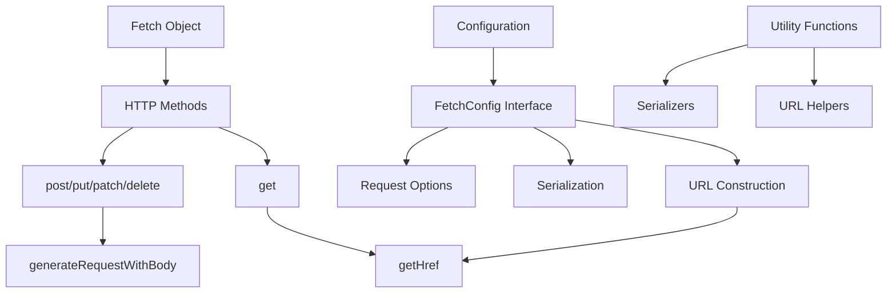

# Fetch Utility Pattern Documentation

## Pattern Overview

The Fetch Utility Pattern is a comprehensive HTTP client abstraction that provides a consistent, type-safe interface for making API requests. This pattern encapsulates the native `fetch` API with enhanced functionality including automatic serialization, URL construction, credential management, and configurable request handling.

**When to use this pattern:**
- Building applications that need consistent HTTP client behavior
- Requiring centralized request configuration and serialization
- Need for type-safe API interactions
- Want to abstract away repetitive fetch boilerplate code
- Applications with complex URL construction requirements

## Architecture



### Core Components

1. **FetchConfig Interface**: Centralized configuration for all requests
2. **HTTP Method Handlers**: Specialized functions for different HTTP verbs
3. **URL Construction**: Smart URL building with base URL support
4. **Serialization Layer**: Pluggable serializers for request/response data
5. **Utility Functions**: Helper functions for common operations

## Implementation Details

### Configuration-Driven Design

The pattern uses a configuration object that can be applied globally or per-request:

```typescript
interface FetchConfig {
  baseUrl?: string;           // Base URL for relative requests
  headers?: HeadersInit;      // Default headers
  params?: object;            // Query parameters
  bodySerializer?: BodySerializer;    // Custom body serialization
  paramsSerializer?: ParamsSerializer; // Custom param serialization
  signal?: AbortSignal;       // Request cancellation
  withCredentials?: boolean;  // Credential handling
  cache?: RequestCache;       // Caching strategy
}
```

### Smart URL Construction

The URL building logic handles both absolute and relative URLs intelligently:

```typescript
const getUrl = (url: string, baseUrl?: string): string => {
  if (baseUrl && !isAbsoluteUrl(url)) {
    return url
      ? baseUrl.replace(/\/+$/, '') + '/' + url.replace(/^\/+/, '')
      : baseUrl;
  }
  return url;
};
```

### Pluggable Serialization

The pattern supports custom serializers with sensible defaults:

```typescript
const defaultBodySerializer: BodySerializer = (body) => JSON.stringify(body);
const defaultParamsSerializer: ParamsSerializer = (params = {}) => {
  return qs.stringify(params, {
    encode: true,
    addQueryPrefix: true,
    arrayFormat: 'repeat',
  });
};
```

## Usage Examples

### Basic Usage

```typescript
import { Fetch } from '@/lib/utils/fetch';

// Simple GET request
const response = await Fetch.get('/api/users');
const users = await response.json();

// POST with data
const createResponse = await Fetch.post('/api/users', {
  name: 'John Doe',
  email: 'john@example.com'
});
```

### Advanced Configuration

```typescript
// Global configuration
const apiConfig: FetchConfig = {
  baseUrl: 'https://api.example.com',
  headers: {
    'Authorization': `Bearer ${token}`,
    'X-API-Version': '2.0'
  },
  withCredentials: true,
  cache: 'no-cache'
};

// Request with configuration
const response = await Fetch.get('/users', apiConfig);
```

### Custom Serialization

```typescript
// Custom XML serializer
const xmlBodySerializer = (body: unknown): string => {
  return convertToXML(body);
};

// Custom query parameter handling
const customParamsSerializer = (params?: object): string => {
  return new URLSearchParams(params as Record<string, string>).toString();
};

const config: FetchConfig = {
  bodySerializer: xmlBodySerializer,
  paramsSerializer: customParamsSerializer,
  headers: { 'Content-Type': 'application/xml' }
};

await Fetch.post('/api/data', xmlData, config);
```

### Request Cancellation

```typescript
const controller = new AbortController();

// Cancel request after 5 seconds
setTimeout(() => controller.abort(), 5000);

try {
  const response = await Fetch.get('/api/slow-endpoint', {
    signal: controller.signal
  });
} catch (error) {
  if (error.name === 'AbortError') {
    console.log('Request was cancelled');
  }
}
```

### Query Parameters

```typescript
// Automatic query string construction
const response = await Fetch.get('/api/users', {
  params: {
    page: 1,
    limit: 10,
    filters: ['active', 'verified'],
    sort: 'name'
  }
});
// Results in: /api/users?page=1&limit=10&filters=active&filters=verified&sort=name
```

## Best Practices

### 1. Create Configuration Presets

```typescript
// api-config.ts
export const defaultApiConfig: FetchConfig = {
  baseUrl: process.env.NEXT_PUBLIC_API_URL,
  headers: {
    'Content-Type': 'application/json',
    'Accept': 'application/json'
  },
  cache: 'no-cache'
};

export const authenticatedConfig = (token: string): FetchConfig => ({
  ...defaultApiConfig,
  headers: {
    ...defaultApiConfig.headers,
    'Authorization': `Bearer ${token}`
  },
  withCredentials: true
});
```

### 2. Create Domain-Specific Wrappers

```typescript
// user-api.ts
class UserAPI {
  private config: FetchConfig;

  constructor(config: FetchConfig) {
    this.config = config;
  }

  async getUsers(params?: { page?: number; limit?: number }) {
    const response = await Fetch.get('/users', {
      ...this.config,
      params
    });
    return response.json();
  }

  async createUser(userData: CreateUserRequest) {
    const response = await Fetch.post('/users', userData, this.config);
    return response.json();
  }
}
```

### 3. Error Handling Wrapper

```typescript
export class FetchError extends Error {
  constructor(
    message: string,
    public status: number,
    public response: Response
  ) {
    super(message);
    this.name = 'FetchError';
  }
}

export const safeFetch = async (
  method: keyof typeof Fetch,
  url: string,
  ...args: any[]
): Promise<Response> => {
  try {
    const response = await Fetch[method](url, ...args);
    
    if (!response.ok) {
      throw new FetchError(
        `HTTP ${response.status}: ${response.statusText}`,
        response.status,
        response
      );
    }
    
    return response;
  } catch (error) {
    if (error instanceof FetchError) {
      throw error;
    }
    throw new Error(`Network error: ${error.message}`);
  }
};
```

## Integration

### React Integration

```typescript
// hooks/useApi.ts
import { useState, useCallback } from 'react';
import { Fetch, FetchConfig } from '@/lib/utils/fetch';

export function useApi<T>(config?: FetchConfig) {
  const [loading, setLoading] = useState(false);
  const [error, setError] = useState<Error | null>(null);

  const request = useCallback(async (
    method: keyof typeof Fetch,
    url: string,
    data?: unknown
  ): Promise<T> => {
    setLoading(true);
    setError(null);

    try {
      const response = await Fetch[method](url, data, config);
      return await response.json();
    } catch (err) {
      setError(err as Error);
      throw err;
    } finally {
      setLoading(false);
    }
  }, [config]);

  return { request, loading, error };
}
```

### Next.js API Routes Integration

```typescript
// pages/api/proxy/[...path].ts
import { NextApiRequest, NextApiResponse } from 'next';
import { Fetch } from '@/lib/utils/fetch';

export default async function handler(
  req: NextApiRequest,
  res: NextApiResponse
) {
  const { path } = req.query;
  const url = Array.isArray(path) ? path.join('/') : path;

  const config: FetchConfig = {
    baseUrl: process.env.INTERNAL_API_URL,
    headers: {
      'Authorization': req.headers.authorization,
      'Content-Type': req.headers['content-type']
    }
  };

  try {
    let response: Response;
    
    switch (req.method) {
      case 'GET':
        response = await Fetch.get(url, config);
        break;
      case 'POST':
        response = await Fetch.post(url, req.body, config);
        break;
      // ... other methods
      default:
        return res.status(405).json({ error: 'Method not allowed' });
    }

    const data = await response.json();
    res.status(response.status).json(data);
  } catch (error) {
    res.status(500).json({ error: 'Proxy request failed' });
  }
}
```

## Type Safety

### Generic Response Types

```typescript
interface ApiResponse<T> {
  data: T;
  status: 'success' | 'error';
  message?: string;
}

interface User {
  id: string;
  name: string;
  email: string;
}

// Type-safe API calls
const fetchUser = async (id: string): Promise<User> => {
  const response = await Fetch.get(`/users/${id}`);
  const apiResponse: ApiResponse<User> = await response.json();
  return apiResponse.data;
};
```

### Configuration Type Extensions

```typescript
interface ExtendedFetchConfig extends FetchConfig {
  retries?: number;
  timeout?: number;
  validateStatus?: (status: number) => boolean;
}

// Enhanced fetch with additional options
const enhancedFetch = async (
  url: string,
  config?: ExtendedFetchConfig
): Promise<Response> => {
  // Implementation with retry logic, timeout, etc.
};
```

### Request/Response Type Mapping

```typescript
type HTTPMethod = 'GET' | 'POST' | 'PUT' | 'PATCH' | 'DELETE';

interface TypedFetchConfig<TRequest = unknown, TResponse = unknown> 
  extends FetchConfig {
  requestValidator?: (data: unknown) => data is TRequest;
  responseValidator?: (data: unknown) => data is TResponse;
}

class TypedFetch {
  static async request<TRequest, TResponse>(
    method: HTTPMethod,
    url: string,
    data?: TRequest,
    config?: TypedFetchConfig<TRequest, TResponse>
  ): Promise<TResponse> {
    // Type-safe implementation
  }
}
```

## Performance

### Request Deduplication

```typescript
const requestCache = new Map<string, Promise<Response>>();

const dedupedFetch = (url: string, config?: FetchConfig): Promise<Response> => {
  const key = `${url}:${JSON.stringify(config)}`;
  
  if (requestCache.has(key)) {
    return requestCache.get(key)!;
  }

  const request = Fetch.get(url, config);
  requestCache.set(key, request);

  // Clean up after request completes
  request.finally(() => {
    requestCache.delete(key);
  });

  return request;
};
```

### Connection Pooling

```typescript
// Configure for high-performance scenarios
const performanceConfig: FetchConfig = {
  cache: 'force-cache', // Use cache when appropriate
  headers: {
    'Connection': 'keep-alive',
    'Keep-Alive': 'timeout=5, max=1000'
  }
};
```

### Streaming for Large Responses

```typescript
const streamingFetch = async (url: string, config?: FetchConfig) => {
  const response = await Fetch.get(url, config);
  
  if (!response.body) {
    throw new Error('Response body is not readable');
  }

  const reader = response.body.getReader();
  const decoder = new TextDecoder();

  try {
    while (true) {
      const { done, value } = await reader.read();
      
      if (done) break;
      
      const chunk = decoder.decode(value, { stream: true });
      // Process chunk
      console.log(chunk);
    }
  } finally {
    reader.releaseLock();
  }
};
```

## Testing

### Unit Testing Utilities

```typescript
// test-utils/fetch-mock.ts
export class FetchMock {
  private mocks = new Map<string, Response>();

  mock(url: string, response: Partial<Response>) {
    this.mocks.set(url, {
      ok: true,
      status: 200,
      json: async () => ({}),
      text: async () => '',
      ...response
    } as Response);
  }

  mockImplementation() {
    return jest.fn().mockImplementation((url: string) => {
      const mock = this.mocks.get(url);
      if (!mock) {
        throw new Error(`No mock found for URL: ${url}`);
      }
      return Promise.resolve(mock);
    });
  }

  clear() {
    this.mocks.clear();
  }
}
```

### Test Examples

```typescript
// __tests__/fetch.test.ts
import { Fetch, getHref, isAbsoluteUrl } from '@/lib/utils/fetch';
import { FetchMock } from './test-utils/fetch-mock';

const fetchMock = new FetchMock();

beforeEach(() => {
  global.fetch = fetchMock.mockImplementation();
});

afterEach(() => {
  fetchMock.clear();
});

describe('Fetch utility', () => {
  test('should construct URLs correctly', () => {
    expect(getHref('/users', { baseUrl: 'https://api.example.com' }))
      .toBe('https://api.example.com/users');
    
    expect(getHref('/users', { 
      baseUrl: 'https://api.example.com',
      params: { page: 1, limit: 10 }
    })).toBe('https://api.example.com/users?page=1&limit=10');
  });

  test('should detect absolute URLs', () => {
    expect(isAbsoluteUrl('https://example.com')).toBe(true);
    expect(isAbsoluteUrl('/relative/path')).toBe(false);
    expect(isAbsoluteUrl('//protocol-relative.com')).toBe(true);
  });

  test('should make GET requests', async () => {
    const mockResponse = { data: [{ id: 1, name: 'John' }] };
    fetchMock.mock('/users', {
      json: async () => mockResponse
    });

    const response = await Fetch.get('/users');
    const data = await response.json();

    expect(data).toEqual(mockResponse);
  });

  test('should make POST requests with body', async () => {
    const userData = { name: 'Jane', email: 'jane@example.com' };
    const mockResponse = { id: 2, ...userData };

    fetchMock.mock('/users', {
      json: async () => mockResponse
    });

    const response = await Fetch.post('/users', userData);
    const data = await response.json();

    expect(data).toEqual(mockResponse);
  });
});
```

### Integration Testing

```typescript
// __tests__/integration/api.test.ts
import { setupServer } from 'msw/node';
import { rest } from 'msw';
import { Fetch } from '@/lib/utils/fetch';

const server = setupServer(
  rest.get('/api/users', (req, res, ctx) => {
    return res(
      ctx.json([
        { id: 1, name: 'John Doe' },
        { id: 2, name: 'Jane Smith' }
      ])
    );
  }),

  rest.post('/api/users', async (req, res, ctx) => {
    const user = await req.json();
    return res(
      ctx.json({ id: 3, ...user })
    );
  })
);

beforeAll(() => server.listen());
afterEach(() => server.resetHandlers());
afterAll(() => server.close());

describe('API Integration', () => {
  test('should fetch users successfully', async () => {
    const response = await Fetch.get('/api/users');
    const users = await response.json();

    expect(users).toHaveLength(2);
    expect(users[0]).toMatchObject({ id: 1, name: 'John Doe' });
  });
});
```

## Common Pitfalls

### 1. Not Handling Response Status

```typescript
// ❌ Wrong - doesn't check response status
const response = await Fetch.get('/api/users');
const data = await response.json(); // May throw on error responses

// ✅ Correct - check response status
const response = await Fetch.get('/api/users');
if (!response.ok) {
  throw new Error(`HTTP ${response.status}: ${response.statusText}`);
}
const data = await response.json();
```

### 2. Memory Leaks with AbortController

```typescript
// ❌ Wrong - controller not properly cleaned up
const controller = new AbortController();
const response = await Fetch.get('/api/data', { signal: controller.signal });

// ✅ Correct - proper cleanup
const controller = new AbortController();
try {
  const response = await Fetch.get('/api/data', { signal: controller.signal });
  // Process response
} finally {
  // Cleanup is handled automatically, but ensure no lingering references
  controller.abort(); // Only if you need to cancel
}
```

### 3. Incorrect Content-Type Handling

```typescript
// ❌ Wrong - conflicting content types
await Fetch.post('/api/upload', formData, {
  headers: { 'Content-Type': 'application/json' } // Wrong for FormData
});

// ✅ Correct - let browser set Content-Type for FormData
await Fetch.post('/api/upload', formData, {
  bodySerializer: (body) => body as FormData, // Don't stringify FormData
  headers: {} // Let browser set appropriate headers
});
```

### 4. Base URL Configuration Issues

```typescript
// ❌ Wrong - double slashes or missing slashes
const config = {
  baseUrl: 'https://api.example.com/', // Trailing slash
};
await Fetch.get('/users'); // Results in: https://api.example.com//users

// ✅ Correct - the utility handles this automatically
const config = {
  baseUrl: 'https://api.example.com', // No trailing slash needed
};
await Fetch.get('/users'); // Results in: https://api.example.com/users
```

### 5. Serialization Assumption Errors

```typescript
// ❌ Wrong - assuming all responses are JSON
const response = await Fetch.get('/api/download');
const data = await response.json(); // May fail for binary data

// ✅ Correct - check content type
const response = await Fetch.get('/api/download');
const contentType = response.headers.get('Content-Type');

if (contentType?.includes('application/json')) {
  const data = await response.json();
} else if (contentType?.includes('text/')) {
  const text = await response.text();
} else {
  const blob = await response.blob();
}
```

This fetch utility pattern provides a robust, type-safe foundation for HTTP client functionality while maintaining flexibility and performance. The key to success is proper configuration management, error handling, and understanding the underlying fetch API behavior.