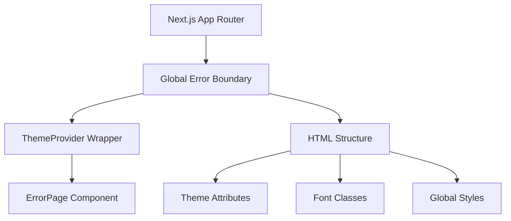

# Global Error Handler Pattern

## Pattern Overview

The **Global Error Handler Pattern** implements a Next.js 13+ App Router global error boundary that catches and handles unhandled errors across the entire application. This pattern provides a fallback UI when critical errors occur, ensuring users never see blank screens or browser error pages.

### When to Use
- Next.js 13+ applications using the App Router
- Applications requiring comprehensive error handling
- Production environments where graceful error recovery is critical
- Applications with complex component hierarchies where errors might bubble up

## Architecture



### Component Structure
- **Outer Shell**: Complete HTML document structure
- **Theme Layer**: Consistent theming even in error states
- **Error UI**: Specialized error page component
- **Styling**: Maintains visual consistency with the main application

## Implementation Details

### Key Techniques

1. **Client-Side Error Boundary**
   ```tsx
   'use client';
   ```
   - Enables React error boundary functionality
   - Required for Next.js App Router global error handling

2. **Complete HTML Document**
   ```tsx
   <html {...DEFAULT_THEME_HTML_ATTRIBUTES}>
     <body>
       {/* Error UI */}
     </body>
   </html>
   ```
   - Provides full page replacement during critical errors
   - Ensures proper document structure

3. **Theme Preservation**
   ```tsx
   <ThemeProvider attribute='class' defaultTheme='system'>
   ```
   - Maintains consistent theming in error states
   - Prevents jarring visual transitions

4. **Font and Style Consistency**
   ```tsx
   className={cn(
     px_grotesk.className,
     px_grotesk_mono.variable,
     'size-full overflow-hidden bg-pgBackground-50'
   )}
   ```
   - Preserves application fonts and base styles
   - Ensures error pages match main application design

## Usage Examples

### Basic Implementation
```tsx
// src/app/global-error.tsx
'use client';

import React from 'react';
import { ErrorPage } from '@/components/error/error-page';
import { ThemeProvider } from '@/components/theme/theme-provider';

export default function GlobalError({ error, reset }: ErrorPageProps) {
  return (
    <html>
      <body>
        <ThemeProvider attribute='class' defaultTheme='system'>
          <ErrorPage error={error} reset={reset} />
        </ThemeProvider>
      </body>
    </html>
  );
}
```

### With Analytics Integration
```tsx
'use client';

import { useEffect } from 'react';
import { trackError } from '@/lib/analytics';

export default function GlobalError({ error, reset }: ErrorPageProps) {
  useEffect(() => {
    // Log error to analytics service
    trackError(error, { scope: 'global', fatal: true });
  }, [error]);

  return (
    <html {...DEFAULT_THEME_HTML_ATTRIBUTES}>
      <body className={cn(fontClasses, baseStyles)}>
        <ThemeProvider attribute='class' defaultTheme='system'>
          <ErrorPage error={error} reset={reset} />
        </ThemeProvider>
      </body>
    </html>
  );
}
```

### Custom Error Types
```tsx
export default function GlobalError({ error, reset }: ErrorPageProps) {
  const getErrorType = (error: Error) => {
    if (error.name === 'ChunkLoadError') return 'chunk-load';
    if (error.message.includes('Network')) return 'network';
    return 'unknown';
  };

  return (
    <html {...DEFAULT_THEME_HTML_ATTRIBUTES}>
      <body>
        <ThemeProvider>
          <ErrorPage 
            error={error} 
            reset={reset}
            errorType={getErrorType(error)}
          />
        </ThemeProvider>
      </body>
    </html>
  );
}
```

## Best Practices

### 1. Complete HTML Structure
```tsx
// ✅ Good - Complete HTML document
<html {...themeAttributes}>
  <body className={styles}>
    <ThemeProvider>
      <ErrorPage />
    </ThemeProvider>
  </body>
</html>

// ❌ Bad - Fragment or incomplete structure
<>
  <ErrorPage />
</>
```

### 2. Maintain Visual Consistency
```tsx
// ✅ Good - Preserve application styling
<body className={cn(
  fonts.className,
  'size-full bg-background text-foreground'
)}>

// ❌ Bad - No styling consistency
<body>
```

### 3. Error Logging
```tsx
// ✅ Good - Log errors for debugging
useEffect(() => {
  console.error('Global error:', error);
  // Send to error tracking service
}, [error]);
```

### 4. Graceful Degradation
```tsx
// ✅ Good - Fallback for theme provider failures
<ThemeProvider 
  attribute='class' 
  defaultTheme='system'
  fallback={<BasicErrorPage />}
>
```

## Integration

### With Error Tracking Services
```tsx
import * as Sentry from '@sentry/nextjs';

export default function GlobalError({ error, reset }: ErrorPageProps) {
  useEffect(() => {
    Sentry.captureException(error, {
      tags: { errorBoundary: 'global' },
      level: 'fatal'
    });
  }, [error]);
  
  // ... rest of component
}
```

### With Feature Flags
```tsx
import { useFeatureFlag } from '@/lib/feature-flags';

export default function GlobalError(props: ErrorPageProps) {
  return (
    <html {...DEFAULT_THEME_HTML_ATTRIBUTES}>
      <body>
        <ThemeProvider>
          <ErrorPage 
            {...props}
            showDetailedError={useFeatureFlag('detailed-errors')}
          />
        </ThemeProvider>
      </body>
    </html>
  );
}
```

### With State Management
```tsx
// Note: Avoid complex state management in global error boundaries
// Keep dependencies minimal to prevent cascading failures
```

## Type Safety

### Core Types
```tsx
interface ErrorPageProps {
  error: Error & { digest?: string };
  reset: () => void;
}

interface GlobalErrorProps extends ErrorPageProps {
  params?: Record<string, string>;
}
```

### Extended Types
```tsx
interface EnhancedErrorPageProps extends ErrorPageProps {
  errorType?: 'network' | 'chunk-load' | 'runtime' | 'unknown';
  showDetails?: boolean;
  onRetry?: () => Promise<void>;
}
```

### Theme Integration Types
```tsx
interface ThemeAttributes {
  'data-theme'?: string;
  className?: string;
  style?: React.CSSProperties;
}

const DEFAULT_THEME_HTML_ATTRIBUTES: ThemeAttributes = {
  'data-theme': 'system',
  className: 'h-full'
};
```

## Performance

### Optimization Strategies

1. **Minimal Dependencies**
   ```tsx
   // ✅ Good - Only essential imports
   import { ErrorPage } from '@/components/error/error-page';
   import { ThemeProvider } from '@/components/theme/theme-provider';
   
   // ❌ Bad - Heavy dependencies that might fail
   import { ComplexChart } from '@/components/charts';
   ```

2. **Lazy Loading Error Components**
   ```tsx
   import { lazy, Suspense } from 'react';
   
   const ErrorPage = lazy(() => import('@/components/error/error-page'));
   
   export default function GlobalError(props: ErrorPageProps) {
     return (
       <html>
         <body>
           <Suspense fallback={<BasicErrorFallback />}>
             <ErrorPage {...props} />
           </Suspense>
         </body>
       </html>
     );
   }
   ```

3. **CSS Optimization**
   ```tsx
   // Import only critical styles
   import './globals.css'; // Critical base styles only
   
   // Avoid importing large CSS bundles that might fail
   ```

## Testing

### Unit Testing
```tsx
import { render, screen } from '@testing-library/react';
import GlobalError from '../global-error';

describe('GlobalError', () => {
  const mockError = new Error('Test error');
  const mockReset = jest.fn();

  it('renders error page with proper structure', () => {
    render(<GlobalError error={mockError} reset={mockReset} />);
    
    expect(document.querySelector('html')).toBeInTheDocument();
    expect(document.querySelector('body')).toHaveClass('size-full');
    expect(screen.getByRole('button', { name: /try again/i })).toBeInTheDocument();
  });

  it('calls reset function when retry button is clicked', () => {
    render(<GlobalError error={mockError} reset={mockReset} />);
    
    screen.getByRole('button', { name: /try again/i }).click();
    expect(mockReset).toHaveBeenCalled();
  });
});
```

### Integration Testing
```tsx
import { renderHook } from '@testing-library/react';
import { ErrorBoundary } from 'react-error-boundary';
import GlobalError from '../global-error';

describe('GlobalError Integration', () => {
  it('handles theme provider errors gracefully', () => {
    // Test theme provider failure scenarios
    const ThrowingComponent = () => {
      throw new Error('Theme provider failed');
    };

    expect(() => {
      render(
        <ErrorBoundary fallback={<GlobalError />}>
          <ThrowingComponent />
        </ErrorBoundary>
      );
    }).not.toThrow();
  });
});
```

### E2E Testing
```tsx
// cypress/e2e/global-error.cy.ts
describe('Global Error Handling', () => {
  it('shows global error page on critical failures', () => {
    cy.visit('/');
    
    // Simulate critical error
    cy.window().then((win) => {
      win.dispatchEvent(new Error('Critical error'));
    });
    
    cy.contains('Something went wrong').should('be.visible');
    cy.get('[data-testid="retry-button"]').should('be.visible');
  });
});
```

## Common Pitfalls

### 1. Missing 'use client' Directive
```tsx
// ❌ Bad - Will not work as error boundary
export default function GlobalError(props) {
  // This won't catch client-side errors
}

// ✅ Good
'use client';
export default function GlobalError(props) {
  // Properly handles client-side errors
}
```

### 2. Incomplete HTML Structure
```tsx
// ❌ Bad - Missing html/body tags
export default function GlobalError(props) {
  return <ErrorPage {...props} />;
}

// ✅ Good - Complete document structure
export default function GlobalError(props) {
  return (
    <html>
      <body>
        <ErrorPage {...props} />
      </body>
    </html>
  );
}
```

### 3. Complex Dependencies
```tsx
// ❌ Bad - Dependencies that might fail
import { ComplexProvider } from '@/providers/complex';
import { HeavyComponent } from '@/components/heavy';

// ✅ Good - Minimal, stable dependencies
import { ErrorPage } from '@/components/error/error-page';
import { ThemeProvider } from '@/components/theme/theme-provider';
```

### 4. Not Preserving Styling
```tsx
// ❌ Bad - Inconsistent appearance
<body>
  <ErrorPage />
</body>

// ✅ Good - Maintains visual consistency
<body className={cn(fonts.className, baseStyles)}>
  <ThemeProvider>
    <ErrorPage />
  </ThemeProvider>
</body>
```

### 5. Forgetting Error Logging
```tsx
// ❌ Bad - Errors disappear silently
export default function GlobalError({ error, reset }) {
  return <ErrorPage />;
}

// ✅ Good - Log errors for debugging
export default function GlobalError({ error, reset }) {
  useEffect(() => {
    console.error('Global error:', error);
    // Send to monitoring service
  }, [error]);
  
  return <ErrorPage />;
}
```

This pattern ensures robust error handling while maintaining a consistent user experience, making it an essential component of production Next.js applications.