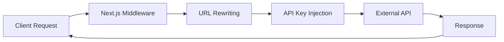

# Next.js API Proxy Middleware Pattern

## Pattern Overview

The API Proxy Middleware pattern is a Next.js middleware implementation that intercepts client requests and transparently proxies them to external APIs. This pattern is particularly useful for:

- **API Key Protection**: Keeping sensitive API keys on the server side
- **CORS Bypass**: Avoiding cross-origin request issues
- **Request Transformation**: Modifying requests before forwarding to external services
- **URL Abstraction**: Providing cleaner, internal API endpoints that map to external services

### When to Use This Pattern

- Integrating with third-party APIs that require server-side authentication
- Building monitoring dashboards that need to proxy uptime/health check services
- Creating unified API gateways for microservices
- Implementing request/response transformation layers

## Architecture



The middleware operates at the edge, intercepting requests before they reach your application routes:

1. **Request Interception**: Catches requests matching the configured pattern
2. **URL Transformation**: Rewrites internal URLs to external API endpoints
3. **Authentication Injection**: Adds API keys or other authentication headers
4. **Request Forwarding**: Proxies the modified request to the external service

## Implementation Details

### Core Components

```tsx
// Type definitions for better understanding
type MiddlewareFunction = (request: NextRequest) => NextResponse | Response | null | undefined;

interface MiddlewareConfig {
  matcher: string | string[];
}
```

### Key Implementation Techniques

1. **URL Cloning and Manipulation**:
   ```tsx
   const url = request.nextUrl.clone();
   url.protocol = api.protocol;
   url.hostname = api.hostname;
   url.port = api.port;
   ```

2. **Path Replacement**:
   ```tsx
   url.pathname = url.pathname.replace(/^\/api-uptime/, api.pathname);
   ```

3. **Query Parameter Injection**:
   ```tsx
   url.searchParams.set('api_key', env.UPTIME_API_KEY);
   ```

4. **Request Rewriting**:
   ```tsx
   return NextResponse.rewrite(url);
   ```

## Usage Examples

### Basic Implementation

```tsx
// src/middleware.ts
import { NextResponse, type NextRequest } from 'next/server';
import { env } from '@/env';

export function middleware(request: NextRequest) {
  const api = new URL(env.NEXT_PUBLIC_UPTIME_API_URL);
  const url = request.nextUrl.clone();
  
  // Transform URL components
  url.protocol = api.protocol;
  url.hostname = api.hostname;
  url.port = api.port;
  
  // Replace path prefix
  url.pathname = url.pathname.replace(/^\/api-uptime/, api.pathname);
  
  // Add authentication
  url.searchParams.set('api_key', env.UPTIME_API_KEY);
  
  return NextResponse.rewrite(url);
}

export const config = {
  matcher: ['/api-uptime/:path*'],
};
```

### Client-Side Usage

```tsx
// components/UptimeStatus.tsx
import { useEffect, useState } from 'react';

interface UptimeData {
  status: string;
  uptime: number;
}

export function UptimeStatus() {
  const [data, setData] = useState<UptimeData | null>(null);
  
  useEffect(() => {
    // Client makes request to internal endpoint
    fetch('/api-uptime/status')
      .then(res => res.json())
      .then(setData);
  }, []);
  
  return (
    <div>
      Status: {data?.status}
      Uptime: {data?.uptime}%
    </div>
  );
}
```

### Advanced Multi-Service Proxy

```tsx
// src/middleware.ts - Enhanced version
import { NextResponse, type NextRequest } from 'next/server';
import { env } from '@/env';

const SERVICE_CONFIGS = {
  uptime: {
    prefix: '/api-uptime',
    baseUrl: env.NEXT_PUBLIC_UPTIME_API_URL,
    apiKey: env.UPTIME_API_KEY,
  },
  analytics: {
    prefix: '/api-analytics',
    baseUrl: env.NEXT_PUBLIC_ANALYTICS_API_URL,
    apiKey: env.ANALYTICS_API_KEY,
  },
} as const;

export function middleware(request: NextRequest) {
  const pathname = request.nextUrl.pathname;
  
  // Find matching service configuration
  const service = Object.values(SERVICE_CONFIGS).find(
    config => pathname.startsWith(config.prefix)
  );
  
  if (!service) {
    return NextResponse.next();
  }
  
  const api = new URL(service.baseUrl);
  const url = request.nextUrl.clone();
  
  // Apply transformations
  url.protocol = api.protocol;
  url.hostname = api.hostname;
  url.port = api.port;
  url.pathname = url.pathname.replace(service.prefix, api.pathname);
  url.searchParams.set('api_key', service.apiKey);
  
  return NextResponse.rewrite(url);
}

export const config = {
  matcher: ['/api-uptime/:path*', '/api-analytics/:path*'],
};
```

## Best Practices

### 1. Environment Variable Management

```tsx
// env.ts - Proper environment validation
import { z } from 'zod';

const envSchema = z.object({
  NEXT_PUBLIC_UPTIME_API_URL: z.string().url(),
  UPTIME_API_KEY: z.string().min(1),
});

export const env = envSchema.parse(process.env);
```

### 2. Error Handling

```tsx
export function middleware(request: NextRequest) {
  try {
    const api = new URL(env.NEXT_PUBLIC_UPTIME_API_URL);
    // ... rest of implementation
  } catch (error) {
    console.error('Middleware error:', error);
    return new NextResponse('Service Unavailable', { status: 503 });
  }
}
```

### 3. Request Validation

```tsx
export function middleware(request: NextRequest) {
  // Validate request method
  if (!['GET', 'POST', 'PUT', 'DELETE'].includes(request.method)) {
    return new NextResponse('Method Not Allowed', { status: 405 });
  }
  
  // Rate limiting check
  if (await isRateLimited(request)) {
    return new NextResponse('Too Many Requests', { status: 429 });
  }
  
  // ... rest of implementation
}
```

### 4. Header Management

```tsx
export function middleware(request: NextRequest) {
  const url = request.nextUrl.clone();
  // ... URL transformation
  
  const response = NextResponse.rewrite(url);
  
  // Add security headers
  response.headers.set('X-Proxy-By', 'Next.js Middleware');
  response.headers.set('Cache-Control', 'no-store');
  
  return response;
}
```

## Integration

### With API Routes

```tsx
// pages/api/uptime/fallback.ts - Fallback for middleware failures
import type { NextApiRequest, NextApiResponse } from 'next';

export default async function handler(
  req: NextApiRequest,
  res: NextApiResponse
) {
  // Fallback logic when middleware fails
  try {
    const response = await fetch(`${process.env.UPTIME_API_URL}${req.url}`);
    const data = await response.json();
    res.json(data);
  } catch (error) {
    res.status(500).json({ error: 'Service unavailable' });
  }
}
```

### With React Query

```tsx
// hooks/useUptimeData.ts
import { useQuery } from '@tanstack/react-query';

export function useUptimeData() {
  return useQuery({
    queryKey: ['uptime'],
    queryFn: () => fetch('/api-uptime/status').then(res => res.json()),
    refetchInterval: 30000, // Refetch every 30 seconds
  });
}
```

## Type Safety

### Request/Response Types

```tsx
// types/uptime.ts
export interface UptimeResponse {
  status: 'up' | 'down' | 'maintenance';
  uptime: number;
  responseTime: number;
  lastCheck: string;
}

export interface UptimeRequest {
  monitor_id?: string;
  range?: '1h' | '24h' | '7d' | '30d';
}
```

### Middleware Configuration Types

```tsx
// types/middleware.ts
import type { NextRequest } from 'next/server';

export interface ServiceConfig {
  prefix: string;
  baseUrl: string;
  apiKey: string;
  headers?: Record<string, string>;
}

export type MiddlewareHandler = (
  request: NextRequest,
  config: ServiceConfig
) => NextResponse | Response | null;
```

## Performance

### Optimization Strategies

1. **Conditional Processing**:
   ```tsx
   export function middleware(request: NextRequest) {
     // Early return for non-matching requests
     if (!request.nextUrl.pathname.startsWith('/api-uptime')) {
       return NextResponse.next();
     }
     // ... processing logic
   }
   ```

2. **Caching Headers**:
   ```tsx
   const response = NextResponse.rewrite(url);
   response.headers.set('Cache-Control', 'public, s-maxage=60');
   ```

3. **Request Deduplication**:
   ```tsx
   // Implement request caching for identical requests
   const cacheKey = `${request.method}:${request.url}`;
   if (requestCache.has(cacheKey)) {
     return requestCache.get(cacheKey);
   }
   ```

### Monitoring Performance

```tsx
export function middleware(request: NextRequest) {
  const start = Date.now();
  
  // ... middleware logic
  
  const response = NextResponse.rewrite(url);
  const duration = Date.now() - start;
  
  response.headers.set('X-Proxy-Duration', duration.toString());
  return response;
}
```

## Testing

### Unit Testing

```tsx
// __tests__/middleware.test.ts
import { NextRequest } from 'next/server';
import { middleware } from '../src/middleware';

describe('middleware', () => {
  it('should rewrite uptime API requests', () => {
    const request = new NextRequest('https://example.com/api-uptime/status');
    const response = middleware(request);
    
    expect(response).toBeInstanceOf(NextResponse);
    // Add more specific assertions
  });
  
  it('should add API key to query parameters', () => {
    const request = new NextRequest('https://example.com/api-uptime/monitors');
    const response = middleware(request);
    
    // Verify API key was added
    expect(response.url).toContain('api_key=');
  });
});
```

### Integration Testing

```tsx
// __tests__/integration/api-proxy.test.ts
import { createMocks } from 'node-mocks-http';

describe('/api-uptime proxy', () => {
  it('should proxy requests to external API', async () => {
    const { req, res } = createMocks({
      method: 'GET',
      url: '/api-uptime/status',
    });
    
    await handler(req, res);
    
    expect(res._getStatusCode()).toBe(200);
    expect(JSON.parse(res._getData())).toMatchObject({
      status: expect.any(String),
      uptime: expect.any(Number),
    });
  });
});
```

### E2E Testing

```tsx
// cypress/integration/uptime-proxy.spec.ts
describe('Uptime API Proxy', () => {
  it('should fetch uptime data through proxy', () => {
    cy.visit('/dashboard');
    cy.intercept('GET', '/api-uptime/**').as('uptimeRequest');
    
    cy.get('[data-testid="uptime-status"]').should('be.visible');
    cy.wait('@uptimeRequest').then((interception) => {
      expect(interception.response.statusCode).to.eq(200);
    });
  });
});
```

## Common Pitfalls

### 1. **Infinite Redirect Loops**

❌ **Wrong**:
```tsx
export const config = {
  matcher: ['/:path*'], // Too broad - will match everything
};
```

✅ **Correct**:
```tsx
export const config = {
  matcher: ['/api-uptime/:path*'], // Specific path matching
};
```

### 2. **Missing Error Handling**

❌ **Wrong**:
```tsx
export function middleware(request: NextRequest) {
  const api = new URL(env.NEXT_PUBLIC_UPTIME_API_URL); // Can throw
  // ... rest of logic
}
```

✅ **Correct**:
```tsx
export function middleware(request: NextRequest) {
  try {
    const api = new URL(env.NEXT_PUBLIC_UPTIME_API_URL);
    // ... rest of logic
  } catch (error) {
    return new NextResponse('Configuration Error', { status: 500 });
  }
}
```

### 3. **Exposing Sensitive Information**

❌ **Wrong**:
```tsx
// Logging sensitive data
console.log('Proxying with API key:', env.UPTIME_API_KEY);
```

✅ **Correct**:
```tsx
// Safe logging
console.log('Proxying request to:', api.hostname);
```

### 4. **Not Handling Different HTTP Methods**

❌ **Wrong**:
```tsx
export function middleware(request: NextRequest) {
  // Assumes all requests are GET
  return NextResponse.rewrite(url);
}
```

✅ **Correct**:
```tsx
export function middleware(request: NextRequest) {
  // Preserve original method and body
  const init: RequestInit = {
    method: request.method,
    headers: request.headers,
  };
  
  if (request.body) {
    init.body = request.body;
  }
  
  return NextResponse.rewrite(url, init);
}
```

### 5. **Incorrect URL Construction**

❌ **Wrong**:
```tsx
// String concatenation can lead to double slashes
url.pathname = api.pathname + '/' + originalPath;
```

✅ **Correct**:
```tsx
// Use replace for clean path handling
url.pathname = url.pathname.replace(/^\/api-uptime/, api.pathname);
```

This pattern provides a robust foundation for API proxying in Next.js applications, enabling secure and efficient integration with external services while maintaining clean client-side code.