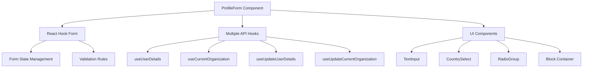

# Profile Form Pattern

## Pattern Overview

The Profile Form pattern implements a comprehensive user profile management interface that handles both user details and organization information through a unified form experience. This pattern is ideal for settings pages, account management interfaces, and onboarding flows where users need to manage personal and business information simultaneously.

**When to use this pattern:**
- Complex forms with multiple data sources
- Settings pages requiring real-time data synchronization
- Forms that need to update multiple API endpoints
- User profile management interfaces
- Business account configuration screens

## Architecture



### Key Architectural Components

1. **Form State Layer**: React Hook Form with Controller pattern for complex UI components
2. **Data Layer**: Multiple query hooks for different data sources
3. **UI Layer**: Composable UI components with consistent styling
4. **Error Handling Layer**: Centralized toast-based error management
5. **Loading State Layer**: Coordinated loading states across multiple operations

## Implementation Details

### Form State Management

```tsx
const {
  control,
  handleSubmit,
  reset,
  formState: { isSubmitting },
} = useForm<UpdateUserDetailsDto>();
```

**Key techniques:**
- **Controller Pattern**: Wraps complex UI components for form integration
- **Dynamic Reset**: Synchronizes form state with fetched data
- **Type-safe Forms**: Uses DTOs for form data structure
- **Validation Rules**: Declarative validation with `rules` prop

### Data Synchronization Strategy

```tsx
useEffect(() => {
  reset({
    usage: userData?.usage || '',
    firstName: userData?.firstName || '',
    lastName: userData?.lastName || '',
    email: userData?.email || '',
    businessName: currentOrganization?.organization?.name || '',
    homeCountry: userData?.homeCountry || '',
  });
}, [userData, reset, currentOrganization]);
```

### Multi-endpoint Update Pattern

```tsx
const onSubmit = async (data: UpdateUserDetailsDto) => {
  try {
    await Promise.all([
      onUpdateUser(
        Object.keys(data)
          .filter((key) => key !== 'businessName')
          .reduce((obj: Partial<UpdateUserDetailsDto>, key) => {
            obj[key as keyof UpdateUserDetailsDto] =
              data[key as keyof UpdateUserDetailsDto];
            return obj;
          }, {})
      ),
      onUpdateOrganization({
        name: data.businessName || '',
        email: data.email || '',
      }),
    ]);
  } catch (_error) {
    // Centralized error handling via query hooks
  }
};
```

## Usage Examples

### Basic Implementation

```tsx
import { ProfileForm } from '@/components/settings/account/profile-form';

export function AccountSettings() {
  return (
    <div className="settings-container">
      <h1>Account Settings</h1>
      <ProfileForm />
    </div>
  );
}
```

### With Custom Styling

```tsx
<ProfileForm 
  className="max-w-4xl mx-auto"
  style={{ backgroundColor: 'var(--background-secondary)' }}
/>
```

### Extending the Pattern for Additional Fields

```tsx
// Extended form type
interface ExtendedProfileDto extends UpdateUserDetailsDto {
  department?: string;
  phoneNumber?: string;
}

// In your extended component
<Controller
  control={control}
  name='department'
  render={({ field }) => (
    <TextInput
      {...field}
      label='Department'
      placeholder='Engineering'
    />
  )}
/>
```

## Best Practices

### 1. Form Validation Strategy

```tsx
// Use consistent validation rules
<Controller
  rules={{ 
    required: 'This field is required',
    pattern: {
      value: /^[A-Z0-9._%+-]+@[A-Z0-9.-]+\.[A-Z]{2,}$/i,
      message: 'Invalid email address'
    }
  }}
  control={control}
  name='email'
  render={({ field, fieldState: { error } }) => (
    <TextInput
      {...field}
      error={error?.message}
      label='Email *'
    />
  )}
/>
```

### 2. Loading State Coordination

```tsx
const isFormDisabled = isSubmitting || 
  isPending || 
  isPendingOrganizationUpdate || 
  isFetchingCurrentOrganization;

<Button
  disabled={isFormDisabled}
  type='submit'
  loading={isFormDisabled}
>
  Save Changes
</Button>
```

### 3. Optimistic Updates

```tsx
const { mutateAsync: onUpdateUser } = useUpdateUserDetails({
  onMutate: async (newData) => {
    // Cancel outgoing refetches
    await queryClient.cancelQueries({ queryKey: ['user-details'] });
    
    // Snapshot previous value
    const previousData = queryClient.getQueryData(['user-details']);
    
    // Optimistically update
    queryClient.setQueryData(['user-details'], (old) => ({
      ...old,
      ...newData
    }));
    
    return { previousData };
  },
  onError: (err, newData, context) => {
    // Rollback on error
    queryClient.setQueryData(['user-details'], context?.previousData);
  }
});
```

## Integration

### Query Hook Integration

```tsx
// Custom hook for profile form data
export function useProfileFormData() {
  const { data: userData, isLoading: isLoadingUser } = useUserDetails();
  const { data: orgData, isLoading: isLoadingOrg } = useCurrentOrganization();
  
  return {
    userData,
    orgData,
    isLoading: isLoadingUser || isLoadingOrg,
    formDefaults: {
      firstName: userData?.firstName || '',
      lastName: userData?.lastName || '',
      businessName: orgData?.organization?.name || '',
      // ... other fields
    }
  };
}
```

### Toast Integration Pattern

```tsx
// Centralized error handling hook
export function useFormErrorHandler() {
  const { toast } = useToast();
  
  return useCallback((error: Error) => {
    toast({
      title: 'Update Failed',
      description: error.message,
      variant: 'destructive'
    });
  }, [toast]);
}
```

## Type Safety

### DTO Pattern

```tsx
// Define clear data transfer objects
export interface UpdateUserDetailsDto {
  firstName?: string;
  lastName?: string;
  email?: string;
  homeCountry?: string;
  usage?: IntendedUseType;
  businessName?: string;
  role?: string;
}

// Use branded types for better type safety
export type IntendedUseType = 
  | 'BUSINESS' 
  | 'PERSONAL' 
  | 'ACADEMIC' 
  | 'JOURNALISM';
```

### Form Type Safety

```tsx
// Type-safe field access
type FormFieldNames = keyof UpdateUserDetailsDto;

const getFieldValue = <T extends FormFieldNames>(
  field: T
): UpdateUserDetailsDto[T] => {
  return watch(field);
};
```

## Performance

### Optimization Strategies

1. **Memoized Form Defaults**:
```tsx
const formDefaults = useMemo(() => ({
  usage: userData?.usage || '',
  firstName: userData?.firstName || '',
  // ... other fields
}), [userData, currentOrganization]);
```

2. **Debounced Auto-save**:
```tsx
const debouncedSave = useMemo(
  () => debounce((data: UpdateUserDetailsDto) => {
    onSubmit(data);
  }, 1000),
  [onSubmit]
);

// Auto-save on form changes
useEffect(() => {
  const subscription = watch((value) => {
    if (isDirty) {
      debouncedSave(value as UpdateUserDetailsDto);
    }
  });
  return () => subscription.unsubscribe();
}, [watch, isDirty, debouncedSave]);
```

3. **Selective Re-renders**:
```tsx
const MemoizedTextInput = memo(TextInput, (prev, next) => 
  prev.value === next.value && prev.error === next.error
);
```

## Testing

### Unit Testing Strategy

```tsx
describe('ProfileForm', () => {
  const mockUserData = {
    firstName: 'John',
    lastName: 'Doe',
    email: 'john@example.com',
    verified: true
  };

  beforeEach(() => {
    vi.mocked(useUserDetails).mockReturnValue({
      data: mockUserData,
      isLoading: false
    });
  });

  it('should populate form with user data', async () => {
    render(<ProfileForm />);
    
    await waitFor(() => {
      expect(screen.getByDisplayValue('John')).toBeInTheDocument();
      expect(screen.getByDisplayValue('Doe')).toBeInTheDocument();
    });
  });

  it('should handle form submission', async () => {
    const mockUpdate = vi.fn();
    vi.mocked(useUpdateUserDetails).mockReturnValue({
      mutateAsync: mockUpdate,
      isPending: false
    });

    render(<ProfileForm />);
    
    fireEvent.click(screen.getByRole('button', { name: /save/i }));
    
    await waitFor(() => {
      expect(mockUpdate).toHaveBeenCalledWith(
        expect.objectContaining({
          firstName: 'John',
          lastName: 'Doe'
        })
      );
    });
  });
});
```

### Integration Testing

```tsx
it('should update both user and organization data', async () => {
  const mockUpdateUser = vi.fn().mockResolvedValue({});
  const mockUpdateOrg = vi.fn().mockResolvedValue({});
  
  // Setup mocks for both mutations
  setupMocks({ mockUpdateUser, mockUpdateOrg });
  
  render(<ProfileForm />);
  
  // Fill form and submit
  await user.type(screen.getByLabelText(/business name/i), 'New Company');
  await user.click(screen.getByRole('button', { name: /save/i }));
  
  await waitFor(() => {
    expect(mockUpdateUser).toHaveBeenCalled();
    expect(mockUpdateOrg).toHaveBeenCalledWith({
      name: 'New Company',
      email: expect.any(String)
    });
  });
});
```

## Common Pitfalls

### 1. **Form Reset Timing Issues**
```tsx
// ❌ Avoid: Resetting before data is loaded
useEffect(() => {
  reset(userData); // userData might be undefined
}, [userData]);

// ✅ Correct: Guard against undefined data
useEffect(() => {
  if (userData && currentOrganization) {
    reset({
      firstName: userData.firstName || '',
      // ... safe field access
    });
  }
}, [userData, currentOrganization, reset]);
```

### 2. **Memory Leaks in Form Subscriptions**
```tsx
// ❌ Avoid: Unsubscribed watchers
useEffect(() => {
  watch((value) => {
    // This creates a memory leak
  });
}, []);

// ✅ Correct: Properly unsubscribe
useEffect(() => {
  const subscription = watch((value) => {
    // Handle changes
  });
  return () => subscription.unsubscribe();
}, [watch]);
```

### 3. **Inconsistent Loading States**
```tsx
// ❌ Avoid: Checking only one loading state
if (isPending) return <LoadingSpinner />;

// ✅ Correct: Coordinate all loading states
const isLoading = isPending || 
  isPendingOrganizationUpdate || 
  !userData?.email || 
  !currentOrganization?.id;

if (isLoading) return <LoadingSpinner />;
```

### 4. **Data Transformation Errors**
```tsx
// ❌ Avoid: Unsafe object manipulation
const userData = Object.keys(data).reduce((obj, key) => {
  obj[key] = data[key]; // Type unsafe
  return obj;
}, {});

// ✅ Correct: Type-safe filtering
const userData = Object.entries(data)
  .filter(([key]) => key !== 'businessName')
  .reduce((obj, [key, value]) => {
    obj[key as keyof UpdateUserDetailsDto] = value;
    return obj;
  }, {} as Partial<UpdateUserDetailsDto>);
```

This pattern provides a robust foundation for complex form management while maintaining type safety, performance, and user experience quality.