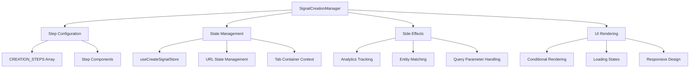

# Signal Creation Manager Pattern

## Pattern Overview

The **Signal Creation Manager** is a sophisticated multi-step form orchestration pattern that manages complex state-driven user workflows. This pattern is ideal for scenarios requiring:

- Sequential multi-step processes with state persistence
- Complex validation across multiple steps
- Dynamic step rendering based on application state
- Integration with external systems and analytics
- Graceful handling of loading states and asynchronous operations

**When to use this pattern:**
- Multi-step forms or wizards
- Onboarding flows
- Complex configuration processes
- Sequential data collection workflows

## Architecture



### Core Components

1. **Step Configuration**: Static array defining step sequence and components
2. **State Management**: Centralized Zustand store with reactive selectors
3. **Effect Management**: Multiple useEffect hooks handling different concerns
4. **Conditional Rendering**: Dynamic UI based on current state and step

## Implementation Details

### Step Configuration Pattern

```tsx
const CREATION_STEPS = [
  {
    step: SIGNAL_CREATION_STEP.STEP1,
    content: <Step1 />,
  },
  {
    step: SIGNAL_CREATION_STEP.STEP2,
    content: <Step2 />,
  },
  // ... additional steps
];
```

**Key Features:**
- **Declarative Configuration**: Steps defined as data structure
- **Component Isolation**: Each step is an independent React component
- **Type Safety**: Step identifiers use enum constants
- **Extensibility**: Easy to add/remove steps by modifying array

### State Management Strategy

```tsx
// Reactive state selectors
const activeStep = useCreateSignalStore((state) => state.activeStep);
const isContinueLoading = useCreateSignalStore((state) => state.isContinueLoading);
const isEditMode = useCreateSignalStore((state) => state.isEditMode);

// Computed values
const currentActiveStep = useMemo(
  () => CREATION_STEPS.find((step) => step.step === activeStep),
  [activeStep]
);
```

**Implementation Techniques:**
- **Granular Selectors**: Each state slice has dedicated selector
- **Memoized Computations**: Expensive lookups cached with useMemo
- **Reactive Updates**: Components re-render only when relevant state changes

### Effect Orchestration Pattern

```tsx
// Cleanup management
useEffect(() => {
  if (isFinalCreationStepSaving || cleanupSetupRef.current) return;
  
  const hasInitialQuery = searchParams.get('initial_query');
  if (!isEditMode && !hasInitialQuery && !isComingFromOmnibar) {
    cleanupSetupRef.current = true;
    return () => setIsFinalCreationStepSaving(false);
  }
}, [/* dependencies */]);

// URL parameter handling
useEffect(() => {
  const initialQuery = searchParams.get('initial_query');
  if (initialQuery) {
    setQuery(initialQuery);
    // Clean up URL
    const newSearchParams = new URLSearchParams(searchParams);
    newSearchParams.delete('initial_query');
    router.replace(newPath, { scroll: false });
  }
}, [searchParams, setQuery, router]);
```

## Usage Examples

### Basic Implementation

```tsx
import { SignalCreationManager, CREATION_STEPS } from './signal-creation-manager';

function CreateSignalPage() {
  return (
    <div className="create-signal-container">
      <SignalCreationManager />
    </div>
  );
}
```

### Custom Step Configuration

```tsx
// Extending the pattern for different workflows
const CUSTOM_WORKFLOW_STEPS = [
  {
    step: WORKFLOW_STEP.INITIALIZATION,
    content: <InitializationStep />,
    validation: (state) => validateInitialization(state),
  },
  {
    step: WORKFLOW_STEP.CONFIGURATION,
    content: <ConfigurationStep />,
    validation: (state) => validateConfiguration(state),
  },
];

function CustomWorkflowManager() {
  const activeStep = useWorkflowStore((state) => state.activeStep);
  
  const currentStep = useMemo(
    () => CUSTOM_WORKFLOW_STEPS.find((step) => step.step === activeStep),
    [activeStep]
  );
  
  return <div>{currentStep?.content}</div>;
}
```

### Integration with Analytics

```tsx
useEffect(() => {
  // Track step transitions
  SignalCreationTracker.stepOpened({ step: activeStep });
  
  // Additional analytics
  if (isEditMode) {
    SignalCreationTracker.editModeEntered({ step: activeStep });
  }
}, [activeStep, isEditMode]);
```

## Best Practices

### 1. State Management

```tsx
// ✅ Good: Granular selectors
const activeStep = useCreateSignalStore((state) => state.activeStep);
const isSaving = useCreateSignalStore((state) => state.isSaving);

// ❌ Bad: Selecting entire state
const entireState = useCreateSignalStore((state) => state);
```

### 2. Effect Dependencies

```tsx
// ✅ Good: Specific dependencies
useEffect(() => {
  // Effect logic
}, [activeStep, isEditMode, specificValue]);

// ❌ Bad: Missing or excessive dependencies
useEffect(() => {
  // Effect logic
}, []); // Missing dependencies
```

### 3. Conditional Rendering

```tsx
// ✅ Good: Early returns for loading states
if (isFetchingMatchingEntities) {
  return <CreateSignalScreenSkeleton />;
}

// ✅ Good: Clear conditional structure
return (
  <div>
    {isFinalCreationStepSaving ? (
      <SavingAnimation />
    ) : (
      <StepContent />
    )}
  </div>
);
```

### 4. Component Isolation

```tsx
// ✅ Good: Each step is independent
function Step1() {
  // Step-specific logic and state
  return <div>Step 1 Content</div>;
}

// ✅ Good: Shared state through store
const sharedData = useCreateSignalStore((state) => state.sharedData);
```

## Integration

### Store Integration

```tsx
// Store structure for multi-step workflows
interface CreateSignalStore {
  // Step management
  activeStep: SIGNAL_CREATION_STEP;
  setActiveStep: (step: SIGNAL_CREATION_STEP) => void;
  
  // Loading states
  isContinueLoading: boolean;
  isSaving: boolean;
  isFinalCreationStepSaving: boolean;
  
  // Data state
  query: string;
  selectedContactPointEmails: ContactPoint[];
  
  // Mode flags
  isEditMode: boolean;
  isComingFromOmnibar: boolean;
}
```

### Router Integration

```tsx
// URL state synchronization
const searchParams = useSearchParams();
const router = useRouter();

// Handle initial query from URL
useEffect(() => {
  const initialQuery = searchParams.get('initial_query');
  if (initialQuery) {
    setQuery(initialQuery);
    // Clean URL after processing
    router.replace(cleanedPath, { scroll: false });
  }
}, [searchParams, setQuery, router]);
```

### Analytics Integration

```tsx
// Event tracking integration
import { SignalCreationTracker } from '@/lib/analytics/event-trackers';

useEffect(() => {
  SignalCreationTracker.stepOpened({ 
    step: activeStep,
    metadata: {
      isEditMode,
      timestamp: Date.now(),
    }
  });
}, [activeStep, isEditMode]);
```

## Type Safety

### Step Configuration Types

```tsx
interface StepConfiguration {
  step: SIGNAL_CREATION_STEP;
  content: React.ReactElement;
  validation?: (state: CreateSignalState) => boolean;
  canSkip?: boolean;
}

// Enum for type safety
enum SIGNAL_CREATION_STEP {
  STEP1 = 'step1',
  STEP2 = 'step2',
  STEP3 = 'step3',
  STEP4 = 'step4',
}
```

### Store Type Safety

```tsx
// Zustand store with TypeScript
interface CreateSignalStore {
  activeStep: SIGNAL_CREATION_STEP;
  setActiveStep: (step: SIGNAL_CREATION_STEP) => void;
  
  // Ensure type safety for state selectors
  isContinueLoading: boolean;
  setIsContinueLoading: (loading: boolean) => void;
}

// Type-safe selectors
const activeStep = useCreateSignalStore(
  (state): SIGNAL_CREATION_STEP => state.activeStep
);
```

### Props and Context Types

```tsx
interface StepProps {
  onNext?: () => void;
  onPrevious?: () => void;
  isLoading?: boolean;
}

// Context type safety
interface TabContainerContext {
  containerRef: React.RefObject<HTMLDivElement>;
  scrollToTop: () => void;
}
```

## Performance

### Memoization Strategy

```tsx
// Memoize expensive computations
const currentActiveStep = useMemo(
  () => CREATION_STEPS.find((step) => step.step === activeStep),
  [activeStep]
);

// Memoize complex selectors
const complexSelector = useMemo(
  () => useCreateSignalStore((state) => ({
    activeStep: state.activeStep,
    isLoading: state.isContinueLoading || state.isSaving,
    canProceed: state.query.length > 0 && !state.hasErrors,
  })),
  []
);
```

### Ref Management

```tsx
// Use refs for values that don't trigger re-renders
const cleanupSetupRef = useRef(false);

// Container refs for DOM manipulation
const { containerRef } = useTabContainer();

useEffect(() => {
  containerRef?.current?.scrollTo({
    top: 0,
    behavior: 'smooth',
  });
}, [activeStep, containerRef]);
```

### Conditional Loading

```tsx
// Avoid unnecessary renders during loading states
return (
  <div
    className={cn(
      'base-classes',
      (isContinueLoading || isSaving) && 'pointer-events-none'
    )}
  >
    {!isFetchingMatchingEntities && <StepContent />}
  </div>
);
```

## Testing

### Unit Testing Strategy

```tsx
// Test step configuration
describe('CREATION_STEPS', () => {
  it('should have all required steps', () => {
    expect(CREATION_STEPS).toHaveLength(4);
    expect(CREATION_STEPS.map(s => s.step)).toEqual([
      SIGNAL_CREATION_STEP.STEP1,
      SIGNAL_CREATION_STEP.STEP2,
      SIGNAL_CREATION_STEP.STEP3,
      SIGNAL_CREATION_STEP.STEP4,
    ]);
  });
});

// Test component behavior
describe('SignalCreationManager', () => {
  it('should render correct step based on active step', () => {
    const mockStore = createMockStore({
      activeStep: SIGNAL_CREATION_STEP.STEP2,
    });
    
    render(<SignalCreationManager />, {
      wrapper: ({ children }) => (
        <StoreProvider store={mockStore}>
          {children}
        </StoreProvider>
      ),
    });
    
    expect(screen.getByTestId('step-2')).toBeInTheDocument();
  });
});
```

### Integration Testing

```tsx
// Test step transitions
describe('Step Navigation', () => {
  it('should progress through steps correctly', async () => {
    const { user } = setup(<SignalCreationManager />);
    
    // Start at step 1
    expect(screen.getByTestId('step-1')).toBeInTheDocument();
    
    // Fill form and proceed
    await user.type(screen.getByLabelText('Query'), 'test query');
    await user.click(screen.getByRole('button', { name: 'Continue' }));
    
    // Should be at step 2
    await waitFor(() => {
      expect(screen.getByTestId('step-2')).toBeInTheDocument();
    });
  });
});
```

### Mock Store Setup

```tsx
// Create mock store for testing
function createMockStore(initialState: Partial<CreateSignalStore>) {
  return create<CreateSignalStore>((set) => ({
    activeStep: SIGNAL_CREATION_STEP.STEP1,
    isContinueLoading: false,
    isSaving: false,
    isEditMode: false,
    setActiveStep: (step) => set({ activeStep: step }),
    ...initialState,
  }));
}
```

## Common Pitfalls

### 1. Effect Dependency Issues

```tsx
// ❌ Bad: Missing dependencies
useEffect(() => {
  if (activeStep === SIGNAL_CREATION_STEP.STEP4) {
    validateFinalStep();
  }
}, []); // Missing activeStep dependency

// ✅ Good: Complete dependencies
useEffect(() => {
  if (activeStep === SIGNAL_CREATION_STEP.STEP4) {
    validateFinalStep();
  }
}, [activeStep]);
```

### 2. State Selector Over-subscription

```tsx
// ❌ Bad: Re-renders on any state change
const wholeState = useCreateSignalStore((state) => state);

// ✅ Good: Only subscribe to needed state
const activeStep = useCreateSignalStore((state) => state.activeStep);
const isSaving = useCreateSignalStore((state) => state.isSaving);
```

### 3. Ref Misuse

```tsx
// ❌ Bad: Using state for non-reactive values
const [cleanupSetup, setCleanupSetup] = useState(false);

// ✅ Good: Using ref for values that don't need reactivity
const cleanupSetupRef = useRef(false);
```

### 4. Memory Leaks in Effects

```tsx
// ❌ Bad: Not cleaning up subscriptions
useEffect(() => {
  const subscription = someAsyncOperation();
  // Missing cleanup
}, []);

// ✅ Good: Proper cleanup
useEffect(() => {
  const subscription = someAsyncOperation();
  return () => subscription.cleanup();
}, []);
```

### 5. Synchronization Issues

```tsx
// ❌ Bad: Race conditions between effects
useEffect(() => {
  setLoading(true);
  processStep();
}, [activeStep]);

useEffect(() => {
  setLoading(false);
}, [someOtherValue]);

// ✅ Good: Coordinated state management
useEffect(() => {
  const processCurrentStep = async () => {
    setLoading(true);
    try {
      await processStep();
    } finally {
      setLoading(false);
    }
  };
  
  processCurrentStep();
}, [activeStep]);
```

This pattern provides a robust foundation for managing complex multi-step workflows while maintaining type safety, performance, and testability.