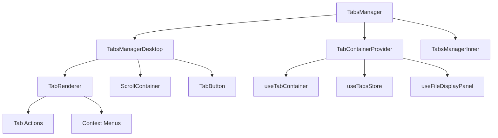

# Tabs Manager Component Pattern

## Pattern Overview

The **Tabs Manager** pattern implements a comprehensive tabbed interface system for managing multiple document views or application states. This pattern provides:

- **Dynamic Tab Management**: Create, close, and manipulate tabs programmatically
- **Responsive Design**: Adaptive behavior between desktop and mobile layouts
- **State Persistence**: Tab state management with background synchronization
- **Navigation Integration**: Deep integration with Next.js routing system
- **Performance Optimization**: Tab prefetching and efficient rendering

### When to Use This Pattern

- Multi-document editors or viewers
- Dashboard applications with multiple views
- File management systems
- Any application requiring multiple concurrent workspaces

## Architecture



### Component Hierarchy

1. **TabsManager** - Root container with responsive logic
2. **TabsManagerDesktop** - Desktop-specific tab bar implementation
3. **TabsManagerInner** - Content container for tab children
4. **TabRenderer** - Individual tab rendering logic
5. **TabButton** - Interactive tab button component

## Implementation Details

### State Management Architecture

```tsx
// Core state management pattern
const { tabs, genericTabs, onGenericTabClose, onTabClose, onTabCloseBatch } = useTabsStore();

// Derived state for unified tab handling
const allTabs = useMemo(() => {
  return [...tabs.slice().reverse(), ...genericTabs];
}, [genericTabs, tabs]);
```

### Navigation Integration Pattern

```tsx
// URL-based tab state synchronization
const positionToHref = useMemo(() => {
  const idxToHref = [
    ...allTabs.map((tab) => ('id' in tab ? tabToHref(tab) : tab.href)),
  ];
  return ['/', ...idxToHref];
}, [allTabs]);

// Smart navigation after tab closure
const getNextHref = useCallback(
  (position: number) => {
    const newHref = positionToHref.filter(
      (_, index) => index !== position + 1
    );
    return newHref[position + 1] || newHref[position] || '/';
  },
  [positionToHref]
);
```

### Performance Optimization Pattern

```tsx
// Intelligent prefetching system
useEffect(() => {
  const prefetchAll = () => {
    allTabs.forEach((tab) => {
      if ('id' in tab) {
        const href = tabToHref(tab);
        if (href !== null && !alreadyPrefetchedTabs.has(href)) {
          router.prefetch(href);
          setAlreadyPrefetchedTabs((prev) => prev.add(href));
        }
      }
    });
  };

  prefetchAll();
  window.addEventListener('focus', prefetchAll);
  return () => window.removeEventListener('focus', prefetchAll);
}, [allTabs, router, alreadyPrefetchedTabs]);
```

## Usage Examples

### Basic Implementation

```tsx
import { TabsManager } from '@/components/main-layout/tabs-manager';

function Application() {
  return (
    <TabsManager>
      <YourMainContent />
    </TabsManager>
  );
}
```

### Custom Tab Actions

```tsx
// Implementing custom tab handlers
const handleTabClose = useCallback(
  (name: string) =>
    async (tabId: number, isActive: boolean, position: number) => {
      if (isActive) {
        router.push(getNextHref(position));
      }
      await onTabClose(tabId);
      await TabsTracker.tabClosed({ tab_id: tabId, name });
    },
  [onTabClose, router, getNextHref]
);

// Batch operations for performance
const handleCloseOthers = useCallback(
  async (tabHrefOrId: number | string) => {
    const regularTabsToClose: Tab[] = [];
    const genericTabsToClose: TabStructure[] = [];

    // Separate tabs by type
    allTabs.forEach((tab) => {
      const isId = 'id' in tab;
      const isCurrent = isId ? tab.id === tabHrefOrId : tab.href === tabHrefOrId;
      
      if (!isCurrent) {
        if (isId) {
          regularTabsToClose.push(tab);
        } else {
          genericTabsToClose.push(tab);
        }
      }
    });

    // Batch close regular tabs
    if (regularTabsToClose.length) {
      await onTabCloseBatch(regularTabsToClose.map((t) => t.id));
    }
  },
  [allTabs, onTabCloseBatch, handleGenericTabClose, router]
);
```

### Responsive Pattern Integration

```tsx
export function TabsManager(props: TabsManagerProps) {
  const { children, ...rest } = props;
  const isDesktop = useBreakpoint('lg');

  return (
    <TabContainerProvider>
      <div className={cn(isDesktop ? 'flex h-full flex-col' : 'h-full')}>
        {isDesktop && <TabsManagerDesktop {...rest} />}
        <TabsManagerInner>{children}</TabsManagerInner>
      </div>
    </TabContainerProvider>
  );
}
```

## Best Practices

### 1. State Management

```tsx
// ✅ Use derived state for complex computations
const allTabs = useMemo(() => {
  return [...tabs.slice().reverse(), ...genericTabs];
}, [genericTabs, tabs]);

// ✅ Batch operations for performance
await onTabCloseBatch(tabIds);

// ❌ Avoid individual operations in loops
// tabs.forEach(tab => onTabClose(tab.id)); // Inefficient
```

### 2. Error Handling

```tsx
// ✅ Implement comprehensive error boundaries
try {
  await handleTabOperation();
} catch (error) {
  captureException(error, { 
    scope: SentryScope.TABS_MANAGER, 
    extra: { tabId, operation } 
  });
}
```

### 3. Memory Management

```tsx
// ✅ Clean up side effects
useEffect(() => {
  return () => {
    setIsOpenMoveTo(false);
    setIsOpenRename(false);
  };
}, []);

// ✅ Remove event listeners
useEffect(() => {
  window.addEventListener('focus', prefetchAll);
  return () => window.removeEventListener('focus', prefetchAll);
}, []);
```

## Integration

### Context Provider Pattern

```tsx
// Wrap the entire tabs system in context
<TabContainerProvider>
  <TabsManager>
    <ApplicationContent />
  </TabsManager>
</TabContainerProvider>
```

### Hook Integration

```tsx
// Custom hooks for tab actions
const handleMoveTo = useTabAction(setIsOpenMoveTo);
const handleRename = useTabAction(setIsOpenRename);

// Background synchronization
useBackgroundSync();

// Responsive behavior
const isDesktop = useBreakpoint('lg');
```

### Analytics Integration

```tsx
// Track tab operations
await TabsTracker.tabClosed({ tab_id: tabId, name });
await TabsTracker.tabClosedBatch({ tab_ids: batchIds });
```

## Type Safety

### Core Type Definitions

```tsx
export interface TabsManagerProps {
  children: ReactNode;
}

// Union type for different tab types
type TabUnion = Tab | TabStructure;

// Type guards for tab differentiation
const isRegularTab = (tab: TabUnion): tab is Tab => 'id' in tab;
const isGenericTab = (tab: TabUnion): tab is TabStructure => 'href' in tab && !('id' in tab);
```

### Generic Constraints

```tsx
// Constrained generic for tab operations
type TabHandler<T extends TabUnion> = T extends Tab 
  ? (tabId: number, isActive: boolean, position: number) => Promise<void>
  : (href: string, isActive: boolean, position: number) => Promise<void>;
```

## Performance

### Optimization Strategies

1. **Memoization**: Critical computations are memoized
2. **Prefetching**: Intelligent route prefetching
3. **Batch Operations**: Group related operations
4. **Virtual Scrolling**: For large tab sets (via ScrollContainer)

### Performance Monitoring

```tsx
// Monitor tab operations
const performanceStart = performance.now();
await tabOperation();
const duration = performance.now() - performanceStart;

if (duration > PERFORMANCE_THRESHOLD) {
  // Log performance issues
}
```

## Testing

### Unit Testing Strategy

```tsx
describe('TabsManager', () => {
  it('should handle tab closure correctly', async () => {
    const mockRouter = { push: jest.fn() };
    const mockOnTabClose = jest.fn();
    
    const { result } = renderHook(() => 
      useTabManager({ router: mockRouter, onTabClose: mockOnTabClose })
    );
    
    await result.current.handleTabClose('test-tab')(1, true, 0);
    
    expect(mockRouter.push).toHaveBeenCalledWith('/');
    expect(mockOnTabClose).toHaveBeenCalledWith(1);
  });

  it('should batch close operations efficiently', async () => {
    // Test batch operations
  });
});
```

### Integration Testing

```tsx
// Test full tab lifecycle
test('complete tab management flow', async () => {
  render(
    <TabsManager>
      <TestContent />
    </TabsManager>
  );
  
  // Test tab creation, interaction, and cleanup
});
```

## Common Pitfalls

### 1. State Synchronization Issues

```tsx
// ❌ Don't forget to sync router state
const handleTabClose = async (tabId) => {
  await onTabClose(tabId);
  // Missing: router.push(nextHref)
};

// ✅ Always sync navigation state
const handleTabClose = async (tabId, isActive, position) => {
  if (isActive) {
    router.push(getNextHref(position));
  }
  await onTabClose(tabId);
};
```

### 2. Memory Leaks

```tsx
// ❌ Forgetting cleanup
useEffect(() => {
  window.addEventListener('focus', handler);
  // Missing cleanup
}, []);

// ✅ Proper cleanup
useEffect(() => {
  window.addEventListener('focus', handler);
  return () => window.removeEventListener('focus', handler);
}, []);
```

### 3. Race Conditions

```tsx
// ❌ Concurrent operations without coordination
tabs.forEach(async (tab) => {
  await closeTab(tab.id); // Race condition
});

// ✅ Proper async handling
await Promise.all(tabs.map(tab => closeTab(tab.id)));
// or sequential processing when order matters
for (const tab of tabs) {
  await closeTab(tab.id);
}
```

### 4. Type Safety Violations

```tsx
// ❌ Assuming tab structure
const href = tab.href; // May not exist on all tab types

// ✅ Proper type checking
const href = 'id' in tab ? tabToHref(tab) : tab.href;
```

This pattern provides a robust, scalable solution for complex tab management scenarios while maintaining type safety and performance optimization.