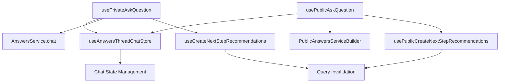

# use-ask-question Hook Pattern

## Pattern Overview

The `use-ask-question` pattern implements a **Dual-Context Chat Hook** that provides both private and public question-asking functionality for an AI-powered chat system. This pattern abstracts the complexity of managing chat interactions, query invalidation, and suggestion generation while maintaining separation between authenticated and public access modes.

**When to use this pattern:**
- Building AI chat interfaces with both authenticated and public access
- Managing complex state synchronization between chat, cache, and recommendations
- Implementing callback-driven async operations with side effects
- Creating reusable hooks that handle both success and error scenarios

## Architecture



### Core Components

1. **Hook Variants**: Separate hooks for private/public contexts
2. **State Management**: Centralized chat store via Zustand
3. **Service Layer**: Abstracted API calls through service builders
4. **Cache Management**: React Query integration for optimistic updates
5. **Callback System**: Structured success/error handling

## Implementation Details

### Key Techniques

1. **Callback Memoization**: Uses `useCallback` to prevent unnecessary re-renders
2. **Conditional Side Effects**: Smart suggestion generation based on answer metadata
3. **Query Invalidation Strategy**: Targeted cache invalidation for optimal performance
4. **Service Abstraction**: Pluggable service layer for different authentication contexts

### Service Integration Pattern

```typescript
// Private context - direct service usage
AnswersService.chat

// Public context - builder pattern with token injection
PublicAnswersServiceBuilder(token).chat
```

## Usage Examples

### Private Chat Implementation

```typescript
import { usePrivateAskQuestion } from '@/components/hooks/use-ask-question';

const PrivateChatComponent = () => {
  const askQuestion = usePrivateAskQuestion();
  
  const handleSubmit = async (question: string) => {
    const filters = {
      dateRange: { start: '2024-01-01', end: '2024-12-31' },
      sources: ['news', 'articles']
    };
    
    try {
      await askQuestion(filters, question, threadId);
    } catch (error) {
      // Error handling is managed by the hook's onError callback
      console.error('Chat error:', error);
    }
  };
  
  return (
    <ChatInterface onSubmit={handleSubmit} />
  );
};
```

### Public Chat Implementation

```typescript
import { usePublicAskQuestion } from '@/components/hooks/use-ask-question';

const PublicChatComponent = ({ accessToken }: { accessToken: string }) => {
  const askQuestion = usePublicAskQuestion(accessToken);
  
  const handleSubmit = async (question: string) => {
    const filters = {
      dateRange: { start: '2024-01-01', end: '2024-12-31' },
      sources: ['public-news']
    };
    
    await askQuestion(filters, question);
  };
  
  return (
    <PublicChatInterface onSubmit={handleSubmit} />
  );
};
```

### Advanced Usage with Thread Management

```typescript
const ChatWithThreads = () => {
  const [currentThread, setCurrentThread] = useState<string>();
  const askQuestion = usePrivateAskQuestion();
  
  const handleNewConversation = async (question: string) => {
    const filters = { sources: ['all'] };
    
    // New thread will be created automatically
    const result = await askQuestion(filters, question);
    setCurrentThread(result.threadId);
  };
  
  const handleContinueConversation = async (question: string) => {
    const filters = { sources: ['all'] };
    
    // Continue existing thread
    await askQuestion(filters, question, currentThread);
  };
  
  return (
    <div>
      <button onClick={() => handleNewConversation("Start new chat")}>
        New Chat
      </button>
      <button onClick={() => handleContinueConversation("Follow up")}>
        Continue
      </button>
    </div>
  );
};
```

## Best Practices

### 1. Filter Configuration
```typescript
// ✅ Good: Specific, well-defined filters
const filters: AnswersThreadNewsArticlesFilter = {
  dateRange: { start: '2024-01-01', end: '2024-12-31' },
  sources: ['news', 'articles'],
  categories: ['technology', 'business']
};

// ❌ Avoid: Empty or overly broad filters
const filters = {}; // Too broad, may impact performance
```

### 2. Error Handling
```typescript
// ✅ Good: Let the hook handle errors, add UI feedback
const ChatComponent = () => {
  const [isLoading, setIsLoading] = useState(false);
  const askQuestion = usePrivateAskQuestion();
  
  const handleAsk = async (question: string) => {
    setIsLoading(true);
    try {
      await askQuestion(filters, question);
    } finally {
      setIsLoading(false);
    }
  };
  
  return <ChatInterface onSubmit={handleAsk} loading={isLoading} />;
};
```

### 3. Token Management for Public Usage
```typescript
// ✅ Good: Memoize the hook when token changes
const PublicChat = ({ token }: { token: string }) => {
  const askQuestion = useMemo(
    () => usePublicAskQuestion(token),
    [token]
  );
  
  // Component implementation
};
```

## Integration

### State Store Integration
```typescript
// The hook integrates with Zustand store
const useAnswersThreadChatStore = create<ChatState>((set, get) => ({
  askChat: async (filters, handler, onSuccess, question, threadId, onError) => {
    // Chat state management logic
  },
  // Other state methods
}));
```

### Query Key Structure
```typescript
// Organized query keys for cache management
const queryKeys = {
  answersThreads: {
    getById: { _def: ['answersThreads', 'getById'] }
  },
  publicAnswersThreads: {
    getById: { _def: ['publicAnswersThreads', 'getById'] }
  },
  usage: { _def: ['usage'] }
};
```

## Type Safety

### Core Type Definitions
```typescript
// Handler type definitions
type AnswerFinishedHandler = (answer: Answer) => Promise<void>;
type AnswerErrorHandler = () => Promise<void>;
type AnswersAskHandler = (question: string, threadUuid?: string) => Promise<void>;

// Filter type for questions
interface AnswersThreadNewsArticlesFilter {
  dateRange?: { start: string; end: string };
  sources?: string[];
  categories?: string[];
}

// Hook return type
type AskQuestionHook = (
  filters: AnswersThreadNewsArticlesFilter,
  question?: string,
  threadUuid?: string
) => Promise<void>;
```

### Generic Service Builder Pattern
```typescript
// Type-safe service builder
class PublicAnswersServiceBuilder {
  constructor(private token: string) {}
  
  chat(question: string, threadUuid?: string): Promise<Answer> {
    // Implementation with token
  }
}
```

## Performance

### Optimization Strategies

1. **Selective Query Invalidation**
```typescript
// Only invalidate specific query patterns
queryClient.invalidateQueries({
  queryKey: queryKeys.answersThreads.getById._def,
});
```

2. **Conditional Side Effects**
```typescript
// Only create suggestions when conditions are met
if (answer?.metadata?.ranRetrieval && answer.hasCitations) {
  await createSuggestion({ messageId: answer.id });
}
```

3. **Callback Memoization**
```typescript
// Prevent unnecessary re-renders
const onNextSteps = useCallback<AnswerFinishedHandler>(
  async (answer) => {
    // Handler implementation
  },
  [createSuggestion, queryClient] // Stable dependencies
);
```

## Testing

### Unit Testing Strategy

```typescript
// Mock the dependencies
jest.mock('@tanstack/react-query');
jest.mock('@/lib/contexts');
jest.mock('@/lib/query-hooks');

describe('usePrivateAskQuestion', () => {
  beforeEach(() => {
    // Setup mocks
    (useQueryClient as jest.Mock).mockReturnValue({
      invalidateQueries: jest.fn(),
    });
  });

  it('should call askChat with correct parameters', async () => {
    const { result } = renderHook(() => usePrivateAskQuestion());
    const filters = { sources: ['news'] };
    
    await act(async () => {
      await result.current(filters, 'test question', 'thread-id');
    });
    
    expect(mockAskChat).toHaveBeenCalledWith(
      filters,
      AnswersService.chat,
      expect.any(Function), // onNextSteps
      'test question',
      'thread-id',
      expect.any(Function)  // onError
    );
  });
});
```

### Integration Testing

```typescript
// Test the full flow
describe('Chat Integration', () => {
  it('should handle complete question flow', async () => {
    const { result } = renderHook(() => usePrivateAskQuestion());
    
    // Mock successful response
    mockAnswersService.chat.mockResolvedValue({
      id: 'answer-1',
      content: 'Test answer',
      metadata: { ranRetrieval: true },
      hasCitations: true
    });
    
    await act(async () => {
      await result.current({ sources: ['news'] }, 'test question');
    });
    
    // Verify side effects
    expect(mockCreateSuggestion).toHaveBeenCalledWith({
      messageId: 'answer-1'
    });
    expect(mockInvalidateQueries).toHaveBeenCalledTimes(2);
  });
});
```

## Common Pitfalls

### 1. **Callback Dependency Issues**
```typescript
// ❌ Wrong: Missing dependencies
const onNextSteps = useCallback(async (answer) => {
  await createSuggestion({ messageId: answer.id });
}, []); // Missing createSuggestion dependency

// ✅ Correct: Include all dependencies
const onNextSteps = useCallback(async (answer) => {
  await createSuggestion({ messageId: answer.id });
}, [createSuggestion]);
```

### 2. **Token Handling in Public Hook**
```typescript
// ❌ Wrong: Not handling token changes
const PublicChat = ({ token }) => {
  const askQuestion = usePublicAskQuestion(token);
  // Hook doesn't recreate when token changes
};

// ✅ Correct: Proper token dependency management
const PublicChat = ({ token }) => {
  const askQuestion = usePublicAskQuestion(token);
  
  useEffect(() => {
    // Handle token changes if needed
  }, [token]);
};
```

### 3. **Error Boundary Integration**
```typescript
// ❌ Wrong: Not handling async errors properly
const handleAsk = async (question) => {
  askQuestion(filters, question); // Unhandled promise
};

// ✅ Correct: Proper async error handling
const handleAsk = async (question) => {
  try {
    await askQuestion(filters, question);
  } catch (error) {
    // Handle or re-throw for error boundary
    throw error;
  }
};
```

### 4. **Memory Leaks**
```typescript
// ❌ Wrong: Not cleaning up subscriptions
useEffect(() => {
  const subscription = chatStore.subscribe(callback);
  // Missing cleanup
}, []);

// ✅ Correct: Proper cleanup
useEffect(() => {
  const subscription = chatStore.subscribe(callback);
  return () => subscription.unsubscribe();
}, []);
```

This pattern provides a robust foundation for building chat interfaces with proper separation of concerns, type safety, and performance optimization.