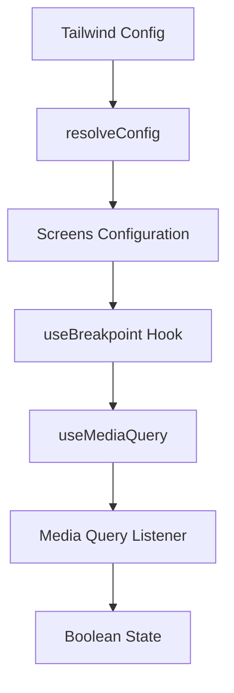

# useBreakpoint Hook Pattern

## Pattern Overview

The `useBreakpoint` hook is a responsive design pattern that provides a React hook interface for detecting viewport size changes based on Tailwind CSS breakpoints. This pattern enables components to conditionally render content or apply different behaviors based on screen size, promoting responsive design principles in React applications.

**When to use this pattern:**
- Conditional rendering based on screen size
- Responsive component behavior without CSS media queries
- Server-side rendering applications requiring viewport-aware logic
- Component-level responsive design decisions

## Architecture



### File Structure
```
src/
├── components/
│   └── hooks/
│       └── use-breakpoint.ts    # Main hook implementation
├── tailwind-config/             # Tailwind configuration
└── types/                       # TypeScript definitions
```

### Core Components

1. **Configuration Resolution**: Resolves Tailwind CSS configuration to extract breakpoint values
2. **Hook Interface**: Provides a clean React hook API for breakpoint detection
3. **Media Query Integration**: Leverages existing media query hook for browser compatibility
4. **SSR Support**: Handles server-side rendering with configurable initial values

## Implementation Details

### Configuration Resolution
```tsx
// Resolve Tailwind config to get actual pixel values
const config = resolveConfig(tailwindConfig);
const screens = config.theme?.screens as Record<string, string>;
```

The pattern uses Tailwind's `resolveConfig` utility to extract the actual breakpoint values, ensuring consistency between CSS and JavaScript breakpoint logic.

### Media Query Generation
```tsx
const minWidth = screens[breakpoint] || '0px';
return useMediaQuery(`(min-width: ${minWidth})`, {
  defaultValue: initialValue,
});
```

The hook dynamically generates CSS media queries using the resolved breakpoint values, providing a seamless integration with Tailwind's responsive system.

## Usage Examples

### Basic Responsive Rendering
```tsx
import { useBreakpoint } from '@/components/hooks/use-breakpoint';

function ResponsiveComponent() {
  const isMobile = useBreakpoint('sm');
  const isTablet = useBreakpoint('md');
  const isDesktop = useBreakpoint('lg');

  if (isDesktop) {
    return <DesktopLayout />;
  }
  
  if (isTablet) {
    return <TabletLayout />;
  }
  
  return <MobileLayout />;
}
```

### Conditional Feature Rendering
```tsx
function NavigationMenu() {
  const showFullMenu = useBreakpoint('lg');
  
  return (
    <nav>
      {showFullMenu ? (
        <FullNavigationMenu />
      ) : (
        <HamburgerMenu />
      )}
    </nav>
  );
}
```

### SSR-Safe Implementation
```tsx
function ServerSideComponent() {
  // Prevent hydration mismatch by setting initial value
  const isDesktop = useBreakpoint('lg', false);
  
  return (
    <div>
      {isDesktop && <DesktopOnlyFeature />}
      <UniversalContent />
    </div>
  );
}
```

### Multiple Breakpoint Logic
```tsx
function ResponsiveGrid() {
  const isSm = useBreakpoint('sm');
  const isMd = useBreakpoint('md');
  const isLg = useBreakpoint('lg');
  
  const getColumns = () => {
    if (isLg) return 4;
    if (isMd) return 3;
    if (isSm) return 2;
    return 1;
  };
  
  return (
    <div className={`grid grid-cols-${getColumns()}`}>
      {/* Grid items */}
    </div>
  );
}
```

## Best Practices

### 1. Consistent Breakpoint Usage
```tsx
// ✅ Good: Use standard Tailwind breakpoints
const isDesktop = useBreakpoint('lg');

// ❌ Avoid: Custom breakpoints not in Tailwind config
const isCustom = useBreakpoint('custom-xl');
```

### 2. SSR Considerations
```tsx
// ✅ Good: Always provide initial value for SSR
const isMobile = useBreakpoint('sm', false);

// ⚠️ Consider: Default behavior might cause hydration issues
const isMobile = useBreakpoint('sm');
```

### 3. Performance Optimization
```tsx
// ✅ Good: Memoize expensive operations
const ExpensiveComponent = () => {
  const isDesktop = useBreakpoint('lg');
  
  const expensiveContent = useMemo(() => {
    return isDesktop ? <ComplexDesktopComponent /> : null;
  }, [isDesktop]);
  
  return <div>{expensiveContent}</div>;
};
```

### 4. Semantic Naming
```tsx
// ✅ Good: Use semantic variable names
const showSidebar = useBreakpoint('md');
const enableHoverEffects = useBreakpoint('lg');

// ❌ Avoid: Generic naming
const breakpoint1 = useBreakpoint('md');
const bp = useBreakpoint('lg');
```

## Integration

### With Component Libraries
```tsx
// Integration with UI component libraries
function ResponsiveModal() {
  const isFullScreen = !useBreakpoint('md');
  
  return (
    <Modal 
      fullScreen={isFullScreen}
      width={isFullScreen ? '100%' : '600px'}
    >
      <ModalContent />
    </Modal>
  );
}
```

### With State Management
```tsx
// Integration with context or state management
const LayoutContext = createContext();

function LayoutProvider({ children }) {
  const isMobile = useBreakpoint('md');
  
  const layoutState = {
    isMobile,
    sidebarCollapsed: isMobile,
    showMobileMenu: false,
  };
  
  return (
    <LayoutContext.Provider value={layoutState}>
      {children}
    </LayoutContext.Provider>
  );
}
```

### With Routing
```tsx
// Conditional routing based on screen size
function ResponsiveRouter() {
  const isMobile = useBreakpoint('md');
  
  return (
    <Routes>
      <Route 
        path="/dashboard" 
        element={isMobile ? <MobileDashboard /> : <DesktopDashboard />} 
      />
    </Routes>
  );
}
```

## Type Safety

### Enhanced Type Definitions
```tsx
// types/breakpoints.ts
export type BreakpointKey = 'sm' | 'md' | 'lg' | 'xl' | '2xl';

export interface UseBreakpointOptions {
  initialValue?: boolean;
  defaultValue?: boolean;
}

// Enhanced hook with strict typing
export function useBreakpoint(
  breakpoint: BreakpointKey,
  options: UseBreakpointOptions = {}
): boolean {
  const { initialValue = false } = options;
  const minWidth = screens[breakpoint] || '0px';
  
  return useMediaQuery(`(min-width: ${minWidth})`, {
    defaultValue: initialValue,
  });
}
```

### Type-Safe Configuration
```tsx
// Ensure type safety for screen configuration
interface ScreenConfig {
  [key: string]: string;
}

const screens: ScreenConfig = config.theme?.screens || {};

// Type guard for breakpoint validation
function isValidBreakpoint(breakpoint: string): breakpoint is BreakpointKey {
  return breakpoint in screens;
}
```

## Performance

### Optimization Strategies

1. **Minimize Re-renders**
```tsx
// Use callback to prevent unnecessary re-renders
const ResponsiveComponent = React.memo(() => {
  const isDesktop = useBreakpoint('lg');
  return <div>{isDesktop ? 'Desktop' : 'Mobile'}</div>;
});
```

2. **Lazy Loading**
```tsx
const DesktopComponent = lazy(() => import('./DesktopComponent'));

function ConditionalLoader() {
  const isDesktop = useBreakpoint('lg');
  
  return (
    <Suspense fallback={<Loading />}>
      {isDesktop && <DesktopComponent />}
    </Suspense>
  );
}
```

3. **Debounced Breakpoint Changes**
```tsx
function useDebouncedBreakpoint(breakpoint: string, delay: number = 100) {
  const immediate = useBreakpoint(breakpoint);
  const [debounced, setDebounced] = useState(immediate);
  
  useEffect(() => {
    const timer = setTimeout(() => setDebounced(immediate), delay);
    return () => clearTimeout(timer);
  }, [immediate, delay]);
  
  return debounced;
}
```

## Testing

### Unit Testing
```tsx
// __tests__/use-breakpoint.test.ts
import { renderHook } from '@testing-library/react';
import { useBreakpoint } from '../use-breakpoint';

// Mock useMediaQuery
jest.mock('usehooks-ts', () => ({
  useMediaQuery: jest.fn(),
}));

describe('useBreakpoint', () => {
  it('should return true for matching breakpoint', () => {
    (useMediaQuery as jest.Mock).mockReturnValue(true);
    
    const { result } = renderHook(() => useBreakpoint('lg'));
    expect(result.current).toBe(true);
  });
  
  it('should use initial value for SSR', () => {
    const { result } = renderHook(() => useBreakpoint('lg', true));
    expect(useMediaQuery).toHaveBeenCalledWith(
      '(min-width: 1024px)', 
      { defaultValue: true }
    );
  });
});
```

### Integration Testing
```tsx
// Component integration test
import { render, screen } from '@testing-library/react';
import ResponsiveComponent from '../ResponsiveComponent';

describe('ResponsiveComponent', () => {
  it('should render mobile layout on small screens', () => {
    // Mock viewport size
    Object.defineProperty(window, 'matchMedia', {
      writable: true,
      value: jest.fn().mockImplementation(query => ({
        matches: query.includes('768px') ? false : true,
        addEventListener: jest.fn(),
        removeEventListener: jest.fn(),
      })),
    });
    
    render(<ResponsiveComponent />);
    expect(screen.getByTestId('mobile-layout')).toBeInTheDocument();
  });
});
```

## Common Pitfalls

### 1. Hydration Mismatches
```tsx
// ❌ Problem: Different server/client rendering
function ProblematicComponent() {
  const isDesktop = useBreakpoint('lg'); // No initial value
  return <div>{isDesktop ? 'Desktop' : 'Mobile'}</div>;
}

// ✅ Solution: Provide consistent initial value
function FixedComponent() {
  const isDesktop = useBreakpoint('lg', false);
  return <div>{isDesktop ? 'Desktop' : 'Mobile'}</div>;
}
```

### 2. Performance Issues with Multiple Breakpoints
```tsx
// ❌ Problem: Multiple media query listeners
function InefficientComponent() {
  const isSm = useBreakpoint('sm');
  const isMd = useBreakpoint('md');
  const isLg = useBreakpoint('lg');
  const isXl = useBreakpoint('xl');
  // ... component logic
}

// ✅ Solution: Use a breakpoint context or custom hook
function useCurrentBreakpoint() {
  const isSm = useBreakpoint('sm');
  const isMd = useBreakpoint('md');
  const isLg = useBreakpoint('lg');
  
  if (isLg) return 'lg';
  if (isMd) return 'md';
  if (isSm) return 'sm';
  return 'xs';
}
```

### 3. Incorrect Breakpoint Logic
```tsx
// ❌ Problem: Overlapping conditions
function IncorrectLogic() {
  const isMd = useBreakpoint('md');
  const isLg = useBreakpoint('lg');
  
  // Both will be true on large screens!
  if (isMd) return <TabletView />;
  if (isLg) return <DesktopView />;
}

// ✅ Solution: Use exclusive conditions
function CorrectLogic() {
  const isLg = useBreakpoint('lg');
  const isMd = useBreakpoint('md');
  
  if (isLg) return <DesktopView />;
  if (isMd) return <TabletView />;
  return <MobileView />;
}
```

### 4. Missing Fallback Values
```tsx
// ❌ Problem: No fallback for undefined breakpoints
const minWidth = screens[breakpoint]; // Could be undefined

// ✅ Solution: Always provide fallback
const minWidth = screens[breakpoint] || '0px';
```

This pattern provides a robust, type-safe, and performant solution for responsive design in React applications while maintaining consistency with Tailwind CSS breakpoint system.