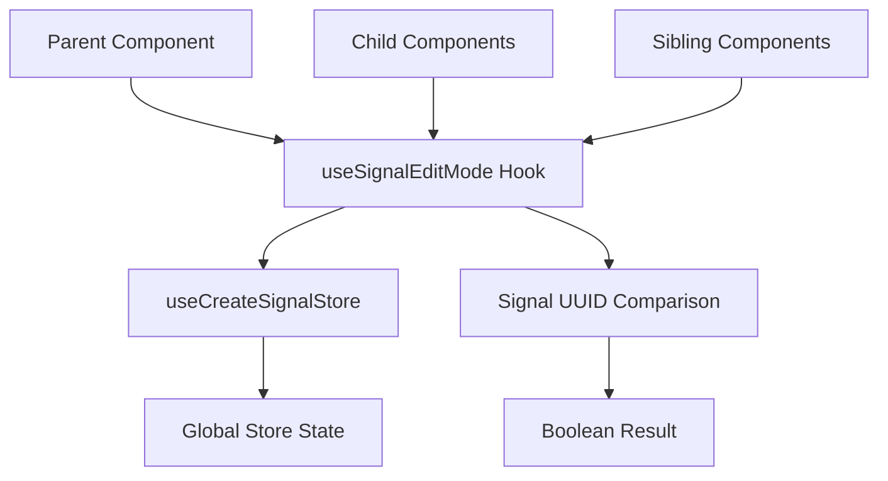

# useSignalEditMode Hook Pattern

## Pattern Overview

The `useSignalEditMode` hook is a **state selection pattern** that determines whether a specific signal is currently in edit mode by comparing its UUID against a globally stored selected signal UUID. This pattern centralizes edit state management while providing a simple boolean interface for components to determine their edit status.

**When to use this pattern:**
- When you need to manage edit mode state across multiple components
- When only one item can be in edit mode at a time
- When you want to avoid prop drilling for edit state
- When implementing inline editing functionality

## Architecture



The pattern follows a **centralized state with distributed access** architecture:

- **Global Store**: Maintains the currently selected signal UUID
- **Hook Layer**: Provides abstraction and comparison logic
- **Component Layer**: Consumes boolean edit state without knowing internal details

## Implementation Details

### Core Logic
```tsx
export function useSignalEditMode(signalUuid?: Signal['uuid']): boolean {
  const selectedSignalUuid = useCreateSignalStore((state) => state.signalUuid);
  return !!signalUuid && selectedSignalUuid === signalUuid;
}
```

**Key Implementation Techniques:**

1. **Store Selection**: Uses store selector to get current selected UUID
2. **Null Safety**: Double negation (`!!`) ensures boolean return
3. **UUID Comparison**: Simple equality check for edit mode determination
4. **Optional Parameters**: Handles undefined signal UUIDs gracefully

### Store Integration Pattern
```tsx
// Store structure example
interface CreateSignalStore {
  signalUuid: string | null;
  setSignalUuid: (uuid: string | null) => void;
}
```

## Usage Examples

### Basic Component Usage
```tsx
interface SignalCardProps {
  signal: Signal;
}

function SignalCard({ signal }: SignalCardProps) {
  const isEditing = useSignalEditMode(signal.uuid);
  
  return (
    <div className={`signal-card ${isEditing ? 'editing' : ''}`}>
      {isEditing ? (
        <SignalEditForm signal={signal} />
      ) : (
        <SignalDisplay signal={signal} />
      )}
    </div>
  );
}
```

### List Component Pattern
```tsx
function SignalList({ signals }: { signals: Signal[] }) {
  return (
    <div className="signal-list">
      {signals.map(signal => (
        <SignalCard key={signal.uuid} signal={signal} />
      ))}
    </div>
  );
}
```

### Conditional Rendering with Actions
```tsx
function SignalActions({ signal }: { signal: Signal }) {
  const isEditing = useSignalEditMode(signal.uuid);
  const { setSignalUuid } = useCreateSignalStore();
  
  const handleEdit = () => {
    setSignalUuid(signal.uuid);
  };
  
  const handleCancel = () => {
    setSignalUuid(null);
  };
  
  return (
    <div className="signal-actions">
      {isEditing ? (
        <>
          <button onClick={handleCancel}>Cancel</button>
          <button type="submit" form={`signal-form-${signal.uuid}`}>
            Save
          </button>
        </>
      ) : (
        <button onClick={handleEdit}>Edit</button>
      )}
    </div>
  );
}
```

## Best Practices

### 1. Single Responsibility
```tsx
// ✅ Good - Hook has single responsibility
const isEditing = useSignalEditMode(signal.uuid);

// ❌ Avoid - Don't add side effects
const isEditing = useSignalEditMode(signal.uuid);
if (isEditing) {
  // Side effects don't belong here
  trackEditMode(signal.uuid);
}
```

### 2. Consistent Usage Pattern
```tsx
// ✅ Good - Always pass the signal UUID
function SignalComponent({ signal }: { signal: Signal }) {
  const isEditing = useSignalEditMode(signal.uuid);
  // ...
}

// ❌ Avoid - Don't use without UUID context
function SomeComponent() {
  const isEditing = useSignalEditMode(); // Returns false always
  // ...
}
```

### 3. Proper Null Handling
```tsx
// ✅ Good - Handle optional signals
function OptionalSignalCard({ signal }: { signal?: Signal }) {
  const isEditing = useSignalEditMode(signal?.uuid);
  
  if (!signal) return null;
  
  // Use isEditing safely
}
```

## Integration

### Store Integration
```tsx
// Store setup
const useCreateSignalStore = create<CreateSignalStore>((set) => ({
  signalUuid: null,
  setSignalUuid: (uuid) => set({ signalUuid: uuid }),
  // Other store methods...
}));
```

### Component Tree Integration
```tsx
// Parent component manages edit state
function SignalManager() {
  return (
    <div>
      <SignalList signals={signals} />
      <SignalToolbar />
    </div>
  );
}

// Child components consume edit state
function SignalToolbar() {
  const { signalUuid } = useCreateSignalStore();
  const hasActiveEdit = !!signalUuid;
  
  return (
    <div className={`toolbar ${hasActiveEdit ? 'edit-mode' : ''}`}>
      {/* Toolbar content */}
    </div>
  );
}
```

## Type Safety

### Type Definitions
```tsx
import { Signal } from '@/lib/types';

// Hook signature with proper typing
function useSignalEditMode(signalUuid?: Signal['uuid']): boolean;

// Store type safety
interface CreateSignalStore {
  signalUuid: Signal['uuid'] | null;
  setSignalUuid: (uuid: Signal['uuid'] | null) => void;
}
```

### Generic Enhancement
```tsx
// Enhanced type-safe version
function useSignalEditMode<T extends { uuid: string }>(
  signalUuid?: T['uuid']
): boolean {
  const selectedSignalUuid = useCreateSignalStore((state) => state.signalUuid);
  return !!signalUuid && selectedSignalUuid === signalUuid;
}
```

## Performance

### Optimization Strategies

1. **Selector Optimization**
```tsx
// ✅ Optimized - Minimal selector
const selectedSignalUuid = useCreateSignalStore((state) => state.signalUuid);

// ❌ Avoid - Selecting entire state
const store = useCreateSignalStore();
const selectedSignalUuid = store.signalUuid;
```

2. **Memoization Considerations**
```tsx
// Usually not needed due to simple comparison
// Only consider if you have expensive derived state
const isEditing = useMemo(
  () => useSignalEditMode(signal.uuid),
  [signal.uuid]
);
```

3. **Batch Updates**
```tsx
// When updating multiple signals
const { setSignalUuid } = useCreateSignalStore();

const handleBatchEdit = (signals: Signal[]) => {
  // Process first signal for edit
  if (signals.length > 0) {
    setSignalUuid(signals[0].uuid);
  }
};
```

## Testing

### Unit Tests
```tsx
import { renderHook } from '@testing-library/react';
import { useSignalEditMode } from './use-signal-edit-mode';

describe('useSignalEditMode', () => {
  it('returns true when signal is in edit mode', () => {
    // Mock store to return specific UUID
    mockStore.setState({ signalUuid: 'test-uuid' });
    
    const { result } = renderHook(() => 
      useSignalEditMode('test-uuid')
    );
    
    expect(result.current).toBe(true);
  });
  
  it('returns false when signal is not in edit mode', () => {
    mockStore.setState({ signalUuid: 'other-uuid' });
    
    const { result } = renderHook(() => 
      useSignalEditMode('test-uuid')
    );
    
    expect(result.current).toBe(false);
  });
  
  it('returns false when signalUuid is undefined', () => {
    const { result } = renderHook(() => 
      useSignalEditMode(undefined)
    );
    
    expect(result.current).toBe(false);
  });
});
```

### Integration Tests
```tsx
import { render, screen } from '@testing-library/react';
import { SignalCard } from './SignalCard';

describe('SignalCard Integration', () => {
  it('shows edit form when signal is in edit mode', () => {
    mockStore.setState({ signalUuid: signal.uuid });
    
    render(<SignalCard signal={signal} />);
    
    expect(screen.getByRole('form')).toBeInTheDocument();
    expect(screen.queryByText('Edit')).not.toBeInTheDocument();
  });
});
```

## Common Pitfalls

### 1. UUID Consistency
```tsx
// ❌ Avoid - Using different UUID formats
const isEditing = useSignalEditMode(signal.id); // Wrong property
const isEditing = useSignalEditMode(signal.uuid.toString()); // Unnecessary conversion

// ✅ Correct - Use consistent UUID property
const isEditing = useSignalEditMode(signal.uuid);
```

### 2. Missing Store Updates
```tsx
// ❌ Avoid - Forgetting to clear edit mode
const handleDelete = async (signal: Signal) => {
  await deleteSignal(signal.uuid);
  // Missing: Clear edit mode if this signal was being edited
};

// ✅ Correct - Clean up edit state
const handleDelete = async (signal: Signal) => {
  const { signalUuid, setSignalUuid } = useCreateSignalStore.getState();
  
  await deleteSignal(signal.uuid);
  
  if (signalUuid === signal.uuid) {
    setSignalUuid(null);
  }
};
```

### 3. Multiple Edit Modes
```tsx
// ❌ Avoid - Don't try to support multiple edit modes with this pattern
const editModes = signals.filter(s => useSignalEditMode(s.uuid));

// ✅ Use different pattern for multiple selections
const useMultipleEditMode = () => {
  const editingSignals = useCreateSignalStore(state => state.editingSignals);
  return {
    isEditing: (uuid: string) => editingSignals.includes(uuid),
    addToEdit: (uuid: string) => { /* implementation */ },
  };
};
```

### 4. Performance Anti-patterns
```tsx
// ❌ Avoid - Creating new objects on each render
const editConfig = {
  isEditing: useSignalEditMode(signal.uuid),
  signal: signal,
};

// ✅ Use boolean directly
const isEditing = useSignalEditMode(signal.uuid);
```

This pattern provides a clean, type-safe way to manage single-item edit mode state across your application while maintaining performance and testability.