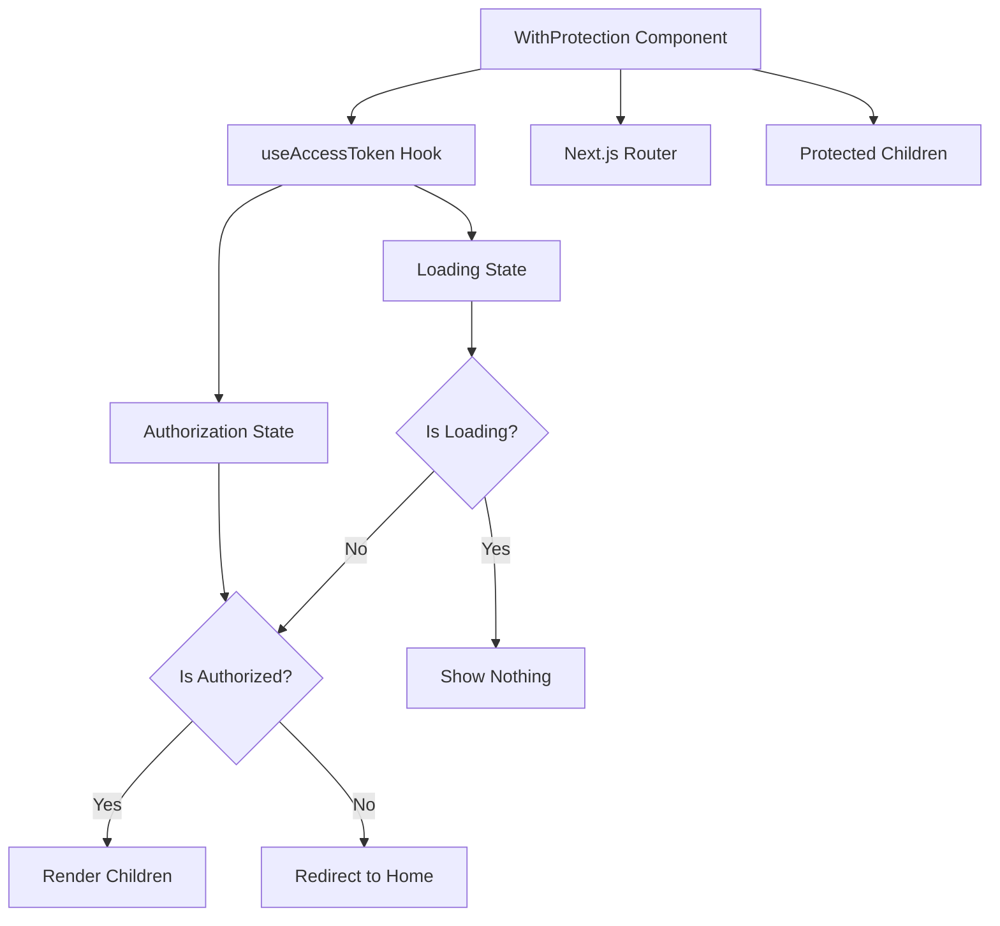

# Route Protection Pattern with Higher-Order Component

## Pattern Overview

The `WithProtection` component implements a **Route Protection Pattern** using a Higher-Order Component (HOC) approach in React. This pattern provides declarative authentication-based access control by wrapping protected content and automatically redirecting unauthorized users.

**When to use this pattern:**
- Protecting entire pages or sections that require authentication
- Implementing consistent authentication behavior across multiple routes
- Creating a reusable authentication boundary component
- Handling client-side route protection in Next.js applications

## Architecture



### Component Structure

```
WithProtection
├── Authentication State Management
│   ├── Loading state handling
│   └── Authorization verification
├── Navigation Control
│   ├── Automatic redirection
│   └── Route management
└── Conditional Rendering
    ├── Protected content display
    └── Null rendering during redirects
```

## Implementation Details

### Core Authentication Logic

```tsx
const { isLoading, isAuthorized } = useAccessToken();

if (!isLoading && !isAuthorized) {
  router.push(REDIRECT_ROUTE);
  return null;
}
```

**Key techniques:**
- **State-based rendering**: Uses authentication state to control component behavior
- **Imperative navigation**: Directly manipulates router for redirection
- **Null rendering**: Returns `null` during redirect to prevent flash of content
- **Loading state handling**: Waits for authentication verification before making decisions

### Redirect Strategy

```tsx
const REDIRECT_ROUTE = '/';
```

- **Centralized configuration**: Single constant for redirect destination
- **Immediate redirection**: No delay or confirmation required
- **Non-blocking**: Uses `router.push()` for smooth navigation

## Usage Examples

### Basic Page Protection

```tsx
// pages/dashboard.tsx
import { WithProtection } from '@/components/authentication/with-protection';

export default function Dashboard() {
  return (
    <WithProtection>
      <div>
        <h1>Protected Dashboard</h1>
        <p>Only authenticated users can see this content.</p>
      </div>
    </WithProtection>
  );
}
```

### Protecting Multiple Components

```tsx
// pages/admin.tsx
import { WithProtection } from '@/components/authentication/with-protection';
import { AdminPanel } from '@/components/admin/admin-panel';
import { UserManagement } from '@/components/admin/user-management';

export default function AdminPage() {
  return (
    <WithProtection>
      <div className="admin-layout">
        <AdminPanel />
        <UserManagement />
      </div>
    </WithProtection>
  );
}
```

### Nested Protection with Loading States

```tsx
// components/protected-section.tsx
import { WithProtection } from '@/components/authentication/with-protection';
import { Suspense } from 'react';

export function ProtectedSection() {
  return (
    <WithProtection>
      <Suspense fallback={<div>Loading protected content...</div>}>
        <ExpensiveProtectedComponent />
      </Suspense>
    </WithProtection>
  );
}
```

### Custom Redirect Routes

```tsx
// Enhanced version with custom redirect
interface WithProtectionProps {
  children: ReactNode;
  redirectTo?: string;
}

export const WithProtection: FC<WithProtectionProps> = ({ 
  children, 
  redirectTo = REDIRECT_ROUTE 
}) => {
  const router = useRouter();
  const { isLoading, isAuthorized } = useAccessToken();

  if (!isLoading && !isAuthorized) {
    router.push(redirectTo);
    return null;
  }

  return <>{children}</>;
};
```

## Best Practices

### 1. Component Placement
```tsx
// ✅ Good: Wrap at the page level
export default function ProtectedPage() {
  return (
    <WithProtection>
      <PageContent />
    </WithProtection>
  );
}

// ❌ Avoid: Deep nesting within components
function SomeComponent() {
  return (
    <div>
      <WithProtection>
        <SmallSection />
      </WithProtection>
    </div>
  );
}
```

### 2. Loading State Management
```tsx
// ✅ Good: Show loading indicator for better UX
export const WithProtection: FC<{ children: ReactNode }> = ({ children }) => {
  const { isLoading, isAuthorized } = useAccessToken();
  
  if (isLoading) {
    return <LoadingSpinner />;
  }
  
  if (!isAuthorized) {
    router.push(REDIRECT_ROUTE);
    return null;
  }
  
  return children;
};
```

### 3. Error Boundary Integration
```tsx
// ✅ Good: Combine with error boundaries
<ErrorBoundary fallback={<AuthError />}>
  <WithProtection>
    <ProtectedContent />
  </WithProtection>
</ErrorBoundary>
```

## Integration

### Authentication Context Integration

```tsx
// lib/contexts/access-token-context.tsx
interface AccessTokenContextValue {
  isLoading: boolean;
  isAuthorized: boolean;
  token: string | null;
  refreshToken: () => Promise<void>;
}

export const useAccessToken = (): AccessTokenContextValue => {
  const context = useContext(AccessTokenContext);
  if (!context) {
    throw new Error('useAccessToken must be used within AccessTokenProvider');
  }
  return context;
};
```

### Next.js Router Integration

```tsx
// Middleware integration for server-side protection
// middleware.ts
import { NextResponse } from 'next/server';
import type { NextRequest } from 'next/server';

export function middleware(request: NextRequest) {
  const token = request.cookies.get('auth-token');
  
  if (!token && request.nextUrl.pathname.startsWith('/protected')) {
    return NextResponse.redirect(new URL('/', request.url));
  }
}
```

### Layout Integration

```tsx
// app/layout.tsx
export default function RootLayout({ children }: { children: ReactNode }) {
  return (
    <html>
      <body>
        <AccessTokenProvider>
          <Navigation />
          {children}
        </AccessTokenProvider>
      </body>
    </html>
  );
}
```

## Type Safety

### Component Props Typing

```tsx
import { FC, ReactNode } from 'react';

interface WithProtectionProps {
  children: ReactNode;
  fallback?: ReactNode;
  redirectTo?: string;
}

export const WithProtection: FC<WithProtectionProps> = ({
  children,
  fallback = null,
  redirectTo = REDIRECT_ROUTE
}) => {
  // Implementation
};
```

### Hook Type Definitions

```tsx
interface UseAccessTokenReturn {
  isLoading: boolean;
  isAuthorized: boolean;
  token: string | null;
  error: Error | null;
}

declare const useAccessToken: () => UseAccessTokenReturn;
```

### Route Type Safety

```tsx
// types/routes.ts
export const ROUTES = {
  HOME: '/',
  LOGIN: '/login',
  DASHBOARD: '/dashboard',
  ADMIN: '/admin'
} as const;

export type RouteKey = keyof typeof ROUTES;
export type RouteValue = typeof ROUTES[RouteKey];

// Usage with type safety
const REDIRECT_ROUTE: RouteValue = ROUTES.HOME;
```

## Performance

### Optimization Strategies

1. **Memoization**
```tsx
import { memo } from 'react';

export const WithProtection = memo<{ children: ReactNode }>(({ children }) => {
  // Implementation remains the same
});
```

2. **Lazy Loading**
```tsx
const WithProtection = lazy(() => import('./with-protection'));

// Usage
<Suspense fallback={<div>Loading...</div>}>
  <WithProtection>
    <ProtectedContent />
  </WithProtection>
</Suspense>
```

3. **Avoiding Unnecessary Re-renders**
```tsx
const WithProtection: FC<{ children: ReactNode }> = ({ children }) => {
  const router = useRouter();
  const { isLoading, isAuthorized } = useAccessToken();
  
  // Memoize redirect logic
  const handleRedirect = useCallback(() => {
    if (!isLoading && !isAuthorized) {
      router.push(REDIRECT_ROUTE);
    }
  }, [isLoading, isAuthorized, router]);
  
  useEffect(() => {
    handleRedirect();
  }, [handleRedirect]);
  
  if (isLoading) return <LoadingSpinner />;
  if (!isAuthorized) return null;
  
  return <>{children}</>;
};
```

### Bundle Size Considerations

- **Tree shaking**: Ensure the component is properly exported for tree shaking
- **Dynamic imports**: Consider lazy loading for non-critical protected routes
- **Dependency optimization**: Keep authentication dependencies minimal

## Testing

### Unit Testing

```tsx
// __tests__/with-protection.test.tsx
import { render } from '@testing-library/react';
import { WithProtection } from '../with-protection';

// Mock the hooks
jest.mock('@/lib/contexts', () => ({
  useAccessToken: jest.fn()
}));

jest.mock('next/navigation', () => ({
  useRouter: jest.fn()
}));

describe('WithProtection', () => {
  const mockPush = jest.fn();
  const mockUseAccessToken = useAccessToken as jest.MockedFunction<typeof useAccessToken>;
  
  beforeEach(() => {
    (useRouter as jest.Mock).mockReturnValue({ push: mockPush });
  });

  it('renders children when authorized', () => {
    mockUseAccessToken.mockReturnValue({
      isLoading: false,
      isAuthorized: true
    });

    const { getByText } = render(
      <WithProtection>
        <div>Protected Content</div>
      </WithProtection>
    );

    expect(getByText('Protected Content')).toBeInTheDocument();
  });

  it('redirects when not authorized', () => {
    mockUseAccessToken.mockReturnValue({
      isLoading: false,
      isAuthorized: false
    });

    render(
      <WithProtection>
        <div>Protected Content</div>
      </WithProtection>
    );

    expect(mockPush).toHaveBeenCalledWith('/');
  });

  it('shows nothing while loading', () => {
    mockUseAccessToken.mockReturnValue({
      isLoading: true,
      isAuthorized: false
    });

    const { container } = render(
      <WithProtection>
        <div>Protected Content</div>
      </WithProtection>
    );

    expect(container.firstChild).toBeNull();
  });
});
```

### Integration Testing

```tsx
// __tests__/integration/protected-page.test.tsx
import { render, waitFor } from '@testing-library/react';
import { AccessTokenProvider } from '@/lib/contexts';
import ProtectedPage from '@/pages/protected';

const TestWrapper = ({ children, isAuthenticated = false }) => (
  <AccessTokenProvider initialAuth={isAuthenticated}>
    {children}
  </AccessTokenProvider>
);

describe('Protected Page Integration', () => {
  it('redirects unauthenticated users', async () => {
    render(
      <TestWrapper isAuthenticated={false}>
        <ProtectedPage />
      </TestWrapper>
    );

    await waitFor(() => {
      expect(mockRouter.push).toHaveBeenCalledWith('/');
    });
  });
});
```

## Common Pitfalls

### 1. **Race Conditions with Authentication State**

```tsx
// ❌ Problematic: Not handling loading state
if (!isAuthorized) {
  router.push(REDIRECT_ROUTE);
  return null;
}

// ✅ Correct: Wait for loading to complete
if (!isLoading && !isAuthorized) {
  router.push(REDIRECT_ROUTE);
  return null;
}
```

### 2. **Flash of Protected Content**

```tsx
// ❌ Problematic: Content flashes before redirect
export const WithProtection = ({ children }) => {
  const { isAuthorized } = useAccessToken();
  
  useEffect(() => {
    if (!isAuthorized) {
      router.push(REDIRECT_ROUTE);
    }
  }, [isAuthorized]);
  
  return children; // Content shows before useEffect runs
};

// ✅ Correct: Conditional rendering prevents flash
if (!isLoading && !isAuthorized) {
  router.push(REDIRECT_ROUTE);
  return null;
}
```

### 3. **Missing Loading States**

```tsx
// ❌ Problematic: No loading feedback
export const WithProtection = ({ children }) => {
  const { isLoading, isAuthorized } = useAccessToken();
  
  if (!isAuthorized) {
    return null; // User sees nothing while loading
  }
  
  return children;
};

// ✅ Correct: Provide loading feedback
if (isLoading) {
  return <LoadingSpinner />;
}
```

### 4. **Server-Side Rendering Issues**

```tsx
// ❌ Problematic: Hydration mismatches
export const WithProtection = ({ children }) => {
  const { isAuthorized } = useAccessToken();
  
  // This can cause SSR/client mismatches
  return isAuthorized ? children : null;
};

// ✅ Correct: Handle SSR properly
export const WithProtection = ({ children }) => {
  const [mounted, setMounted] = useState(false);
  const { isLoading, isAuthorized } = useAccessToken();
  
  useEffect(() => {
    setMounted(true);
  }, []);
  
  if (!mounted) {
    return <LoadingSpinner />;
  }
  
  // Rest of the logic...
};
```

### 5. **Infinite Redirect Loops**

```tsx
// ❌ Problematic: Can cause infinite loops
const REDIRECT_ROUTE = '/login';

// If /login also uses WithProtection, this creates a loop

// ✅ Correct: Ensure redirect destination is always accessible
const REDIRECT_ROUTE = '/'; // Public home page
// Or implement role-based routing logic
```