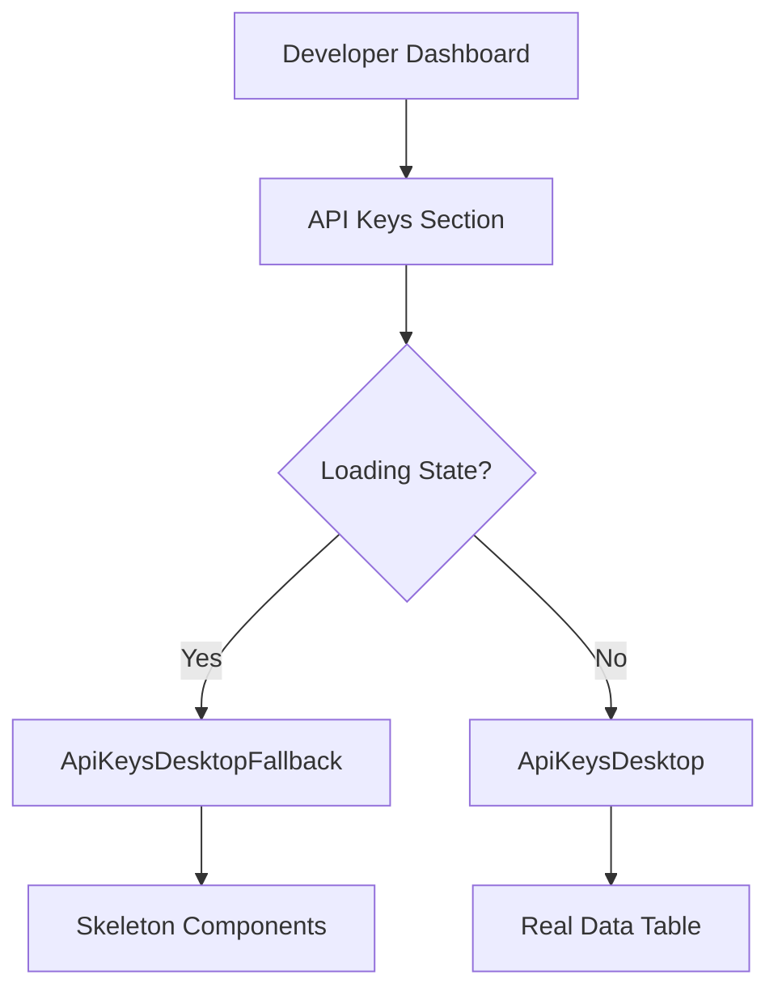

# ApiKeysDesktopFallback Component

## Purpose

The `ApiKeysDesktopFallback` component provides a loading state skeleton for the API keys management interface on desktop devices. It renders placeholder content that mimics the structure and layout of the actual API keys table, providing visual feedback to users while data is being fetched or processed. This component ensures a smooth user experience by preventing layout shifts and maintaining visual consistency during loading states.

## Component Type

**Server Component** - This is a server component as it contains no client-side interactivity, state management, or browser-specific APIs. It renders static skeleton elements and can be safely rendered on the server, improving initial page load performance.

## Props Interface

| Prop Name | Type | Required | Default | Description |
|-----------|------|----------|---------|-------------|
| N/A | N/A | N/A | N/A | This component accepts no props |

## Usage Example

```tsx
import { Suspense } from 'react';
import { ApiKeysDesktopFallback } from '@/components/developers/api-keys/api-keys-desktop-fallback';
import { ApiKeysDesktop } from '@/components/developers/api-keys/api-keys-desktop';

// Usage in a page or parent component
export default function DeveloperDashboard() {
  return (
    <div className="container mx-auto p-6">
      <h1>API Keys Management</h1>
      
      {/* Suspense boundary with fallback */}
      <Suspense fallback={<ApiKeysDesktopFallback />}>
        <ApiKeysDesktop />
      </Suspense>
    </div>
  );
}

// Alternative usage with conditional rendering
export function ApiKeysSection({ isLoading }: { isLoading: boolean }) {
  if (isLoading) {
    return <ApiKeysDesktopFallback />;
  }
  
  return <ApiKeysDesktop />;
}

// Usage with TanStack Query loading states
export function ApiKeysContainer() {
  const { data, isLoading, error } = useApiKeys();
  
  if (isLoading) {
    return <ApiKeysDesktopFallback />;
  }
  
  if (error) {
    return <ErrorMessage error={error} />;
  }
  
  return <ApiKeysDesktop data={data} />;
}
```

## Functionality

### Core Features

- **Skeleton Layout**: Renders a complete skeleton structure that matches the expected API keys interface layout
- **Header Section**: Displays skeleton placeholders for titles, descriptions, and action buttons
- **Table Structure**: Provides skeleton rows representing the API keys table with appropriate column widths
- **Responsive Design**: Optimized for desktop viewing with proper spacing and layout
- **Visual Consistency**: Uses consistent skeleton styling that matches the application's design system

### Layout Structure

1. **Top Section**: 64px height skeleton representing the page header or title area
2. **Main Content Area**: Bordered container with rounded corners containing:
   - Header section with title and description skeletons
   - Action button placeholder
   - Table header skeleton
   - 10 rows of table data skeletons with 5 columns each

## State Management

**No State Management** - This component is purely presentational and manages no state. It renders static skeleton elements without any dynamic behavior or state updates.

## Side Effects

**No Side Effects** - This component performs no side effects, API calls, or external interactions. It is a pure rendering component focused solely on displaying loading placeholders.

## Dependencies

### Internal Dependencies
- `@/components/ui/skeleton` - Core skeleton component for rendering loading placeholders

### External Dependencies
- **React** - For component rendering and JSX syntax

### Styling Dependencies
- **Tailwind CSS Classes**:
  - Layout: `flex`, `flex-col`, `gap-*`, `w-*`, `h-*`
  - Borders: `border`, `border-*`, `rounded-*`
  - Background: `bg-*`
  - Spacing: `px-*`, `py-*`

## Integration

### Application Architecture Role



### Integration Patterns

1. **Suspense Boundaries**: Used as fallback UI within React Suspense components
2. **Loading States**: Integrated with TanStack Query or other data fetching patterns
3. **Conditional Rendering**: Displayed when parent components are in loading states
4. **Desktop-First**: Part of a responsive design system with mobile-specific fallback components

### File Structure Context

```
src/components/developers/api-keys/
├── api-keys-desktop.tsx           # Main desktop component
├── api-keys-desktop-fallback.tsx  # This fallback component
├── api-keys-mobile.tsx            # Mobile version
└── api-keys-mobile-fallback.tsx   # Mobile fallback
```

## Best Practices

### Architecture Adherence

✅ **Server Component Usage**: Correctly implemented as a server component since no client-side features are needed

✅ **Component Decomposition**: Follows flat component structure, specific to desktop API keys loading state

✅ **Single Responsibility**: Focused solely on providing loading state UI for desktop API keys interface

✅ **Reusability**: Generic enough to be used in multiple contexts where API keys loading state is needed

### Performance Considerations

- **Zero JavaScript Bundle**: No client-side JavaScript required, reducing bundle size
- **Server-Side Rendering**: Can be rendered on the server, improving Time to First Byte (TTFB)
- **Layout Stability**: Prevents Cumulative Layout Shift (CLS) by maintaining consistent dimensions

### Design System Integration

- **Consistent Skeleton Usage**: Utilizes the shared Skeleton component for visual consistency
- **Design Token Adherence**: Uses application's color tokens (`pgStroke-200`, `alphaNeutral/6`, etc.)
- **Responsive Design**: Desktop-specific implementation as part of broader responsive strategy

### Usage Guidelines

1. **Always pair with Suspense**: Use within Suspense boundaries for automatic loading state management
2. **Match actual layout**: Ensure skeleton structure closely matches the real component layout
3. **Consider timing**: Display for appropriate duration - not too brief to cause flashing, not too long to seem unresponsive
4. **Accessibility**: Skeleton components should not interfere with screen readers or keyboard navigation