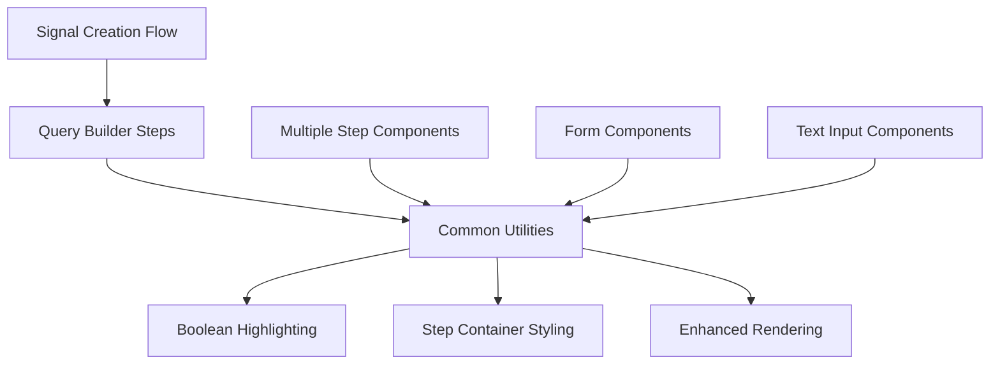

# Common Signal Creation Utilities

## Purpose

The `common.tsx` module provides shared utilities and configurations for signal creation components. It exports styling variants, regex patterns, and text area renderers that enable boolean query syntax highlighting and bracket colorization across the signal creation workflow.

## Component Type

**Utility Module** - This is not a React component but a collection of utility exports including CVA variants, regex patterns, and text area renderers that are consumed by Client Components in the signal creation flow.

## Exports Interface

| Export | Type | Description |
|--------|------|-------------|
| `stepContainer` | `CVA Variant` | Class variant for consistent step container styling |
| `booleanQueryRegex` | `RegExp` | Regex pattern for matching boolean query operators |
| `booleanTextAreaHighlights` | `Highlight[]` | Configuration for highlighting boolean operators in text areas |
| `booleanTextAreaRenderer` | `Renderer` | Basic renderer for boolean operator highlighting |
| `enhancedBooleanTextAreaRenderer` | `Renderer` | Advanced renderer with boolean operators and bracket colorization |

## Usage Example

```tsx
'use client';

import { useState } from 'react';
import { HighlightWithinTextarea } from 'react-highlight-within-textarea';
import { RichTextarea } from 'rich-textarea';
import { 
  stepContainer, 
  booleanTextAreaHighlights,
  enhancedBooleanTextAreaRenderer 
} from '@/components/signals/creation/common';

export function QueryBuilder() {
  const [query, setQuery] = useState('');

  return (
    <div className={stepContainer()}>
      <h2>Build Boolean Query</h2>
      
      {/* Basic highlighting approach */}
      <HighlightWithinTextarea
        highlight={booleanTextAreaHighlights}
        value={query}
        onChange={setQuery}
        placeholder="Enter boolean query (AND, OR, NOT, *)"
      />

      {/* Enhanced highlighting with brackets */}
      <RichTextarea
        value={query}
        onChange={setQuery}
        renderer={enhancedBooleanTextAreaRenderer}
        placeholder="(field:value AND status:active) OR priority:high"
        className="min-h-32 p-3 border rounded-md"
      />
    </div>
  );
}

// Using the step container variant
export function SignalCreationStep({ children }: { children: React.ReactNode }) {
  return (
    <div className={stepContainer()}>
      {children}
    </div>
  );
}
```

## Functionality

### Key Features

- **Consistent Styling**: `stepContainer` provides standardized layout classes for signal creation steps
- **Boolean Operator Recognition**: Regex pattern matches `AND NOT`, `AND`, `OR`, `NOT`, and `*` operators
- **Syntax Highlighting**: Multiple rendering approaches for different complexity needs
- **Enhanced Visualization**: Advanced renderer combines boolean highlighting with bracket colorization
- **Reusable Configuration**: Centralized patterns and styles for consistent UX

### Boolean Query Support

The utilities support common boolean query patterns:
- **AND**: Logical conjunction
- **OR**: Logical disjunction  
- **NOT**: Logical negation
- **AND NOT**: Combined exclusion
- **\***: Wildcard operator

## State Management

**Not Applicable** - This module provides stateless utilities. State management occurs in consuming components that use these utilities with their own state management approaches (React Hook Form for form inputs, local state for interactive text areas).

## Side Effects

**None** - Pure utility exports with no side effects. The regex patterns and renderers are deterministic and don't trigger external operations.

## Dependencies

### External Dependencies
- `class-variance-authority` - For CSS class variant management
- `react-highlight-within-textarea` - For text highlighting functionality
- `rich-textarea` - For advanced text area rendering

### Internal Dependencies
- `@/lib/utils/bracket-colorizer` - Provides enhanced bracket and quote colorization

## Integration

### Application Architecture Role



### Usage Across Components

- **Signal Creation Wizard**: Step container styling for consistent layout
- **Query Builder Forms**: Boolean operator highlighting for user guidance
- **Rule Definition Components**: Enhanced rendering for complex query visualization
- **Validation Components**: Regex patterns for input validation

## Best Practices

### Architectural Adherence

✅ **Separation of Concerns**: Utilities separated from component logic
✅ **Reusability**: Centralized patterns prevent duplication across signal creation components
✅ **Performance**: Regex patterns and renderers created once and reused
✅ **Consistency**: CVA variants ensure uniform styling across related components

### Implementation Guidelines

```tsx
// ✅ Good: Import only needed utilities
import { stepContainer, enhancedBooleanTextAreaRenderer } from './common';

// ✅ Good: Combine with local component logic
const MySignalStep = () => {
  const { register, handleSubmit } = useForm();
  
  return (
    <form className={stepContainer()} onSubmit={handleSubmit(onSubmit)}>
      {/* Component-specific logic here */}
    </form>
  );
};

// ❌ Avoid: Recreating regex patterns in components
const BadComponent = () => {
  const regex = /\b(AND|OR|NOT)\b/g; // Should use booleanQueryRegex
  // ...
};
```

### Performance Considerations

- Regex patterns are defined at module level for reuse
- Renderers are created once and shared across components
- CVA variants are optimized for minimal runtime overhead