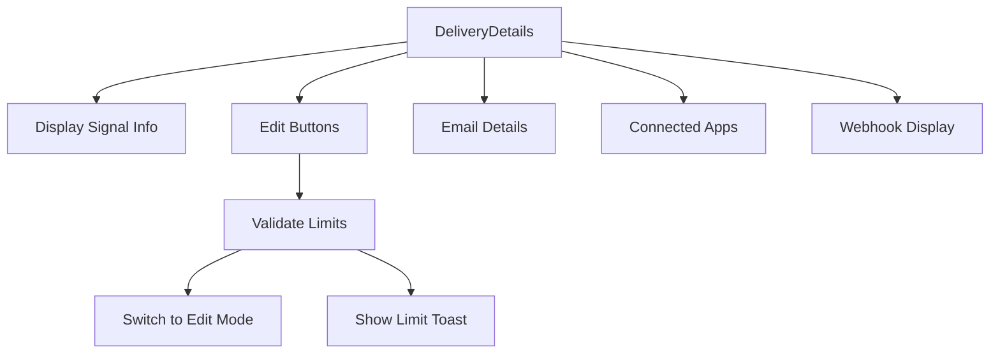

# DeliveryDetails Component

## Purpose

The `DeliveryDetails` component displays and manages the alert preferences and delivery methods for a signal. It shows signal type information (anomaly detection, scheduled, or continuous), delivery configurations (email, connected apps, webhooks), and provides edit functionality for both alert preferences and delivery methods.

## Component Type

**Client Component** - Uses `'use client'` directive because it:
- Manages user interactions with edit buttons
- Uses custom hooks for state management and navigation
- Handles click events for editing preferences
- Renders conditional UI based on signal status and user limits

## Props Interface

| Prop | Type | Required | Description |
|------|------|----------|-------------|
| `signalData` | `Signal` | ✅ | Complete signal object containing configuration, contact points, and delivery settings |

### Supporting Component Props

#### IconWrapper
| Prop | Type | Required | Description |
|------|------|----------|-------------|
| `children` | `React.ReactNode` | ✅ | Icon component to wrap with styled container |

#### AnomalyLabel
| Prop | Type | Required | Description |
|------|------|----------|-------------|
| `label` | `string` | ✅ | Display label for anomaly type |
| `percentage` | `string` | ✅ | Percentage range or value to display |

## Usage Example

```tsx
import { DeliveryDetails } from '@/components/signals/details/delivery-details';
import { Signal } from '@/lib/types';

function SignalDetailsPage({ signalId }: { signalId: string }) {
  const { data: signal } = useSignalQuery(signalId);

  if (!signal) return <div>Loading...</div>;

  return (
    <div className="grid grid-cols-1 lg:grid-cols-2 gap-6">
      {/* Other signal details */}
      <DeliveryDetails signalData={signal} />
    </div>
  );
}

// Using utility functions independently
function AnomalyVolumeDisplay({ threshold }: { threshold: number }) {
  const label = getAnomalySignalVolumePercentageLabel(threshold);
  
  return (
    <div className="anomaly-info">
      Volume increase: {label}
    </div>
  );
}
```

## Functionality

### Core Features
- **Alert Preferences Display**: Shows signal type (anomaly, scheduled, continuous) with appropriate icons and descriptions
- **Delivery Methods Management**: Displays configured email, connected apps, and webhook delivery options
- **Edit Controls**: Provides buttons to edit alert preferences and delivery methods with proper validation
- **Anomaly Configuration**: Special handling for anomaly detection signals with volume threshold display
- **No Delivery State**: Shows helpful message and call-to-action when no delivery methods are configured

### Signal Type Handling
- **Anomaly Signals**: Shows anomaly detection icon and volume increase percentage
- **Scheduled Signals**: Displays schedule days and time with calendar icon
- **Continuous Signals**: Shows instant alerting information with time icon

### Delivery Method Display
- **Email Delivery**: Renders email-specific delivery details
- **Connected Apps**: Shows Fastn-connected application configurations
- **Webhooks**: Displays webhook URLs with route icon
- **Empty State**: Provides setup guidance when no methods are configured

## State Management

### Context Usage
- **`useUsageContext`**: Accesses `activeSignalsRemaining` to validate edit permissions
- **`FastnConfigurationProvider`**: Provides signal-specific configuration for connected apps

### Custom Hooks
- **`useSwitchSignalEditMode`**: Handles navigation to signal editing modes
- **`useSignalCreation`**: Manages signal limit validation and user feedback

### Computed State
```tsx
const isAnomalySignal = useMemo(() => {
  return signalData.signalType === SignalTypeEnum.ARTICLES_VOLUME;
}, [signalData.signalType]);

const isNoDeliveryMethodsConfigured = useMemo(() => {
  return !signalData.contactPoints.some(c => 
    c.type === ContactPointTypeEnum.EMAIL || 
    c.type === ContactPointTypeEnum.FASTN
  );
}, [signalData.contactPoints]);
```

## Side Effects

### User Interactions
- **Edit Alert Preferences**: Validates signal limits before switching to step 3 of signal creation
- **Edit Delivery Method**: Validates signal limits before switching to step 4 of signal creation
- **Limit Validation**: Shows toast notifications when signal limits are exceeded

### Navigation Effects
```tsx
const handleEditAlertPreferences = useCallback(() => {
  if (
    signalData?.status === SignalStatusEnum.ACTIVE ||
    activeSignalsRemaining === null ||
    activeSignalsRemaining! > 0
  ) {
    switchToEditMode(SIGNAL_CREATION_STEP.STEP3);
  } else {
    checkSignalLimitAndShowToast();
  }
}, [/* dependencies */]);
```

## Dependencies

### Internal Components
- `Block`, `Button`, `Tooltip`, `Typography` from UI library
- `IconWrapper`, `AnomalyLabel` (exported utilities)
- `EmailDeliveryDetails`, `ConnectedAppsDeliveryDetails` (child components)

### Icons
- `IconAnomalyDetection`, `PiEditBoxLine`, `PiRouteLine`, `PiTimeLine`

### Hooks & Context
- `useSwitchSignalEditMode` - Signal editing navigation
- `useUsageContext` - Signal limit validation
- `useSignalCreation` - Signal creation workflow

### Utilities
- `getSignalScheduleDays`, `getSignalScheduleTime` - Schedule formatting
- `mapAnomalyPercentageToAnomalyType` - Anomaly type mapping

## Integration

### Signal Management Flow


### Context Integration
- Wraps connected apps section with `FastnConfigurationProvider`
- Integrates with usage context for limit enforcement
- Connects to signal editing workflow through custom hooks

## Best Practices

### ✅ Architecture Adherence
- **Component Decomposition**: Well-decomposed with `IconWrapper`, `AnomalyLabel` utilities
- **Client Component Usage**: Appropriate use of client component for interactive features
- **State Management**: Uses context and custom hooks instead of prop drilling
- **Reusability**: Exports utility functions for use in other components

### ✅ Performance Optimizations
- Uses `useMemo` for expensive computations
- Uses `useCallback` for event handlers to prevent unnecessary re-renders
- Conditional rendering to avoid rendering unused delivery method components

### ✅ User Experience
- Provides clear visual hierarchy with proper typography and spacing
- Shows helpful empty states with actionable guidance
- Validates user permissions before allowing destructive actions
- Uses tooltips for additional context on interactive elements

### ✅ Error Prevention
- Validates signal limits before allowing edits
- Handles missing data gracefully with fallback displays
- Uses TypeScript for type safety across all props and state