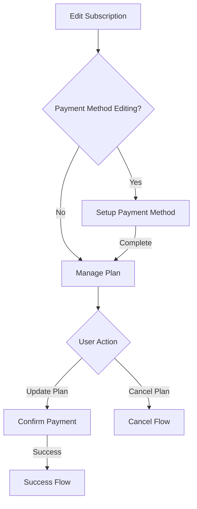

# EditSubscriptionFlow Component

## Purpose

The `EditSubscriptionFlow` component manages the subscription modification workflow within a billing dialog. It allows users to upgrade or downgrade their subscription plans, modify payment methods, view upcoming invoice details, and cancel subscriptions. The component handles the complete flow from plan selection to payment confirmation with real-time pricing calculations and billing previews.

## Component Type

**Client Component** - Uses `'use client'` directive because it:
- Manages interactive subscription state through Zustand store
- Handles user interactions for plan selection and payment method editing
- Integrates with Stripe Elements for payment processing
- Requires real-time state updates and form interactions

## Props Interface

### EditSubscriptionFlow

| Prop | Type | Required | Description |
|------|------|----------|-------------|
| `meta` | `SubscribeDialogEditSubscriptionFlow['meta']` | Yes | Contains subscription flow metadata including current billing price, payment method, selected plan, and UI state flags |

### ManagePlan (Internal)

| Prop | Type | Required | Description |
|------|------|----------|-------------|
| `currentBillingPriceId` | `number` | Yes | ID of the currently active billing price |
| `isMonthMode` | `boolean` | Yes | Whether monthly billing is selected |
| `isPending` | `boolean` | No | Loading state for subscription operations |
| `isSubscriptionCancelled` | `boolean` | Yes | Whether the subscription is cancelled |
| `paymentMethod` | `OrganizationPaymentMethod` | Yes | Current payment method details |
| `selectedPlanId` | `number \| null` | Yes | ID of the selected plan |
| `onCancelPlan` | `() => void` | Yes | Callback to initiate plan cancellation |
| `onIsMonthModeChange` | `(isMonthMode: boolean) => void` | Yes | Callback for billing period changes |
| `onPaymentMethodEditing` | `() => void` | Yes | Callback to open payment method editor |
| `onSelectPlan` | `(selectedPlanId: number \| null) => void` | Yes | Callback for plan selection |
| `onSubscribe` | `(dto: UpdateOrganizationSubscriptionDto) => void` | Yes | Callback to update subscription |

## Usage Example

```tsx
import { EditSubscriptionFlow } from '@/components/settings/billing/subscribe-dialog/edit-subscription-flow';

// Within a subscription dialog
function SubscriptionDialog() {
  const flow = useSubscribeDialogStore(store => store.flow);
  
  if (flow.type === SubscribeDialogFlowType.EDIT_SUBSCRIPTION) {
    return (
      <EditSubscriptionFlow 
        meta={{
          currentBillingPrice: { id: 123, amount: 2900 },
          isMonthMode: true,
          isPaymentMethodEditingOpen: false,
          isSubscriptionCancelled: false,
          paymentMethod: {
            id: 'pm_123',
            cardLast4: '4242',
            type: 'card'
          },
          selectedPlanId: 456
        }}
      />
    );
  }
  
  return null;
}

// Usage in billing settings
function BillingSettings() {
  const onFlowChange = useSubscribeDialogStore(store => store.onFlowChange);
  
  const handleEditSubscription = () => {
    onFlowChange({
      type: SubscribeDialogFlowType.EDIT_SUBSCRIPTION,
      meta: {
        currentBillingPrice: currentSubscription.billingPrice,
        isMonthMode: currentSubscription.isMonthly,
        isPaymentMethodEditingOpen: false,
        isSubscriptionCancelled: currentSubscription.cancelled,
        paymentMethod: organization.paymentMethod,
        selectedPlanId: currentSubscription.planId
      }
    });
  };

  return (
    <Button onClick={handleEditSubscription}>
      Manage Subscription
    </Button>
  );
}
```

## Functionality

### Core Features
- **Plan Selection**: Switch between available subscription tiers with real-time pricing
- **Billing Period Toggle**: Choose between monthly and yearly billing cycles
- **Payment Method Management**: Edit and update payment methods via Stripe integration
- **Invoice Preview**: Display upcoming invoice amounts and billing dates
- **Subscription Actions**: Update plans or cancel subscriptions
- **Change Type Detection**: Identify upgrades vs downgrades with appropriate messaging

### Interactive Elements
- Plan selector with current plan highlighting
- Monthly/yearly billing toggle
- Payment method editing workflow
- Update plan button with loading states
- Cancel subscription option

### Real-time Updates
- Automatic invoice calculation based on plan selection
- Dynamic pricing display for different billing periods
- Live validation of plan changes

## State Management

### Zustand Store Integration
- **`useSubscribeDialogStore`**: Manages dialog flow state and navigation
- **Flow Navigation**: Handles transitions between subscription workflows
- **Meta State Updates**: Synchronizes subscription editing state

### TanStack Query
- **`useCurrentOrganizationSubscriptablePlans`**: Fetches available subscription plans
- **`useUpcomingInvoice`**: Calculates invoice preview for selected plans
- **Real-time Data**: Automatic refetching and cache management

### Local State
- **Component State**: Managed through meta object updates
- **Form State**: Handled via callback-based state updates
- **UI State**: Controls payment method editing and loading states

## Side Effects

### API Interactions
- Fetches organization's available subscription plans
- Calculates upcoming invoice amounts based on plan selection
- Processes subscription updates through Stripe integration
- Handles payment method modifications

### Navigation Effects
- Transitions to payment confirmation flow when required
- Opens payment method setup when editing
- Redirects to cancellation flow when requested

### Data Synchronization
- Automatically selects first available plan if none selected
- Updates invoice calculations when plans change
- Synchronizes payment method state across flows

## Dependencies

### Core Dependencies
- **`useSubscribeDialogStore`**: Dialog state management
- **`useSubscribe`**: Subscription update operations
- **`useSubscribeSuccess`**: Success handling workflow
- **`useCurrentOrganizationSubscriptablePlans`**: Plan data fetching
- **`useUpcomingInvoice`**: Invoice calculation

### UI Components
- **`StripeElements`**: Payment processing context
- **`SubscribeDialogPlanSelector`**: Plan selection interface
- **`SetupPaymentMethod`**: Payment method editing
- **`SubscribeDialogWrapper`**: Layout wrapper
- **`AlertBanner`**: Status notifications

### Utility Dependencies
- **`date-fns/format`**: Date formatting for billing cycles
- **`CURRENCY_FORMATTER`**: Currency display formatting

## Integration

### Billing System Integration
- Integrates with organization billing management
- Connects to Stripe payment processing
- Synchronizes with subscription state management

### Dialog System
- Part of larger subscribe dialog workflow
- Handles state transitions between different flows
- Maintains consistent UI patterns across billing operations

### Navigation Flow


## Best Practices

### Component Architecture
- **Single Responsibility**: Each component handles specific subscription concerns
- **Composition Pattern**: Uses wrapper components for consistent layout
- **State Isolation**: Separates payment method editing into dedicated component

### State Management
- **Centralized Flow State**: Uses Zustand for dialog navigation
- **Server State**: Leverages TanStack Query for data fetching
- **Optimistic Updates**: Provides immediate UI feedback during operations

### Error Handling
- **Graceful Degradation**: Shows skeletons during data loading
- **Validation**: Disables actions when prerequisites aren't met
- **User Feedback**: Provides clear status through alert banners

### Performance Optimization
- **Memoized Selectors**: Optimizes data transformations
- **Conditional Queries**: Only fetches invoice data when needed
- **Efficient Re-renders**: Uses callback dependencies to prevent unnecessary updates

### User Experience
- **Progressive Disclosure**: Hides complexity behind intuitive workflows
- **Clear Feedback**: Shows loading states and change implications
- **Accessible Actions**: Provides clear labeling and disabled states