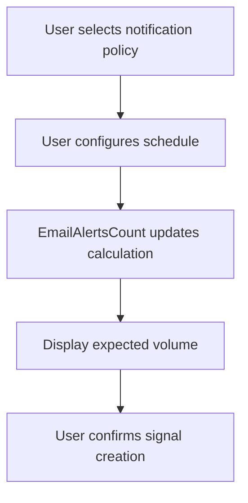

# EmailAlertsCount Component

## Purpose

The `EmailAlertsCount` component displays an estimated count of email alerts a user can expect to receive per month based on their signal notification settings. It dynamically calculates and shows different counts depending on whether the user has selected scheduled digest emails or "as it happens" notifications, providing transparency about email frequency before signal creation.

## Component Type

**Client Component** - Uses the `'use client'` directive implicitly through its dependencies on:
- Zustand store hooks (`useCreateSignalStore`)
- Custom hooks with state (`useSignalArticlesVolume`)
- `useMemo` for client-side calculations

This component requires client-side reactivity to respond to notification policy changes and perform real-time calculations.

## Props Interface

| Prop | Type | Required | Default | Description |
|------|------|----------|---------|-------------|
| `className` | `string` | No | `undefined` | Additional CSS classes to apply to the root container |

## Usage Example

```tsx
import { EmailAlertsCount } from '@/components/signals/creation/signal-types/email-alerts-count';

// Basic usage in signal creation flow
function SignalNotificationSettings() {
  return (
    <div className="space-y-4">
      <NotificationPolicySelector />
      <SchedulePolicySelector />
      
      {/* Display expected email count */}
      <EmailAlertsCount />
      
      <SignalCreateButton />
    </div>
  );
}

// With custom styling
function SignalSummary() {
  return (
    <div>
      <h3>Signal Summary</h3>
      <EmailAlertsCount className="mt-4 border border-gray-200" />
    </div>
  );
}
```

## Functionality

### Core Features
- **Dynamic Count Calculation**: Automatically calculates expected email volume based on notification settings
- **Dual Notification Modes**: 
  - **Scheduled**: Shows digest email count based on selected days/intervals
  - **As It Happens**: Shows projected count based on historical article volume
- **Smart Formatting**: Uses `nFormatter` for large numbers and proper pluralization
- **Responsive Design**: Hides detailed context on smaller screens
- **Visual Feedback**: Prominent display with icon and clear typography hierarchy

### Calculation Logic
- **Scheduled Emails**: Counts total selected days across all intervals
- **Immediate Emails**: Uses average articles from last month as baseline
- **Monthly Projection**: Both calculations provide monthly estimates

## State Management

### Zustand Store Integration
```tsx
// Consumes signal creation state
const schedulePolicy = useCreateSignalStore((state) => state.schedulePolicy);
const notificationPolicy = useCreateSignalStore((state) => state.notificationPolicy);
```

### Local State Optimization
```tsx
// Memoized calculations prevent unnecessary re-renders
const digestEmailsCount = useMemo(() => {
  // Calculation logic
}, [schedulePolicy]);

const asItHappensEmailsCount = useMemo(() => {
  // Historical data processing
}, [averageArticlesLastMonth]);
```

## Side Effects

### Data Dependencies
- **Historical Analysis**: Relies on `useSignalArticlesVolume` hook for past 30 days data
- **Real-time Updates**: Responds immediately to notification policy changes
- **Calculation Utilities**: Uses `calculateEmailAlertsCount` for complex scheduling logic

### No Direct Side Effects
- Pure display component with no API calls
- No external state mutations
- No localStorage or session storage interactions

## Dependencies

### Hooks & State
- `useCreateSignalStore` - Signal creation state management
- `useSignalArticlesVolume` - Historical article volume data
- `useMemo` - Performance optimization

### UI Components
- `Typography` - Consistent text styling
- `IconNavigationSignals` - Visual signal indicator

### Utilities
- `pluralize` - Grammar-correct pluralization
- `nFormatter` - Number formatting for large values
- `cn` - Tailwind class name utility
- `calculateEmailAlertsCount` - Business logic for email calculations

### Types
- `NotificationPolicyEnum` - Notification policy constants

## Integration

### Signal Creation Flow


### Data Flow Architecture
- **Input**: Notification policies and schedules from Zustand store
- **Processing**: Client-side calculation of expected email volume
- **Output**: Formatted display of email expectations
- **Context**: Part of larger signal creation wizard

## Best Practices

### Architectural Compliance
✅ **Component Decomposition**: Single-purpose component focused on email count display  
✅ **State Management**: Proper Zustand integration for signal creation state  
✅ **Performance**: Memoized calculations prevent unnecessary re-renders  
✅ **Reusability**: Clean props interface allows flexible styling and placement  

### Implementation Patterns
✅ **Conditional Logic**: Clean separation of scheduled vs. immediate notification logic  
✅ **Error Handling**: Graceful fallbacks for missing data (returns 0)  
✅ **Responsive Design**: Adaptive content based on screen size  
✅ **Type Safety**: Full TypeScript integration with proper interfaces  

### User Experience
✅ **Transparency**: Clear communication of email frequency expectations  
✅ **Context**: "Based on last 30 days" provides data source context  
✅ **Visual Hierarchy**: Proper emphasis on key numbers with bold formatting  
✅ **Accessibility**: Semantic HTML structure with proper color contrast  

This component exemplifies proper integration within the signal creation flow, providing essential user feedback while maintaining clean separation of concerns and optimal performance.