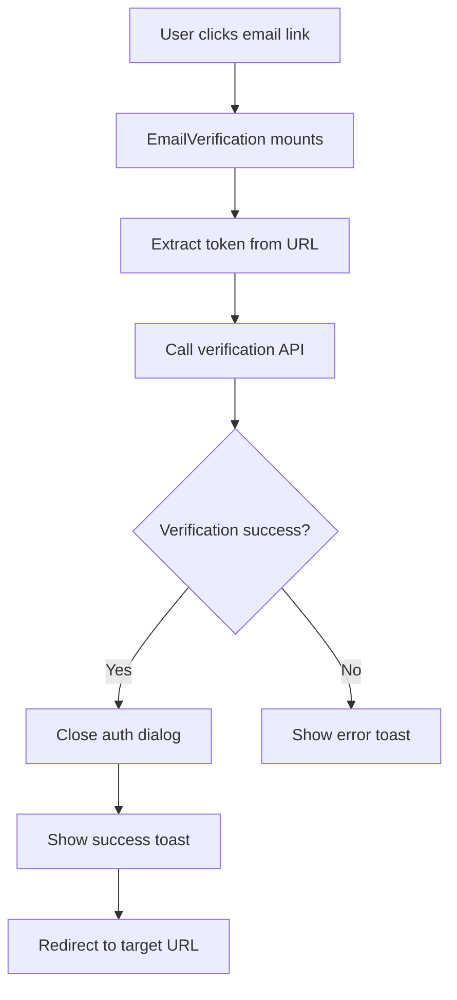

# EmailVerification Component

## Purpose

The `EmailVerification` component handles the automatic verification of user email addresses via URL tokens. It processes email verification tokens from URL search parameters, triggers the verification API call, and manages the post-verification user experience including navigation and success feedback.

## Component Type

**Client Component** - Uses the `'use client'` directive because it:
- Accesses browser APIs (`useRouter`, `useSearchParams`)
- Manages side effects with `useEffect`
- Handles user interactions and navigation
- Requires access to client-side context providers

## Props Interface

### EmailVerification
| Prop | Type | Required | Description |
|------|------|----------|-------------|
| None | - | - | This component accepts no props |

### EmailVerificationInner
| Prop | Type | Required | Description |
|------|------|----------|-------------|
| None | - | - | This component accepts no props |

## Usage Example

```tsx
import { EmailVerification } from '@/components/authentication/email-verification';

// In a verification page or route
function VerificationPage() {
  return (
    <div className="verification-container">
      <h1>Verifying your email...</h1>
      <EmailVerification />
    </div>
  );
}

// URL examples that trigger verification:
// /verify?verify_email_token=abc123&redirect_to=/dashboard
// /verify?verify_email_token=xyz789
```

## Functionality

### Core Features
- **Automatic Token Processing**: Extracts verification token from URL parameters
- **Single Execution Guard**: Prevents duplicate verification attempts using `useRef`
- **Post-Verification Navigation**: Redirects users to specified URL or default location
- **Success Feedback**: Shows toast notification on successful verification
- **Error Handling**: Displays appropriate error messages for failed verifications
- **Dialog Management**: Closes authentication dialogs after successful verification

### URL Parameter Handling
- `verify_email_token`: The verification token from email links
- `redirect_to`: Optional redirect destination after successful verification

## State Management

### TanStack Query Integration
```tsx
const { mutate: onVerifyEmail } = useVerifyEmail({
  onSuccess: () => {
    // Handle successful verification
  },
  onError: handleToastError,
});
```

### Local State
- **Execution Guard**: `useRef` to prevent duplicate API calls
- **No React State**: Component relies on URL parameters and external state management

## Side Effects

### API Interactions
- **Email Verification**: Calls verification endpoint with token
- **Automatic Execution**: Triggers verification on component mount when token is present

### Navigation Effects
- **Redirect Handling**: Navigates to specified or default URL after verification
- **Dialog Closure**: Closes authentication-related dialogs

### User Feedback
- **Success Toast**: Shows confirmation message
- **Error Toast**: Displays error details via `useHandleToastError`

## Dependencies

### Hooks
- `useRouter` - Next.js navigation
- `useSearchParams` - URL parameter access
- `useVerifyEmail` - Custom query hook for verification API
- `useAuthDialog` - Authentication dialog context
- `useToast` - Toast notification system
- `useHandleToastError` - Standardized error handling

### Utilities
- `getRedirectUrl` - Safe URL construction for redirects
- Constants for parameter names (`VERIFY_EMAIL_PARAM`, `REDIRECT_TO_PARAM`)

### External Dependencies
- Next.js navigation system
- Authentication context providers

## Integration

### Authentication Flow


### Application Architecture
- **Authentication System**: Integrates with broader auth flow
- **Routing Layer**: Works with Next.js App Router
- **Error Handling**: Uses centralized error management
- **User Experience**: Provides seamless verification flow

## Best Practices

### Architecture Adherence
✅ **Client Component Usage**: Appropriately uses client-side features  
✅ **Suspense Boundary**: Implements proper loading state handling  
✅ **TanStack Query**: Uses query hooks for server state management  
✅ **Error Handling**: Centralizes error management with custom hooks  
✅ **Component Decomposition**: Separates concerns with inner/outer pattern  

### Implementation Patterns
✅ **Side Effect Management**: Properly guards against duplicate executions  
✅ **URL Parameter Handling**: Uses Next.js recommended patterns  
✅ **Context Integration**: Leverages application context providers  
✅ **User Feedback**: Provides clear success/error messaging  

### Security Considerations
✅ **Token Handling**: Processes verification tokens securely  
✅ **Redirect Validation**: Uses utility function for safe URL construction  
✅ **Single Execution**: Prevents replay attacks through execution guards  

### Performance Optimizations
✅ **Lazy Loading**: Uses Suspense for progressive loading  
✅ **Minimal Renders**: No unnecessary state updates  
✅ **Efficient Dependencies**: Minimal dependency array in useEffect  