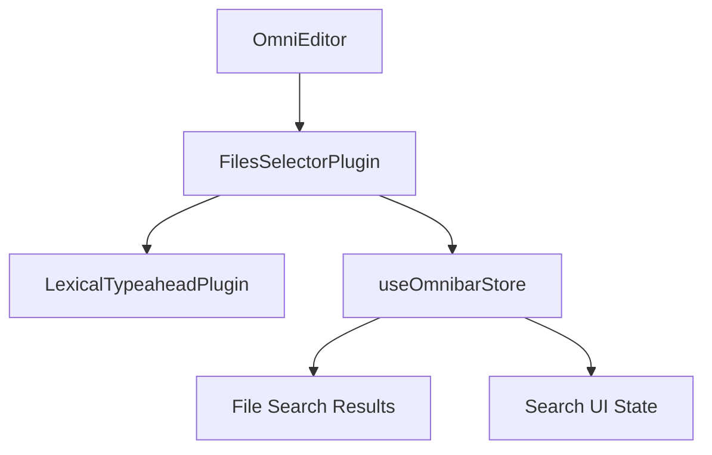

# FilesSelectorPlugin

## Purpose

The `FilesSelectorPlugin` is a specialized Lexical editor plugin that enables file search functionality within the omnibar editor. It detects when users type the `//` trigger sequence and activates a file search mode, allowing users to search and select files through a typeahead interface. This component bridges the gap between text input and file system navigation within the omnibar context.

## Component Type

**Client Component** - Uses the `'use client'` directive (implied by React hooks usage)

This is a client component because it:
- Uses interactive React hooks (`useCallback`, `useDebounceCallback`)
- Manages real-time text input detection and state updates
- Integrates with Lexical editor's interactive typeahead functionality
- Requires immediate user interaction feedback

## Props Interface

This component accepts no props - it's a self-contained plugin that integrates directly with the omnibar store and Lexical editor context.

| Prop | Type | Required | Description |
|------|------|----------|-------------|
| N/A | N/A | N/A | This component accepts no external props |

## Usage Example

```tsx
import { FilesSelectorPlugin } from '@/components/omnibar/omni-editor/plugins/files-selector-plugin';

// Within the omnibar editor plugin composition
function OmniEditor() {
  return (
    <LexicalComposer>
      <div className="editor-container">
        <RichTextPlugin />
        <FilesSelectorPlugin />
        {/* Other plugins */}
      </div>
    </LexicalComposer>
  );
}

// Usage in the omnibar context
function Omnibar() {
  return (
    <OmnibarProvider>
      <OmniEditor />
    </OmnibarProvider>
  );
}
```

**User Interaction Example:**
```
User types: "Open //config"
// Triggers file search mode
// Shows file suggestions matching "config"
// Updates omnibar store with search state
```

## Functionality

### Core Features

- **Trigger Detection**: Monitors text input for `//` sequence to activate file search
- **Debounced Search**: Implements 300ms debounced search queries to optimize performance
- **State Synchronization**: Maintains file search state across the omnibar store
- **Match Tracking**: Tracks and reports matching text segments for replacement
- **Clean Deactivation**: Properly cleans up state when trigger is removed

### Key Behaviors

- **Trigger Pattern**: Activates on `//` followed by search text
- **Search Activation**: Sets `isFileSearchActive` flag in store
- **Query Management**: Updates `filesSearchQuery` with debounced input
- **Match Reporting**: Provides match details to parent typeahead system

## State Management

**Zustand Store Integration** - Uses `useOmnibarStore` for centralized state management

### Store Actions Used:
```tsx
// File search query management
setFilesSearchQuery: (query: string | null) => void

// Search activation state
setIsFileSearchActive: (active: boolean) => void

// Match state for typeahead coordination
setFilePluginMatch: (match: MenuTextMatch | null) => void
```

### State Flow:
1. User types text containing `//`
2. Plugin detects trigger and activates search mode
3. Debounced query updates are sent to store
4. Store notifies other components of file search state
5. Match details are tracked for text replacement

## Side Effects

### State Updates
- **Debounced Query Updates**: 300ms debounced updates to prevent excessive API calls
- **Search Mode Toggle**: Immediate activation/deactivation of file search mode
- **Match State Tracking**: Real-time updates of text matching information

### Performance Optimizations
- **Debounced Search**: Reduces API call frequency during rapid typing
- **Memoized Callbacks**: Prevents unnecessary re-renders through `useCallback`

## Dependencies

### External Dependencies
```tsx
import { MenuTextMatch } from '@lexical/react/LexicalTypeaheadMenuPlugin';
import { useDebounceCallback } from 'usehooks-ts';
```

### Internal Dependencies
```tsx
import { useOmnibarStore } from '@/lib/contexts';
import { LexicalTypeaheadPlugin } from '../lexical-typeahead-plugin';
```

### Component Relationships
- **Parent**: Omnibar editor plugin system
- **Child**: `LexicalTypeaheadPlugin` (provides base typeahead functionality)
- **Store**: `useOmnibarStore` (manages omnibar state)

## Integration

### Omnibar Architecture Integration



### Plugin System Role
- **Input Processing**: Handles text input analysis for file triggers
- **State Coordination**: Bridges Lexical editor and omnibar store
- **Search Activation**: Manages transition between modes
- **Result Integration**: Coordinates with file search results display

## Best Practices

### ✅ Architectural Adherence

- **Single Responsibility**: Focused solely on file search trigger detection
- **State Management Pattern**: Proper use of Zustand for omnibar state
- **Performance Optimization**: Implements debouncing for search queries
- **Clean Architecture**: Clear separation between trigger detection and search logic

### ✅ Component Design Patterns

- **Plugin Architecture**: Follows Lexical plugin composition pattern
- **Hook Optimization**: Proper use of `useCallback` for stable references
- **State Synchronization**: Maintains consistency between editor and store state
- **Error Boundaries**: Graceful handling of trigger state changes

### ✅ Integration Patterns

- **Store Integration**: Leverages centralized omnibar store effectively
- **Debounced Updates**: Implements performance-conscious search updates
- **Clean State Management**: Proper cleanup on component unmount/trigger removal
- **Typeahead Coordination**: Seamless integration with base typeahead functionality

### 🔧 Usage Recommendations

1. **Always wrap in OmnibarProvider context**
2. **Include alongside other omnibar plugins**
3. **Ensure store is properly initialized**
4. **Consider file search result handling components**