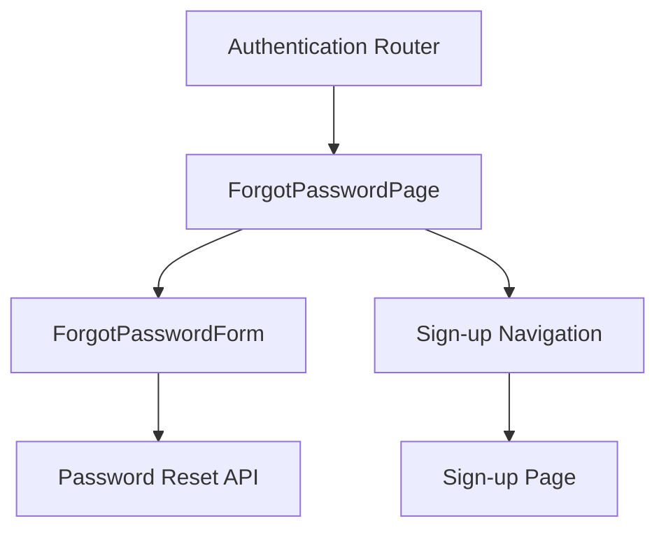

# ForgotPasswordPage Component

## Purpose

The `ForgotPasswordPage` component serves as a page-level wrapper for the forgot password functionality in the authentication flow. It manages navigation context by preserving redirect and referrer parameters when users switch between different authentication pages, ensuring a seamless user experience after password recovery.

## Component Type

**Client Component** - Uses the `'use client'` directive because it requires browser-specific functionality including Next.js router navigation and interactive callbacks that need to execute in the client environment.

## Props Interface

| Prop | Type | Required | Description |
|------|------|----------|-------------|
| `redirect` | `string` | Yes | The URL path where the user should be redirected after successful authentication |
| `referrer` | `string` | No | Optional referrer information to track the source of the authentication request |

## Usage Example

```tsx
// In a page component or routing setup
import { ForgotPasswordPage } from '@/components/authentication/forgot-password-page';

// Basic usage with redirect
function ForgotPasswordRoute() {
  return (
    <ForgotPasswordPage 
      redirect="/dashboard" 
    />
  );
}

// With referrer tracking
function ForgotPasswordWithReferrer() {
  return (
    <ForgotPasswordPage 
      redirect="/profile" 
      referrer="email-campaign"
    />
  );
}

// In Next.js app router page
export default function ForgotPasswordPageRoute({
  searchParams
}: {
  searchParams: { redirect?: string; referrer?: string }
}) {
  return (
    <ForgotPasswordPage
      redirect={searchParams.redirect || '/'}
      referrer={searchParams.referrer}
    />
  );
}
```

## Functionality

- **Navigation Management**: Preserves redirect and referrer parameters across authentication flow transitions
- **Sign-up Redirect**: Provides seamless navigation to the sign-up page while maintaining context
- **URL Parameter Handling**: Properly serializes and maintains URL parameters using the application's default parameter serializer
- **Authentication Flow Integration**: Acts as a bridge between different authentication pages

## State Management

This component uses **local callback state** with `useCallback` for performance optimization. It doesn't directly manage server or client state but relies on:
- Next.js router for navigation state
- URL parameters for maintaining authentication context
- The child `ForgotPasswordForm` component for form state management

## Side Effects

- **Navigation Side Effects**: Triggers browser navigation when users select the sign-up option
- **URL Manipulation**: Constructs URLs with preserved query parameters for maintaining authentication context

## Dependencies

### Components
- `ForgotPasswordForm` - The actual form component that handles password reset functionality

### Hooks
- `useRouter` from Next.js - For programmatic navigation
- `useCallback` from React - For performance optimization of navigation handlers

### Utilities
- `defaultParamsSerializer` - Application utility for URL parameter serialization
- `REDIRECT_TO_PARAM`, `REFERRER_PARAM` - Application constants for parameter names

## Integration

The `ForgotPasswordPage` component fits into the authentication architecture as:

1. **Page-Level Component**: Serves as the top-level component for the forgot password route
2. **Authentication Flow Hub**: Connects to other authentication pages (sign-up) while preserving context
3. **Parameter Bridge**: Maintains authentication flow state across different pages
4. **Form Container**: Wraps the actual form component with navigation logic



## Best Practices

✅ **Follows Architecture Guidelines**:
- **Client Component Usage**: Appropriately uses client-side rendering for interactive navigation
- **Component Decomposition**: Clean separation between page logic and form logic
- **Flat Structure**: Minimal nesting with clear component boundaries
- **Parameter Management**: Proper handling of URL parameters using application utilities

✅ **Performance Optimizations**:
- Uses `useCallback` to prevent unnecessary re-renders
- Minimal state management overhead

✅ **User Experience**:
- Preserves user context across authentication flows
- Provides clear navigation paths between authentication states
- Maintains redirect intentions throughout the process

✅ **Integration Patterns**:
- Follows consistent parameter naming conventions
- Uses application-standard utilities for URL handling
- Maintains clean separation of concerns between navigation and form logic