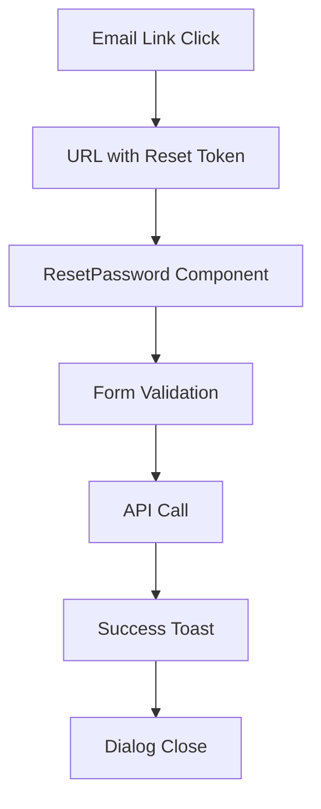

# ResetPassword Component

## Purpose

The `ResetPassword` component provides a secure password reset interface within the authentication dialog. It allows users to set a new password using a reset token received via email, with comprehensive validation and error handling to ensure password security requirements are met.

## Component Type

**Client Component** - Uses the `'use client'` directive because it requires:
- Browser-specific hooks (`useSearchParams` for URL parameters)
- Form state management with React Hook Form
- Interactive form submission handling
- Toast notifications and dialog interactions

## Props Interface

This component does not accept any props. It operates independently within the authentication dialog context.

| Prop | Type | Required | Description |
|------|------|----------|-------------|
| None | - | - | Component is self-contained |

## Usage Example

```tsx
import { ResetPassword } from '@/components/authentication/auth-dialog/reset-password';

// Used within AuthDialog routing
function AuthDialog() {
  const { authDialogView } = useAuthDialog();
  
  return (
    <Dialog>
      <DialogContent>
        {authDialogView === 'reset-password' && <ResetPassword />}
      </DialogContent>
    </Dialog>
  );
}

// URL structure for reset password flow
// /auth?reset-password-token=abc123xyz789
```

## Functionality

### Core Features
- **Dual Password Input**: New password and confirmation fields with validation
- **Real-time Validation**: Form validation on field touch with immediate feedback
- **Password Requirements**: Enforces 8+ characters, 1 number, 1 special character
- **Token-based Reset**: Extracts reset token from URL parameters
- **Success Handling**: Shows success toast and closes dialog on completion
- **Error Management**: Comprehensive error handling with user-friendly messages

### Form Validation
- **Password Matching**: Ensures new password and confirmation match exactly
- **Security Requirements**: Validates against `passwordSchema` rules
- **Field-level Errors**: Individual field validation with specific error messages
- **Form State**: Disables submit button until form is valid and dirty

## State Management

### Form State
- **React Hook Form**: Manages form state, validation, and submission
- **Mode**: `onTouched` validation for immediate user feedback
- **Resolver**: Zod schema validation with `zodResolver`

### Server State
- **TanStack Query**: `useResetPassword` mutation for API communication
- **Optimistic Updates**: Immediate UI feedback during submission
- **Error Handling**: Automatic error state management

### Application State
- **Auth Dialog Context**: Integration with authentication dialog state
- **Toast Context**: Success and error message display

## Side Effects

### API Interactions
```tsx
const { mutate: onResetPassword, isPending } = useResetPassword({
  onSuccess: () => {
    toast({ title: 'Your password has been reset.' });
    onAuthDialogClose();
  },
  onError: handleToastError,
});
```

### URL Parameter Reading
- Extracts reset token from search parameters
- Handles missing or invalid tokens gracefully

### Navigation Effects
- Closes authentication dialog on successful password reset
- Maintains URL state during form interaction

## Dependencies

### Core Dependencies
- **Form Management**: `react-hook-form`, `@hookform/resolvers/zod`
- **Validation**: `zod` schema validation
- **Navigation**: `next/navigation` for URL parameters
- **State**: `useAuthDialog` context hook

### UI Components
- `Button`, `PasswordInput`, `Typography`, `HintText`
- `DialogTitlePrimitive` for accessibility
- `PiInformationFill` icon for error states

### Custom Hooks
- `useHandleToastError`: Standardized error handling
- `useToast`: Notification system
- `useResetPassword`: API mutation hook

## Integration

### Authentication Flow Integration


### Context Integration
- **Auth Dialog**: Part of authentication dialog routing system
- **Global Toast**: Integrated with application-wide notification system
- **Query Context**: Participates in global API state management

### URL Structure
- Reads from `RESET_PASSWORD_TOKEN_PARAM` constant
- Maintains consistency with email link generation
- Handles token validation at component level

## Best Practices

### Architectural Compliance
✅ **Client Component Usage**: Appropriately uses client-side features  
✅ **Form Management**: Follows React Hook Form + Zod pattern  
✅ **State Management**: TanStack Query for server state  
✅ **Component Decomposition**: Single responsibility, focused functionality  

### Security Implementation
- **Token Validation**: Proper handling of reset tokens
- **Password Requirements**: Enforces strong password policies
- **Error Handling**: Secure error messages without information leakage
- **Form State**: Prevents submission of invalid or incomplete data

### User Experience
- **Progressive Enhancement**: Form works with JavaScript disabled
- **Accessibility**: Proper ARIA attributes and semantic HTML
- **Loading States**: Clear feedback during form submission
- **Error Recovery**: Clear error messages with actionable guidance

### Code Quality
- **Type Safety**: Full TypeScript integration with Zod inference
- **Reusability**: Uses shared UI components and validation schemas
- **Maintainability**: Clear separation of concerns and single responsibility
- **Testing**: Structure supports unit and integration testing