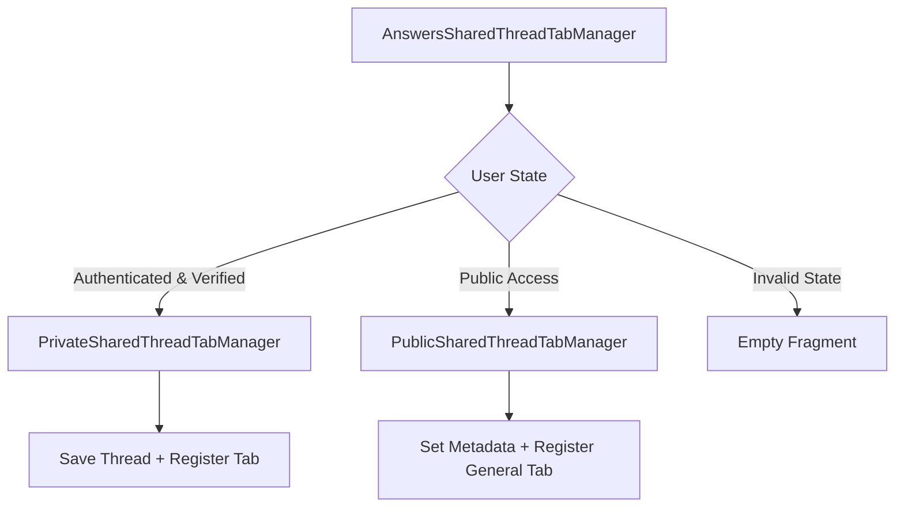

# AnswersSharedThreadTabManager

## Purpose

The `AnswersSharedThreadTabManager` is a smart router component that manages tab registration for shared thread pages based on user authentication state. It conditionally renders either private or public tab managers, handling the automatic saving of shared threads for authenticated users while ensuring proper tab integration in the main layout system.

## Component Type

**Client Component** - Uses the `'use client'` directive because it:
- Manages authentication state with `useAccessToken` hook
- Performs conditional rendering based on user state
- Executes side effects for thread saving and tab registration
- Integrates with client-side tab management system

## Props Interface

| Prop | Type | Required | Description |
|------|------|----------|-------------|
| `thread` | `AnswersThreadWithMessages` | Yes | The shared thread object containing thread data and associated messages |

### Type Definitions
```tsx
interface AnswersSharedThreadTabManagerProps {
  thread: AnswersThreadWithMessages;
}
```

## Usage Example

```tsx
import { AnswersSharedThreadTabManager } from '@/components/answers/shared-thread-tab-manager';

// In a shared thread page component
function SharedThreadPage({ threadId }: { threadId: string }) {
  const { data: thread } = useSharedThread(threadId);
  
  if (!thread) return <div>Loading...</div>;

  return (
    <div>
      {/* Tab manager handles authentication-based tab registration */}
      <AnswersSharedThreadTabManager thread={thread} />
      
      {/* Thread content */}
      <ThreadMessages messages={thread.messages} />
    </div>
  );
}
```

## Functionality

### Authentication-Based Routing
- **Authenticated Users**: Renders `PrivateSharedThreadTabManager` for logged-in, verified users
- **Public Users**: Renders `PublicSharedThreadTabManager` for public access
- **Unauthenticated**: Returns empty fragment for invalid states

### Private Thread Management
- Automatically saves shared threads to user's saved collection
- Prevents duplicate thread saving through existence checks
- Registers tabs with full authentication context

### Public Thread Management
- Updates public shared thread metadata in context
- Registers general tabs without authentication requirements
- Maintains proper routing for public access

## State Management

### TanStack Query Integration
```tsx
// Fetches user's saved threads for duplicate checking
const { data: savedThreads, isLoading } = useSavedSharedMemberThreads({
  page: 0,
  size: 100,
  sortBy: 'createdAt',
  sortOrder: 'desc',
});

// Mutation for creating saved threads
const { mutate: onCreateThread } = useCreateSavedSharedMemberThread({
  throwOnError: false,
});
```

### Context Usage
- `useAccessToken`: Authentication state management
- `usePublicSharedThreadPage`: Public thread metadata management

## Side Effects

### Thread Saving Effect (Private)
```tsx
useEffect(() => {
  if (isLoadingSavedThreads || !savedThreads) return;
  
  const threadExists = savedThreads.data.some(
    savedThread => savedThread.id === thread.id
  );
  
  if (!threadExists) {
    onCreateThread({
      threadId: thread.id,
      name: thread.name,
      folderId: null,
    });
  }
}, [thread, onCreateThread, savedThreads, isLoadingSavedThreads]);
```

### Metadata Setting Effect (Public)
```tsx
useEffect(() => {
  setPublicSharedThreadMetadata({
    threadId: thread.id,
    name: thread.name,
    createdAt: new Date().toISOString(),
  });
}, [setPublicSharedThreadMetadata, thread]);
```

## Dependencies

### Internal Components
- `RegisterGeneralTab`: General tab registration for public users
- `RegisterTab`: Authenticated tab registration for private users

### Hooks & Contexts
- `useAccessToken`: Authentication state management
- `usePublicSharedThreadPage`: Public thread context
- `useSavedSharedMemberThreads`: Query for saved threads
- `useCreateSavedSharedMemberThread`: Thread saving mutation

### Types & Utils
- `AnswersThreadWithMessages`: Thread data type
- `TabEntity`, `TabOptions`: Tab configuration types
- `TABS_TO_HREF_BASE`: URL routing utilities

## Integration

### Main Layout System
Integrates with the application's tab management system through:
- `RegisterTab` for authenticated users with full tab entity support
- `RegisterGeneralTab` for public users with simplified tab options

### Authentication Flow


### Data Flow
1. Component receives thread data via props
2. Authentication state determines rendering path
3. Private path: Checks saved threads → Creates if needed → Registers tab
4. Public path: Sets metadata → Registers general tab

## Best Practices

### Architectural Adherence
- ✅ **Smart Component Pattern**: Handles authentication routing and business logic
- ✅ **Flat Component Structure**: Avoids deep nesting with conditional rendering
- ✅ **TanStack Query**: Proper server state management for saved threads
- ✅ **Error Handling**: Uses `throwOnError: false` for graceful mutation failures

### Performance Considerations
- Efficient duplicate checking with `some()` method
- Conditional effects prevent unnecessary API calls
- Lazy loading of saved threads with proper loading states

### Security & Access Control
- Proper authentication state checking before rendering sensitive components
- Separate handling for public vs. private thread access
- Graceful degradation for unauthenticated states

### State Management Best Practices
- Uses context for cross-component state (public metadata)
- Leverages TanStack Query for server state caching
- Implements proper loading states and dependency arrays