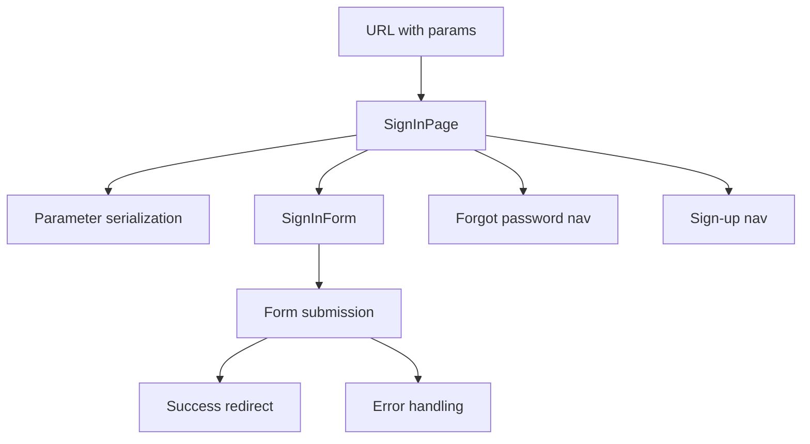

# SignInPage Component

## Purpose
The `SignInPage` component serves as a page-level wrapper for the sign-in functionality, managing navigation parameters and providing a complete sign-in experience. It acts as the orchestrator between URL parameters, navigation logic, and the actual sign-in form, ensuring proper handling of redirects and referrer information throughout the authentication flow.

## Component Type
**Client Component** - Uses `'use client'` directive because it:
- Utilizes Next.js `useRouter` hook for programmatic navigation
- Handles client-side navigation callbacks
- Manages URL parameter serialization for client-side routing

## Props Interface

| Prop | Type | Required | Description |
|------|------|----------|-------------|
| `isSignInError` | `boolean` | ✅ | Indicates if there was an error during the sign-in process |
| `oauthError` | `string` | ❌ | Optional OAuth-specific error message to display |
| `redirect` | `string` | ✅ | URL path to redirect to after successful authentication |
| `referrer` | `string` | ❌ | Optional referrer URL for tracking user navigation flow |

## Usage Example

```tsx
// In a Next.js page or layout
import { SignInPage } from '@/components/authentication/sign-in-page';

// Basic usage
export default function SignInRoute() {
  return (
    <SignInPage
      isSignInError={false}
      redirect="/dashboard"
    />
  );
}

// With error handling and referrer tracking
export default function SignInWithError() {
  return (
    <SignInPage
      isSignInError={true}
      oauthError="OAuth provider temporarily unavailable"
      redirect="/dashboard"
      referrer="/pricing"
    />
  );
}

// From URL search params (typical Next.js pattern)
import { searchParams } from 'next/navigation';

export default function SignInPageRoute({ searchParams }) {
  const isError = searchParams.error === 'true';
  const oauthError = searchParams.oauth_error;
  const redirect = searchParams.redirect_to || '/dashboard';
  const referrer = searchParams.referrer;

  return (
    <SignInPage
      isSignInError={isError}
      oauthError={oauthError}
      redirect={redirect}
      referrer={referrer}
    />
  );
}
```

## Functionality

### Core Features
- **Parameter Management**: Serializes redirect and referrer parameters for consistent URL handling
- **Navigation Orchestration**: Provides callbacks for forgot password and sign-up navigation
- **Error State Handling**: Passes through sign-in and OAuth errors to the form component
- **URL Preservation**: Maintains redirect and referrer information across navigation

### Navigation Handlers
- **Forgot Password**: Navigates to `/forgot-password` with preserved parameters
- **Sign-Up**: Navigates to `/sign-up` with preserved parameters
- **Parameter Persistence**: Ensures redirect and referrer information survives navigation

## State Management
**Local State Only** - This component:
- Uses `useMemo` for parameter serialization optimization
- Uses `useCallback` for navigation handler memoization
- Does not manage global state directly
- Relies on props for all external state

## Side Effects
- **Navigation**: Triggers programmatic navigation via Next.js router
- **URL Manipulation**: Serializes and appends query parameters to navigation URLs
- **Parameter Preservation**: Maintains authentication flow context across page transitions

## Dependencies

### Internal Dependencies
- `SignInForm` - The actual form component for authentication
- `REDIRECT_TO_PARAM`, `REFERRER_PARAM` - URL parameter constants
- `defaultParamsSerializer` - Utility for URL parameter serialization

### External Dependencies
- `next/navigation` - Next.js routing functionality
- `react` - Core React hooks and types

### Component Hierarchy
```
SignInPage (Page-level orchestrator)
└── SignInForm (Form implementation)
    └── [Form fields, validation, submission logic]
```

## Integration

### Application Architecture Role
- **Page Layer**: Acts as a page-level component in the authentication domain
- **Parameter Bridge**: Connects URL parameters to form component props
- **Navigation Hub**: Centralizes authentication-related navigation logic

### Authentication Flow Integration


## Best Practices

### Architecture Adherence
✅ **Proper Component Decomposition**: Page-level wrapper delegates form logic to specialized component  
✅ **Client Component Usage**: Appropriately uses client component for navigation requirements  
✅ **Parameter Management**: Centralizes URL parameter handling for authentication flow  
✅ **Separation of Concerns**: Navigation logic separated from form implementation  

### Performance Optimizations
- **Memoized Parameters**: Uses `useMemo` to prevent unnecessary parameter re-serialization
- **Memoized Callbacks**: Uses `useCallback` to prevent child component re-renders
- **Efficient Navigation**: Reuses serialized parameters across navigation actions

### Integration Patterns
- **URL Parameter Preservation**: Maintains authentication context across navigation
- **Error Propagation**: Cleanly passes error states to form component
- **Navigation Consistency**: Standardizes parameter handling across auth routes

This component exemplifies the page-level orchestrator pattern, managing navigation and parameter concerns while delegating specialized functionality to focused child components.