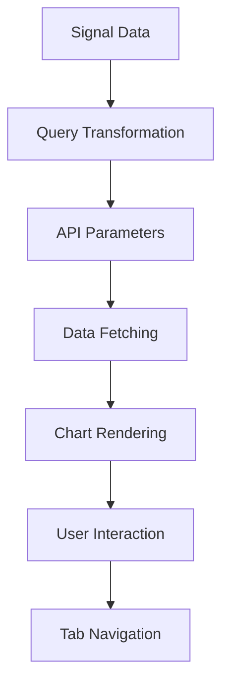

# SignalDetailsOverview Component

## Purpose

The `SignalDetailsOverview` component provides a comprehensive overview of signal monitoring data, displaying analytics charts alongside configurable query and delivery details. It serves as the main dashboard view for signal details, allowing users to visualize signal performance metrics and manage signal configuration through a dual-pane interface.

## Component Type

**Client Component** - Uses the `'use client'` directive because it requires:
- Local state management with `useState` for tab switching
- Interactive user events (button clicks for tab navigation)
- Complex data transformations and memoized calculations
- Real-time chart rendering and user interactions

## Props Interface

| Prop | Type | Required | Description |
|------|------|----------|-------------|
| `signalData` | `Signal` | Yes | Complete signal configuration object containing query parameters, notification settings, and metadata |

## Usage Example

```tsx
import { SignalDetailsOverview } from '@/components/signals/details/signal-details-overview';
import { Signal } from '@/lib/types';

function SignalDetailPage({ signalId }: { signalId: string }) {
  const { data: signal } = useSignal(signalId);
  
  if (!signal) return <div>Loading...</div>;
  
  return (
    <div className="container mx-auto py-6">
      <SignalDetailsOverview signalData={signal} />
    </div>
  );
}

// Example with anomaly detection signal
const anomalySignal: Signal = {
  id: 'signal-123',
  signalType: SignalTypeEnum.ARTICLES_VOLUME,
  signalQuery: {
    query: {
      articlesQuery: {
        query: { q: 'AI technology', title: 'AI News Monitor' },
        showReprints: false
      },
      articlesVolumeQuery: {
        right: { multiplier: 1.5 }
      }
    }
  },
  notificationPolicyType: 'IMMEDIATE'
};

<SignalDetailsOverview signalData={anomalySignal} />
```

## Functionality

### Core Features
- **Dual-Pane Layout**: Split view with analytics chart on the left and configurable details on the right
- **Tab Navigation**: Toggle between Query and Delivery configuration views
- **Real-time Analytics**: Interactive charts showing signal performance metrics
- **Anomaly Detection**: Special handling and visualization for volume-based anomaly signals
- **Notification Tracking**: Displays recent notification counts and delivery statistics

### Key Behaviors
- **Responsive Design**: Adapts layout from column stack on mobile to side-by-side on desktop
- **Dynamic Chart Rendering**: Shows loading skeleton while data loads, then renders interactive chart
- **Contextual Information**: Displays different metrics based on signal type (standard vs. anomaly)
- **Filter Integration**: Automatically converts signal queries to filter parameters for analytics

## State Management

### Local State
- **Block Selection**: `useState<BlockType>` manages active tab (Query/Delivery)

### Server State (TanStack Query)
- **Signal Articles Data**: `useSignalArticlesIntervalData` - Time-series analytics data
- **Sources Count**: `useTopEntitiesCounts` - Source diversity metrics
- **Notifications**: `useSignalsNotifications` - Recent notification history

### Memoized Computations
- **Filters**: Transforms signal query to filter parameters
- **Anomaly Threshold**: Calculates percentage thresholds for anomaly signals
- **API Parameters**: Optimizes query parameters for data fetching

## Side Effects

### Data Fetching
- Fetches article interval data based on signal configuration
- Retrieves source count statistics for the signal's time range
- Loads recent notifications (last 10 days) for the signal

### Computed Values
- Converts complex query objects to filter parameters
- Calculates anomaly thresholds from multiplier values
- Processes notification counts and delivery statistics

## Dependencies

### UI Components
- `Block` - Container component for layout sections
- `Button` - Tab navigation controls
- `ChartSkeleton` - Loading state for chart area

### Feature Components
- `DetailsChart` - Main analytics visualization component
- `QueryDetails` - Signal query configuration display
- `DeliveryDetails` - Notification delivery settings display

### Hooks & Services
- `useSignalArticlesIntervalData` - Custom hook for signal analytics
- `useSignalsNotifications` - Notification data queries
- `useTopEntitiesCounts` - Source statistics queries

### Utilities
- `mapComplexAllEndpointQueryToFilters` - Query transformation
- `getAnomalyArticlesVolumePercentage` - Anomaly threshold calculation
- `date-fns` - Date manipulation and formatting

## Integration

### Application Flow
1. **Signal Details Page** → `SignalDetailsOverview` → Analytics Dashboard
2. **Signal Management** → Overview → Configuration Updates
3. **Monitoring Dashboard** → Signal List → Individual Signal Overview

### Data Pipeline


## Best Practices

### Architectural Adherence
- ✅ **Proper Client Component Usage**: Uses `'use client'` only for necessary interactivity
- ✅ **Component Decomposition**: Delegates chart rendering and detail views to specialized components
- ✅ **TanStack Query Integration**: Leverages server state management for all data fetching
- ✅ **Memoization**: Optimizes expensive computations with `useMemo`

### Performance Optimizations
- **Selective Re-renders**: Memoizes complex calculations to prevent unnecessary recalculations
- **Efficient Data Fetching**: Uses optimized query parameters and selective data transformations
- **Loading States**: Provides immediate feedback with skeleton components

### Code Organization
- **Single Responsibility**: Each sub-component handles specific concerns (chart, query, delivery)
- **Props Drilling Avoidance**: Passes complete signal data object rather than multiple props
- **Type Safety**: Leverages TypeScript enums and interfaces for reliable state management

### User Experience
- **Responsive Design**: Adapts layout for different screen sizes
- **Progressive Loading**: Shows content as data becomes available
- **Clear Navigation**: Intuitive tab switching between different views