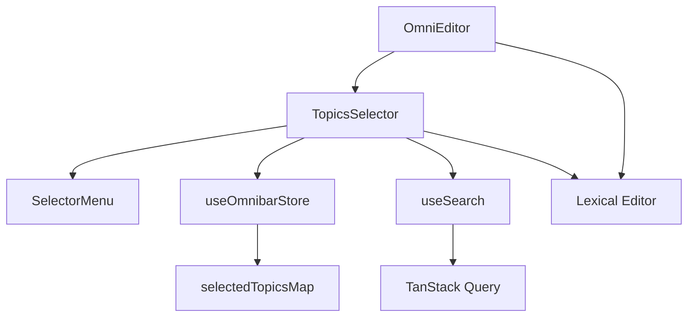

# TopicsSelector Component

## Purpose

The `TopicsSelector` component provides a searchable dropdown interface for selecting and managing hashtag topics within the omnibar editor. It enables users to search for topics, select them to create hashtag nodes in the editor, and maintains the relationship between selected topics and their corresponding editor nodes.

## Component Type

**Client Component** - Uses `'use client'` directive because it:
- Manages complex interactive state with Zustand store
- Handles Lexical editor interactions and node mutations
- Requires event handlers and real-time user interactions
- Performs client-side search operations

## Props Interface

This component accepts no props - it's a self-contained widget that manages its state through the Zustand store.

| Prop | Type | Required | Description |
|------|------|----------|-------------|
| - | - | - | No props accepted |

## Usage Example

```tsx
import { TopicsSelector } from '@/components/omnibar/topics-selector/topics-selector';

// Used within the omnibar interface
export function OmnibarInterface() {
  return (
    <div className="omnibar-container">
      <OmniEditor />
      {/* TopicsSelector renders conditionally based on search state */}
      <TopicsSelector />
    </div>
  );
}

// The component automatically shows when user types '#' in the editor
// and displays topic search results for selection
```

## Functionality

### Core Features

- **Topic Search**: Searches for topics based on user input following '#' character
- **Hashtag Creation**: Converts selected topics into hashtag nodes in the Lexical editor
- **Node Management**: Tracks and manages the lifecycle of hashtag nodes
- **Temporary Highlighting**: Provides visual feedback while typing hashtags
- **Duplicate Prevention**: Prevents creation of duplicate topic selections

### Key Behaviors

- Renders only when `topicsSearchQuery` is active (not null)
- Displays loading state during search operations
- Shows "No Topics Found" when search yields no results
- Automatically replaces temporary hashtag nodes with permanent ones on selection
- Maintains bidirectional sync between editor nodes and selected topics map

## State Management

### Zustand Store Integration

Uses `useOmnibarStore` for centralized state management:

```tsx
// Read state
const topicsSearchQuery = useOmnibarStore((state) => state.topicsSearchQuery);
const selectedTopicsMap = useOmnibarStore((state) => state.selectedTopicsMap);
const topicPluginMatch = useOmnibarStore((state) => state.topicPluginMatch);

// Update state
const setSelectedTopicsMap = useOmnibarStore((state) => state.setSelectedTopicsMap);
```

### Local State Management

- **Search Results**: Managed through `useSearch` hook with TanStack Query
- **Component Lifecycle**: Uses React hooks for side effects and memoization

## Side Effects

### Editor Integration

- **Node Mutation Listeners**: Monitors hashtag node creation, updates, and destruction
- **Node Replacement**: Replaces temporary nodes with permanent hashtag nodes
- **Selection Tracking**: Updates node styling based on editor selection state

### Search Operations

- **Debounced Search**: Searches topics based on query input
- **Result Filtering**: Filters search to topics only (disables stories, people, companies)

## Dependencies

### Core Dependencies

- **Lexical Editor**: `$getSelection` for editor state management
- **Custom Hooks**:
  - `useLexicalEditorTools` - Editor manipulation utilities
  - `useCreateTextEntityFromTextNode` - Temporary node creation
  - `useSearch` - Search functionality with TanStack Query

### UI Components

- **Icons**: `PiCornerDownLeftLine` for selection indicator
- **Typography**: Text rendering with consistent styling
- **SelectorMenu**: Reusable dropdown menu component

### Node Types

- **HashtagNode**: Permanent hashtag representations
- **TemporaryHashtagNode**: Temporary highlighting during typing
- **BaseTokenNode**: Base class for token-based editor nodes

## Integration

### Omnibar Architecture



### Editor Workflow

1. User types '#' character in editor
2. Triggers topic search query in store
3. `TopicsSelector` renders with search results
4. User selects topic from dropdown
5. Creates permanent hashtag node in editor
6. Updates selected topics map for tracking

## Best Practices

### Architecture Adherence

✅ **State Management**: Properly uses Zustand for client state and TanStack Query for search results

✅ **Component Decomposition**: Leverages reusable `SelectorMenu` component rather than building custom dropdown

✅ **Separation of Concerns**: Search logic separated into custom hook, editor logic in dedicated tools hook

✅ **Performance**: Uses `useMemo` and `useCallback` for expensive operations and event handlers

### Implementation Patterns

- **Conditional Rendering**: Returns null when not needed, following React patterns
- **Error Boundaries**: Graceful handling of missing search results
- **Accessibility**: Proper keyboard navigation through SelectorMenu component
- **Type Safety**: Strongly typed with TypeScript throughout

### Integration Guidelines

- Component automatically integrates with omnibar workflow
- No manual props required - connects through shared Zustand store
- Follows established patterns for editor node management
- Maintains consistency with other selector components in the omnibar