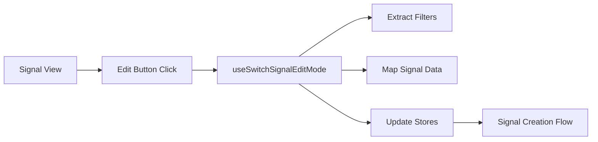

# useSwitchSignalEditMode Hook

## Purpose

The `useSwitchSignalEditMode` hook manages the transition from viewing a signal to editing it by setting up the necessary state and filters for the signal creation workflow. It handles the complex process of converting existing signal data into an editable format and initializing the creation store with the appropriate step and filters.

## Component Type

**Client Hook** - This is a client-side hook that requires the `useCallback` hook and manages client-side state transitions. It doesn't perform any server-side operations but orchestrates client state management between multiple stores.

## Props Interface

| Prop | Type | Required | Description |
|------|------|----------|-------------|
| `signalData` | `Signal \| undefined` | No | The signal data object to be converted into edit mode. If undefined, the hook will not perform any operations when called |

## Usage Example

```tsx
'use client'

import { useSwitchSignalEditMode } from '@/components/hooks/use-switch-signal-edit-mode';
import { SIGNAL_CREATION_STEP } from '@/lib/types';

export function SignalDetailsPage({ signal }: { signal: Signal }) {
  const { switchToEditMode } = useSwitchSignalEditMode(signal);

  const handleEditSignal = () => {
    // Switch to edit mode starting at the filters step
    switchToEditMode(SIGNAL_CREATION_STEP.FILTERS);
  };

  const handleEditNotifications = () => {
    // Switch to edit mode starting at the notifications step
    switchToEditMode(SIGNAL_CREATION_STEP.NOTIFICATIONS);
  };

  return (
    <div className="signal-details">
      <h1>{signal.name}</h1>
      
      <div className="actions">
        <button onClick={handleEditSignal}>
          Edit Signal Filters
        </button>
        
        <button onClick={handleEditNotifications}>
          Edit Notifications
        </button>
      </div>
    </div>
  );
}
```

## Functionality

### Core Features

- **Signal Data Conversion**: Transforms existing signal data into the format required by the creation workflow
- **Filter Mapping**: Extracts and converts complex query filters from signal data to filter drawer format
- **State Initialization**: Sets up the create signal store with appropriate edit mode state
- **Step Navigation**: Allows starting the edit workflow from any specific creation step
- **Reprint Handling**: Preserves showReprints settings when mapping filters

### Key Behaviors

- Only processes data when `signalData` is provided
- Automatically applies extracted filters to the filters drawer
- Sets the `isEditMode` flag to distinguish from new signal creation
- Preserves original signal filters for comparison or reset functionality

## State Management

### Zustand Stores Used

- **useCreateSignalStore**: Updates the signal creation state with mapped data and edit mode configuration
- **useFiltersDrawerStore**: Applies extracted filters to maintain consistency between signal data and filter UI

### State Updates

```tsx
// Updates create signal store with:
{
  ...signalState,              // Mapped signal data for the specified step
  originalSignalFilters: filters, // Original filters for reference
  isEditMode: true            // Flag indicating edit mode
}
```

## Side Effects

- **Filter Application**: Automatically applies extracted filters to the filters drawer store
- **Store State Updates**: Modifies the create signal store state to reflect edit mode
- **Query Parsing**: Processes complex article query structures to extract filter data

## Dependencies

### Hooks
- `useCreateSignalStore` - For managing signal creation workflow state
- `useFiltersDrawerStore` - For applying and managing filter state

### Utilities
- `mapComplexAllEndpointQueryToFilters` - Converts API query format to filter UI format
- `mapSignalDataToCreationState` - Transforms signal data for creation workflow

### Types
- `Signal` - Signal data type definition
- `SIGNAL_CREATION_STEP` - Enum for creation workflow steps

## Integration

### Application Flow



### Store Integration

- Seamlessly transitions from read-only signal display to editable creation workflow
- Maintains filter consistency between different parts of the application
- Enables context switching while preserving user's current filter state

## Best Practices

### Architectural Adherence

✅ **Single Responsibility**: Focused solely on edit mode transition logic
✅ **State Management**: Proper use of Zustand stores for client state
✅ **Reusability**: Generic hook that works with any signal data
✅ **Type Safety**: Proper TypeScript interfaces and optional parameters

### Usage Patterns

```tsx
// ✅ Good - Check if signal exists before using
const { switchToEditMode } = useSwitchSignalEditMode(signal);

if (signal) {
  switchToEditMode(SIGNAL_CREATION_STEP.FILTERS);
}

// ✅ Good - Handle different edit entry points
const editFilters = () => switchToEditMode(SIGNAL_CREATION_STEP.FILTERS);
const editNotifications = () => switchToEditMode(SIGNAL_CREATION_STEP.NOTIFICATIONS);

// ❌ Avoid - Calling without checking signal data
switchToEditMode(step); // May not work if signalData is undefined
```

### Performance Considerations

- Uses `useCallback` to prevent unnecessary re-renders
- Only processes data when signalData is available
- Efficiently maps complex query structures without redundant operations