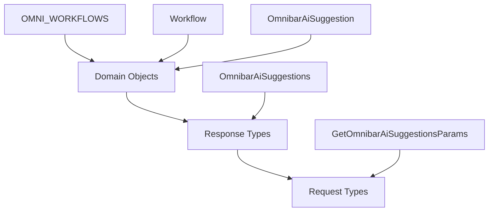

# Omnibar Types Documentation

## Purpose

The omnibar types define the type system for the application's command bar interface, which provides unified access to multiple workflows including chat, search, signals, files, and stories. This type system enables AI-powered suggestions and workflow selection, serving as the primary interface for user interactions across different application domains.

## Type Definition

### Core Enums

```typescript
enum OMNI_WORKFLOWS {
  ALL = 'ALL',
  CHAT = 'CHAT',
  SEARCH = 'SEARCH',
  SIGNAL = 'SIGNAL',
  FILES = 'FILES',
  STORY = 'STORY',
}

enum WORKFLOW_SELECTOR {
  ENTITIES = 'ENTITIES',
  TOPICS = 'TOPICS',
  STORIES = 'STORIES',
}

enum OmnibarAiSuggestionType {
  CHAT = 'CHAT',
  SIGNAL = 'SIGNAL',
  SEARCH = 'SEARCH',
}
```

### Core Interfaces

```typescript
interface Workflow {
  title: string;
  description: string;
  icon: ReactNode;
  type: OMNI_WORKFLOWS;
  command: string;
}

interface GetOmnibarAiSuggestionsParams {
  promptPrefix: string;
  suggestionType?: OmnibarAiSuggestionType;
}
```

### Discriminated Union Types

```typescript
type OmnibarAiSuggestion = 
  | OmnibarSignalSuggestion
  | OmnibarChatSuggestion
  | OmnibarSearchSuggestion;

type OmnibarAiSuggestions = OmnibarAiSuggestion[];
```

## Properties

### OMNI_WORKFLOWS Enum

| Value | Description |
|-------|-------------|
| `ALL` | Represents all available workflows |
| `CHAT` | Chat/conversation workflow |
| `SEARCH` | General search workflow |
| `SIGNAL` | Signal analysis workflow |
| `FILES` | File management workflow |
| `STORY` | Story/content workflow |

### WORKFLOW_SELECTOR Enum

| Value | Description |
|-------|-------------|
| `ENTITIES` | Entity-based workflow selection |
| `TOPICS` | Topic-based workflow selection |
| `STORIES` | Story-based workflow selection |

### Workflow Interface

| Property | Type | Required | Description |
|----------|------|----------|-------------|
| `title` | `string` | ✅ | Display title for the workflow |
| `description` | `string` | ✅ | Detailed description of workflow functionality |
| `icon` | `ReactNode` | ✅ | React component/element for visual representation |
| `type` | `OMNI_WORKFLOWS` | ✅ | Workflow type identifier |
| `command` | `string` | ✅ | Command string to trigger the workflow |

### GetOmnibarAiSuggestionsParams Interface

| Property | Type | Required | Description |
|----------|------|----------|-------------|
| `promptPrefix` | `string` | ✅ | Initial prompt text for AI suggestions |
| `suggestionType` | `OmnibarAiSuggestionType` | ❌ | Optional filter for suggestion type |

### OmnibarAiSuggestion Union Variants

#### Signal Suggestion
| Property | Type | Required | Description |
|----------|------|----------|-------------|
| `type` | `OmnibarAiSuggestionType.SIGNAL` | ✅ | Discriminator for signal suggestions |
| `title` | `string` | ✅ | Suggestion title |
| `description` | `string` | ✅ | Detailed description |
| `query.query` | `ComplexAllEndpointQuery` | ✅ | Query parameters for signal endpoint |
| `query.showReprints` | `boolean \| null` | ✅ | Whether to include reprints |

#### Chat Suggestion
| Property | Type | Required | Description |
|----------|------|----------|-------------|
| `type` | `OmnibarAiSuggestionType.CHAT` | ✅ | Discriminator for chat suggestions |
| `prompt` | `string` | ✅ | Chat prompt text |
| `imageUrl` | `string` | ✅ | Associated image URL |

#### Search Suggestion
| Property | Type | Required | Description |
|----------|------|----------|-------------|
| `type` | `OmnibarAiSuggestionType.SEARCH` | ✅ | Discriminator for search suggestions |
| `title` | `string` | ✅ | Search suggestion title |
| `imageUrl` | `string` | ✅ | Associated image URL |
| `reasoning` | `string` | ✅ | AI reasoning for the suggestion |
| `description` | `string` | ✅ | Detailed description |
| `query.query` | `ComplexAllEndpointQuery` | ✅ | Query parameters for search endpoint |
| `query.showReprints` | `boolean \| null` | ✅ | Whether to include reprints |

## Usage Examples

### Defining Workflows

```typescript
import { OMNI_WORKFLOWS, Workflow } from '@/lib/types/omnibar';
import { SearchIcon, ChatIcon, SignalIcon } from '@/components/icons';

const workflows: Workflow[] = [
  {
    title: 'Search',
    description: 'Search across all content and data',
    icon: <SearchIcon />,
    type: OMNI_WORKFLOWS.SEARCH,
    command: '/search'
  },
  {
    title: 'Chat',
    description: 'Start a conversation with AI',
    icon: <ChatIcon />,
    type: OMNI_WORKFLOWS.CHAT,
    command: '/chat'
  },
  {
    title: 'Signals',
    description: 'Analyze market signals and trends',
    icon: <SignalIcon />,
    type: OMNI_WORKFLOWS.SIGNAL,
    command: '/signal'
  }
];
```

### Working with AI Suggestions

```typescript
import { 
  OmnibarAiSuggestion, 
  OmnibarAiSuggestionType,
  GetOmnibarAiSuggestionsParams 
} from '@/lib/types/omnibar';

// Request parameters
const suggestionParams: GetOmnibarAiSuggestionsParams = {
  promptPrefix: 'Find trending topics about',
  suggestionType: OmnibarAiSuggestionType.SEARCH
};

// Type-safe suggestion handling
function handleSuggestion(suggestion: OmnibarAiSuggestion) {
  switch (suggestion.type) {
    case OmnibarAiSuggestionType.SEARCH:
      return executeSearch(suggestion.query, suggestion.title);
    
    case OmnibarAiSuggestionType.CHAT:
      return startChat(suggestion.prompt, suggestion.imageUrl);
    
    case OmnibarAiSuggestionType.SIGNAL:
      return analyzeSignal(suggestion.query, suggestion.description);
    
    default:
      // TypeScript ensures exhaustive checking
      const _exhaustive: never = suggestion;
      throw new Error('Unhandled suggestion type');
  }
}
```

### Component Integration

```typescript
interface OmnibarProps {
  workflows: Workflow[];
  onSuggestionSelect: (suggestion: OmnibarAiSuggestion) => void;
  currentWorkflow?: OMNI_WORKFLOWS;
}

const Omnibar: React.FC<OmnibarProps> = ({ 
  workflows, 
  onSuggestionSelect, 
  currentWorkflow = OMNI_WORKFLOWS.ALL 
}) => {
  const [suggestions, setSuggestions] = useState<OmnibarAiSuggestions>([]);
  
  const fetchSuggestions = async (params: GetOmnibarAiSuggestionsParams) => {
    const response = await omnibarService.getAiSuggestions(params);
    setSuggestions(response);
  };

  return (
    <div className="omnibar">
      {/* Implementation */}
    </div>
  );
};
```

## Type Architecture Pattern

### Domain Objects → Response Types → Request Types



1. **Domain Objects**: Core business entities (`Workflow`, `OmnibarAiSuggestion`)
2. **Response Types**: API response shapes (`OmnibarAiSuggestions`)
3. **Request Types**: API request parameters (`GetOmnibarAiSuggestionsParams`)

## Related Types

### Dependencies
- `ReactNode` from React - for workflow icons
- `ComplexAllEndpointQuery` from `./complex-all-endpoint-body` - for query structures

### Extension Points
```typescript
// Extending for new workflow types
type ExtendedWorkflow = Workflow & {
  category: string;
  priority: number;
};

// Utility types for workflow management
type WorkflowsByType = Record<OMNI_WORKFLOWS, Workflow[]>;
type WorkflowCommands = Pick<Workflow, 'command' | 'type'>;
```

## Integration Points

### Services
- **OmnibarService**: Handles AI suggestion fetching
- **SearchService**: Processes search-type suggestions
- **ChatService**: Manages chat-type suggestions
- **SignalService**: Handles signal analysis suggestions

### Components
- **Omnibar**: Main command bar component
- **WorkflowSelector**: Workflow selection interface
- **SuggestionList**: AI suggestion display
- **CommandPalette**: Command execution interface

### State Management
```typescript
interface OmnibarState {
  activeWorkflow: OMNI_WORKFLOWS;
  suggestions: OmnibarAiSuggestions;
  isLoading: boolean;
  query: string;
}
```

## Validation

### Zod Schemas

```typescript
import { z } from 'zod';

const WorkflowSchema = z.object({
  title: z.string().min(1),
  description: z.string().min(1),
  type: z.nativeEnum(OMNI_WORKFLOWS),
  command: z.string().min(1),
  // Note: icon validation handled at component level
});

const GetOmnibarAiSuggestionsParamsSchema = z.object({
  promptPrefix: z.string().min(1),
  suggestionType: z.nativeEnum(OmnibarAiSuggestionType).optional(),
});

const OmnibarAiSuggestionSchema = z.discriminatedUnion('type', [
  z.object({
    type: z.literal(OmnibarAiSuggestionType.SIGNAL),
    title: z.string(),
    description: z.string(),
    query: z.object({
      query: ComplexAllEndpointQuerySchema,
      showReprints: z.boolean().nullable(),
    }),
  }),
  z.object({
    type: z.literal(OmnibarAiSuggestionType.CHAT),
    prompt: z.string(),
    imageUrl: z.string().url(),
  }),
  z.object({
    type: z.literal(OmnibarAiSuggestionType.SEARCH),
    title: z.string(),
    description: z.string(),
    imageUrl: z.string().url(),
    reasoning: z.string(),
    query: z.object({
      query: ComplexAllEndpointQuerySchema,
      showReprints: z.boolean().nullable(),
    }),
  }),
]);
```

## Best Practices

### TypeScript Guidelines Adherence

✅ **Strict Typing**: All types are strictly defined with no `any` usage

✅ **Enums for Reusable Values**: Using enums for workflow types and suggestion types that are reused across the application

✅ **Discriminated Unions**: `OmnibarAiSuggestion` uses proper discriminated union pattern for type safety

✅ **Domain-First Architecture**: Following domain objects → response types → request types pattern

### Recommended Patterns

```typescript
// Use type guards for runtime safety
function isSearchSuggestion(
  suggestion: OmnibarAiSuggestion
): suggestion is Extract<OmnibarAiSuggestion, { type: OmnibarAiSuggestionType.SEARCH }> {
  return suggestion.type === OmnibarAiSuggestionType.SEARCH;
}

// Leverage utility types for partial updates
type WorkflowUpdate = Partial<Pick<Workflow, 'title' | 'description'>>;

// Use const assertions for immutable data
const DEFAULT_WORKFLOWS = [
  {
    title: 'All',
    type: OMNI_WORKFLOWS.ALL,
    // ...
  }
] as const;
```

### Performance Considerations

- Use `React.memo` with workflow objects due to ReactNode icons
- Consider lazy loading of suggestion types
- Implement debouncing for AI suggestion requests
- Cache frequently used workflows